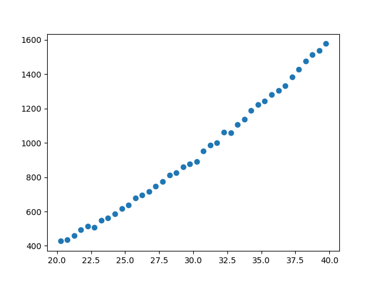
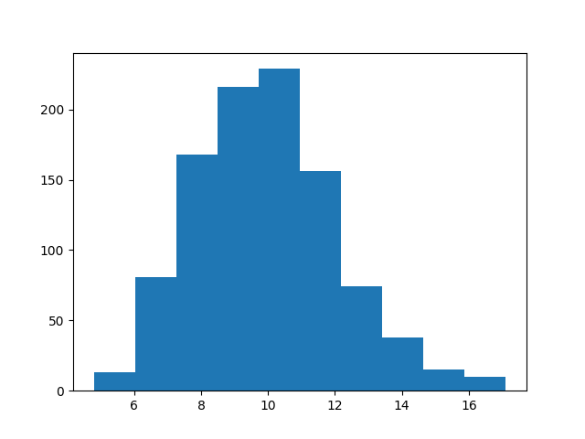
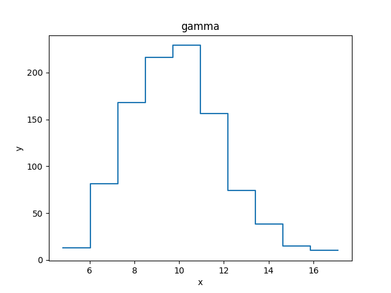
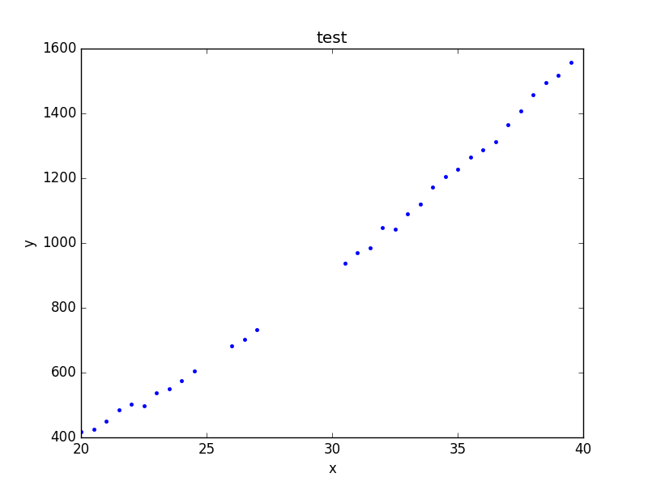
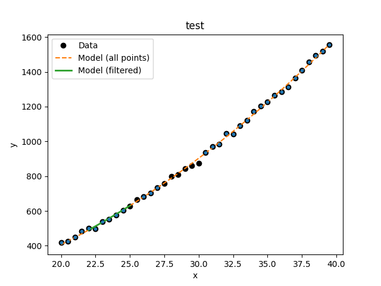

***********************
What data is to be fit?
***********************

The Sherpa :py:class:`~sherpa.data.Data` class is used to
carry around the data to be fit: this includes the independent
axis (or axes), the dependent axis (the data), and any
necessary metadata. Although the design of Sherpa supports
multiple-dimensional data sets, the current classes only
support one- and two-dimensional data sets.

The following modules are assumed to have been imported::

    >>> import numpy as np
    >>> import matplotlib.pyplot as plt
    >>> from sherpa.stats import LeastSq
    >>> from sherpa.optmethods import LevMar
    >>> from sherpa import data

Names
=====

The first argument to any of the Data classes is the name
of the data set. This is used for display purposes only,
and can be useful to identify which data set is in use.
It is stored in the ``name`` attribute of the object, and
can be changed at any time.

.. _independent-axis:

The independent axis
====================

The independent axis - or axes - of a data set define the
grid over which the model is to be evaluated. It is referred
to as ``x``, ``x0``, ``x1``, ... depending on the dimensionality
of the data (for
:ref:`binned datasets <data_binned>` there are ``lo``
and ``hi`` variants).

Although dense multi-dimensional data sets can be stored as
arrays with dimensionality greater than one, the internal
representation used by Sherpa is often a flattened - i.e.
one-dimensional - version.

The :py:class:`sherpa.astro.data.DataPHA` class can be thought of
as being either unbinned or binned, depending on the units
(channels or energy/wavelength), and this is discussed in the
:doc:`PHA example <pha>` page.

The dependent axis
==================

This refers to the data being fit, and is referred to as ``y``.

.. _data_unbinned:

Unbinned data
-------------

Unbinned data sets - defined by classes which do not end in
the name ``Int`` - represent point values; that is, the the data
value is the value at the coordinates given by the independent
axis.
Examples of unbinned data classes are
:py:class:`~sherpa.data.Data1D` and :py:class:`~sherpa.data.Data2D`.

    >>> np.random.seed(0)
    >>> x = np.arange(20.25, 40, 0.5)
    >>> y = x**2 + np.random.normal(0, 10, size=x.size)
    >>> d1 = data.Data1D('test', x, y)
    >>> print(d1)
    name      = test
    x         = Float64[40]
    y         = Float64[40]
    staterror = None
    syserror  = None
    >>> print(d1.x)
    [20.25 20.75 21.25 21.75 22.25 22.75 23.25 23.75 24.25 24.75 25.25 25.75
     26.25 26.75 27.25 27.75 28.25 28.75 29.25 29.75 30.25 30.75 31.25 31.75
     32.25 32.75 33.25 33.75 34.25 34.75 35.25 35.75 36.25 36.75 37.25 37.75
     38.25 38.75 39.25 39.75]
    >>> print(d1.y)
    [ 427.70302346  434.56407208  461.34987984  495.47143199  513.7380799
      507.7897212   550.06338418  562.54892792  587.03031148  616.66848502
      639.00293571  677.60523507  696.67287725  716.77925016  747.00113233
      773.39924327  813.00329073  824.51091736  858.69317702  876.52154261
      889.53260184  952.09868595  985.20686199 1000.6408498  1062.76004624
     1058.01884325 1106.02008517 1137.1906615  1188.39029214 1222.2560877
     1244.11197426 1281.8441252  1305.18464252 1330.75453532 1384.08337851
     1426.62598969 1475.36540681 1513.58629849 1536.68923183 1577.03947249]
    >>> plt.plot(d.x, d.y, 'o')

.. _data_binned:

Binned data
-----------

Binned data sets represent values that are defined over a range,
such as a histogram.
The integrated model classes end in ``Int``: examples are
:py:class:`~sherpa.data.Data1DInt`
and :py:class:`~sherpa.data.Data2DInt`.

It can be a useful optimisation to treat a binned data set as
an unbinned one, since it avoids having to estimate the integral
of the model over each bin. It depends in part on how the bin
size compares to the scale over which the model changes.

::

    >>> z = np.random.gamma(20, scale=0.5, size=1000)
    >>> (y, edges) = np.histogram(z)
    >>> d2 = data.Data1DInt('gamma', edges[:-1], edges[1:], y)
    >>> print(d2)
    name      = gamma
    xlo       = Float64[10]
    xhi       = Float64[10]
    y         = Int64[10]
    staterror = None
    syserror  = None
    >>> plt.clf()
    >>> plt.bar(d2.xlo, d2.y, d2.xhi - d2.xlo, align='edge')

Errors
======

There is support for both statistical and systematic
errors by either using the ``staterror`` and ``syserror``
parameters when creating the data object, or by changing the
:py:attr:`~sherpa.data.Data.staterror` and
:py:attr:`~sherpa.data.Data.syserror` attributes of the object.

.. _data_filter:

Filtering data
==============

Sherpa supports filtering data sets; that is, temporarily removing
parts of the data (perhaps because there are problems, or to help
restrict parameter values). There are routines to filter the data
and to find out what bins have been selected.

The :py:meth:`~sherpa.data.Data.ignore` and
:py:meth:`~sherpa.data.Data.notice` methods are used to
define the ranges to exclude or include.
The :py:attr:`~sherpa.data.Data.mask` attribute indicates
whether a filter has been applied: if it returns ``True`` then
no filter is set, ``False`` when all data has been filtered out,
otherwise it is a bool array
where ``False`` values indicate those elements that are to be
ignored. 
Note that the Sherpa definition is opposite of the convention in numpy, where `True` indicates
a masked value to be ignored, while Sherpa uses `False` for this purpose. 
For example, the following
hides those values where the independent axis values are between
21.2 and 22.8::

    >>> d1.ignore(21.2, 22.8)
    >>> d1.x[np.invert(d1.mask)]
    array([21.25, 21.75, 22.25, 22.75])

.. note::
   The meaning of the range selected by the `notice` and `ignore` calls
   depends on the data class: :py:class:`sherpa.data.Data1DInt` and
   :py:class:`sherpa.astro.data.DataPHA` classes can treat the
   upper limit differently (it can be inclusive or exclusive)
   and 2D datasets such as :py:class:`sherpa.data.Data2D` can
   use filters that use both axes.

The :py:meth:`~sherpa.data.Data1D.get_filter` method will report a
string representation of the existing filter, so here showing that
the bins between 21.2 and 22.8 have been ignored::

    >>> print(d1.get_fiter())
    20.2500:20.7500,23.2500:39.7500

.. note::
   The filter does not record the requested changes - that is here
   the 21.2 to 22.8 arguments to :py:meth:`~sherpa.data.Data.ignore` -
   but instead reflects the selected bins in the data set.

After this, a fit to the data will ignore these values, as shown
below, where the number of degrees of freedom of the first fit,
which uses the filtered data, is three less than the fit to the
full data set (the call to
:py:meth:`~sherpa.data.Data.notice` removes the filter since
no arguments were given)::

    >>> from sherpa.models import Polynom1D
    >>> from sherpa.fit import Fit
    >>> mdl = Polynom1D()
    >>> mdl.c2.thaw()
    >>> fit = Fit(d1, mdl, stat=LeastSq(), method=LevMar())
    >>> res1 = fit.fit()

    >>> d1.notice()
    >>> res2 = fit.fit()

    >>> print(f"Degrees of freedom: {res1.dof} vs {res2.dof}")
    Degrees of freedom: 34 vs 38

.. _filter_reset:

Resetting the filter
--------------------

The :py:meth:`~sherpa.data.Data.notice` method can be used to
reset the filter - that is, remove all filters - by calling with no
arguments (or, equivalently, with two `None` arguments). Similarly
the :py:meth:`~sherpa.data.Data.ignore` method called with no
arguments will remove all points.

The first filter call
---------------------

When a data set is created no filter is applied, which is treated
as a special case (this also holds if the
:ref:`filters have been reset <filter_reset>`).
The first call to :py:meth:`~sherpa.data.Data.notice`
will restrict the data to just the requested range, and subsequent
calls will add the new data. So with no filter we see the whole data
range::

    >>> d1.notice()
    >>> print(d1.get_fiter(format='%.2f'))
    20.25:39.75

The first :py:meth:`~sherpa.data.Data.notice` call restricts to just
this range::

    >>> d1.notice(25, 27)
    >>> print(d1.get_fiter(format='%.1f'))
    25.25:26.75

Subsequent :py:meth:`~sherpa.data.Data.notice` calls add to the selected
range::

    >>> d1.notice(30, 35)
    >>> print(d1.get_fiter(format='%.1f'))
    25.25:26.75,30.25:34.75

The edges of a filter
---------------------

Mathematically the two sets of commands below should select the same
range, but it can behave slightly different for values at the edge
of the filter (or within the edge bins for :py:class:`~sherpa.data.Data1DInt`
and :py:class:`~sherpa.astro.data.DataPHA` objects):

    >>> d1.notice(25, 35)
    >>> d1.ignore(29, 31)

    >>> d1.notice(25, 29)
    >>> d1.notice(31, 35)

.. _filter_enhance:

Accessing filtered data
-----------------------

Although the :py:attr:`~sherpa.data.Data.mask` attribure can be used
to manually filter the data, many data accessors accept a ``filter``
argument which, if set, will filter the requested data.  When a filter
is applied, :py:meth:`~sherpa.data.Data1D.get_x` and
:py:meth:`~sherpa.data.Data.get_y` will default to returning all the
data but if the ``filter`` argument is set then the current filter
will be applied::

  >>> d1.notice()
  >>> d1.notice(21.1, 23.5)
  >>> d1.get_x()
  [20.25 20.75 21.25 21.75 22.25 22.75 23.25 23.75 24.25 24.75 25.25 25.75
   26.25 26.75 27.25 27.75 28.25 28.75 29.25 29.75 30.25 30.75 31.25 31.75
   32.25 32.75 33.25 33.75 34.25 34.75 35.25 35.75 36.25 36.75 37.25 37.75
   38.25 38.75 39.25 39.75]
  >>> d1.get_y()
  [ 427.70302346  434.56407208  461.34987984  495.47143199  513.7380799
    507.7897212   550.06338418  562.54892792  587.03031148  616.66848502
    639.00293571  677.60523507  696.67287725  716.77925016  747.00113233
    773.39924327  813.00329073  824.51091736  858.69317702  876.52154261
    889.53260184  952.09868595  985.20686199 1000.6408498  1062.76004624
   1058.01884325 1106.02008517 1137.1906615  1188.39029214 1222.2560877
   1244.11197426 1281.8441252  1305.18464252 1330.75453532 1384.08337851
   1426.62598969 1475.36540681 1513.58629849 1536.68923183 1577.03947249]
  >>> d1.get_x(filter=True)
  [21.25 21.75 22.25 22.75 23.25]
  >>> d1.get_y(filter=True)
  [461.34987984 495.47143199 513.7380799  507.7897212  550.06338418]

Enhanced filtering
------------------

Certain data classes - in particular :py:class:`sherpa.astro.data.DataIMG`
and :py:class:`sherpa.astro.data.DataPHA` - extend and enhance the
filtering capabilities to:

* allow filters to use different units (logical and physical for
  :py:class:`~sherpa.astro.data.DataIMG` and channels, energies,
  or wavelengths for :py:class:`~sherpa.astro.data.DataPHA`;

* filtering with geometric shapes (regions) for
  :py:class:`~sherpa.astro.data.DataIMG`;

* and dynamically re-binning the data to enhance the signal-to-noise
  of the data for :py:class:`~sherpa.astro.data.DataPHA`.

.. _data_visualize:

Visualizing a data set
======================

The data objects contain several methods which can be used to
visualize the data, but do not provide any direct plotting
or display capabilities. There are low-level routines which
provide access to the data - these include the
:py:meth:`~sherpa.data.Data.to_plot` and
:py:meth:`~sherpa.data.Data.to_contour` methods - but the
preferred approach is to use the classes defined in the
:py:mod:`sherpa.plot` module, which are described in the
:doc:`visualization section <../plots/index>`:

    >>> from sherpa.plot import DataHistogramPlot
    >>> pdata = DataHistogramPlot()
    >>> pdata.prepare(d2)
    >>> pdata.plot()

.. image:: ../_static/data/data_int_to_plot.png

Although the data represented by ``d2`` is
a histogram, the values are displayed at the center of the bin.

Plot preferences can be changed in the `plot` call:

    >>> pdata.plot(linestyle='solid', marker='')

.. note::

   The supported options depend on the plot backend (although
   at present only :term:`matplotlib` is supported).

The plot objects automatically handle any
:ref:`filters <data_filter>`
applied to the data, as shown below.

::

    >>> from sherpa.plot import DataPlot
    >>> pdata = DataPlot()
    >>> d1.notice()
    >>> d1.ignore(25, 30)
    >>> d1.notice(26, 27)
    >>> pdata.prepare(d1)
    >>> pdata.plot()

.. note::

   The plot object stores the data given in the
   :py:meth:`~sherpa.plot.DataPlot.prepare` call,
   so that changes to the underlying objects will not be reflected
   in future calls to
   :py:meth:`~sherpa.plot.DataPlot.plot`
   unless a new call to
   :py:meth:`~sherpa.plot.DataPlot.prepare` is made.

::

    >>> d1.notice()

At this point, a call to ``pdata.plot()`` would re-create the previous
plot, even though the filter has been removed from the underlying
data object.

Evaluating a model
==================

The :py:meth:`~sherpa.data.Data.eval_model` and
:py:meth:`~sherpa.data.Data.eval_model_to_fit`
methods can be used
to evaluate a model on the grid defined by the data set. The
first version uses the full grid, whereas the second respects
any :ref:`filtering <data_filter>` applied to the data.

::

    >>> d1.notice(22, 25)
    >>> y1 = d1.eval_model(mdl)
    >>> y2 = d1.eval_model_to_fit(mdl)
    >>> x2 = d1.x[d1.mask]
    >>> plt.plot(d1.x, d1.y, 'ko', label='Data')
    >>> plt.plot(d1.x, y1, '--', label='Model (all points)')
    >>> plt.plot(x2, y2, linewidth=2, label='Model (filtered)')
    >>> plt.legend(loc=2)

Astronomy data
==============

.. toctree::
   :maxdepth: 2
   :name: data_detailed

   pha

.. todo::

   Want an image section.

Reference/API
=============

.. todo::

   There are a bunch of methods that seem out of place;
   e.g. Data1D has get_x0 even though it's not ND!

.. toctree::
   :maxdepth: 2
   :name: api_data

   data
   astrodata
