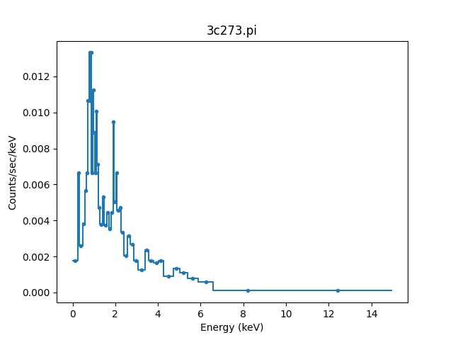
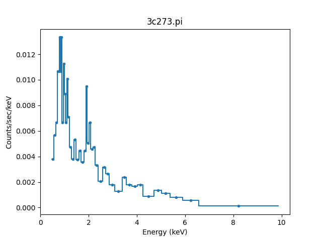
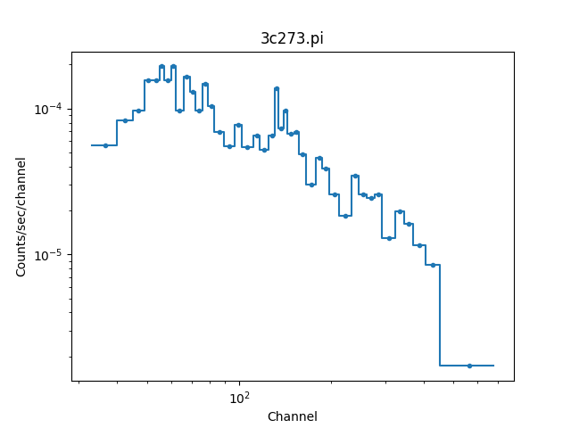
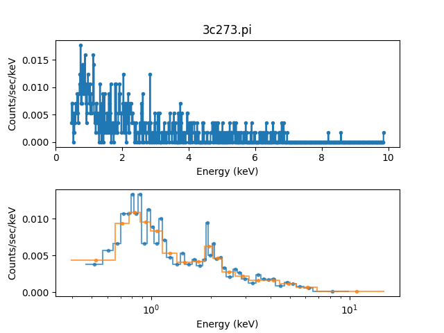

******************
Analyzing PHA data
******************

As mentioned in :ref:`filter_enhance`, PHA datasets add extra features
to the standard Sherpa data class. These are:

* creating a PHA data set requires significantly more metadata than
  other data classes, which is automatically handled when reading the
  data from a FITS file that follows the :term:`OGIP` standards, but
  have to be explicitly set when creating a :py:class:`~sherpa.astro.data.DataPHA`
  object;

* the :py:class:`sherpa.astro.data.DataPHA` class is derived from
  :py:class:`sherpa.data.Data1D`, since the "raw" data being fit is
  channel number and counts, but much analysis requires an "integrated"
  data set;

* a source region can also have one or more associated background
  regions which provide an estimate of the background contamination in
  the source region and this can either be subtracted from the data
  or a separate model fit to it;

* analysis can be done using one of three "coordinates" - `"channel"`,
  `"energy"`, or `"wavelength"` - that control the plot appearance and
  units for the :py:meth:`~sherpa.astro.data.DataPHA.notice` and
  :py:meth:`~sherpa.astro.data.DataPHA.ignore` calls;

* data can be dynamically regrouped to change the signal-to-noise
  during the analysis;

* and model evaluation uses classes related to the :term:`ARF` and
  :term:`RMF` to convert between channels and energies.

The :ref:`model_evaluate_example_pha` section of the
:doc:`model evaluation <../evaluation/index>` page shows how many
of these features work, while below we focus on an overview of
these changes.

The following imports have been made::

  >>> import numpy as np
  >>> from matplotlib import pyplot as  plt
  >>> from sherpa.astro.data import DataPHA

Creating a DataPHA object
=========================

The :py:func:`sherpa.astro.io.read_pha` routine will read in a
PHA FITS file::

  >>> from sherpa.astro.io import read_pha
  >>> pha = read_pha('3c273.pi')
  WARNING: systematic errors were not found in file '3c273.pi'
  statistical errors were found in file '3c273.pi'
  but not used; to use them, re-read with use_errors=True
  read ARF file 3c273.arf
  read RMF file 3c273.rmf
  WARNING: systematic errors were not found in file '3c273_bg.pi'
  statistical errors were found in file '3c273_bg.pi'
  but not used; to use them, re-read with use_errors=True
  read background file 3c273_bg.pi
  >>> print(pha)
  name           = 3c273.pi
  channel        = Float64[1024]
  counts         = Float64[1024]
  staterror      = None
  syserror       = None
  bin_lo         = None
  bin_hi         = None
  grouping       = Int16[1024]
  quality        = Int16[1024]
  exposure       = 38564.608926889
  backscal       = 2.5264364698914e-06
  areascal       = 1.0
  grouped        = True
  subtracted     = False
  units          = energy
  rate           = True
  plot_fac       = 0
  response_ids   = [1]
  background_ids = [1]

.. note::

   The :py:mod:`sherpa.astro.io` module requires that a FITS backend
   is available. The :term:`Astropy` package can be used for this.

As well as reading in the data it has also automatically loaded in
the background data and response information (:term:`ARF` and :term:`RMF`)
that are set in this file's FITS metdata::

  >>> print(pha.get_background())
  name           = 3c273_bg.pi
  channel        = Float64[1024]
  counts         = Float64[1024]
  staterror      = None
  syserror       = None
  bin_lo         = None
  bin_hi         = None
  grouping       = Int16[1024]
  quality        = Int16[1024]
  exposure       = 38564.608926889
  backscal       = 1.872535141462e-05
  areascal       = 1.0
  grouped        = True
  subtracted     = False
  units          = energy
  rate           = True
  plot_fac       = 0
  response_ids   = [1]
  background_ids = []
  >>> print(pha.get_arf())
  name     = 3c273.arf
  energ_lo = Float64[1090]
  energ_hi = Float64[1090]
  specresp = Float64[1090]
  bin_lo   = None
  bin_hi   = None
  exposure = 38564.141454905
  ethresh  = 1e-10
  >>> print(pha.get_rmf())
  name     = 3c273.rmf
  detchans = 1024
  energ_lo = Float64[1090]
  energ_hi = Float64[1090]
  n_grp    = UInt64[1090]
  f_chan   = UInt64[2002]
  n_chan   = UInt64[2002]
  matrix   = Float64[61834]
  offset   = 1
  e_min    = Float64[1024]
  e_max    = Float64[1024]
  ethresh  = 1e-10

A PHA object can also be created directly - all that is needed at
first are the channel and counts arrays as other metadata can be added
after the :py:class:`~sherpa.astro.data.DataPHA` object has been
created::

  >>> chans = np.arange(1, 1025, dtype=int)
  >>> counts = np.ones(1024, dtype=int)
  >>> test = DataPHA('example', chans, counts)
  >>> print(test)
  name           = example
  channel        = Int64[1024]
  counts         = Int64[1024]
  staterror      = None
  syserror       = None
  bin_lo         = None
  bin_hi         = None
  grouping       = None
  quality        = None
  exposure       = None
  backscal       = None
  areascal       = None
  grouped        = False
  subtracted     = False
  units          = channel
  rate           = True
  plot_fac       = 0
  response_ids   = []
  background_ids = []

The units used to analyse the data depend on whether the response
information has been loaded. For the data loaded from disk (``pha``)
it is energy units::

  >>> print(pha.units)
  energy

Visualizing the data
====================

The :py:mod:`sherpa.astro.plot` module contains classes for
visualizing the data (the :doc:`visualization section
<../plots/index>` provides more information on how to use the
plot classes), so we
can visualize the data with::

  >>> from sherpa.astro.plot import DataPHAPlot
  >>> plot = DataPHAPlot()
  >>> plot.histo_prefs['linestyle'] = '-'
  >>> plot.prepare(pha)
  >>> plot.plot()

.. note::

   The :py:mod:`sherpa.astro.plot` module requires that a plotting backend
   is available. The :term:`matplotlib` package can be used for this.

   The default plot style has been adjusted to also include the
   bin edges (by setting the matplotlib ``linestyle`` option).

Filtering
=========

The default is for all the data to be included and, because the file
contained grouping information, the data has been grouped (this is
shown in the plot above, where there are only of order 50 data points
shown rather than the 1024 channels this data set has)::

  >>> print(pha.mask)
  True
  >>> print(pha.grouped)
  True

The "dependent axis" - so in this case, the counts - can be retrieved
with the :py:meth:`~sherpa.astro.data.DataPha.get_dep` method, and we
can see the difference the ``filter`` flag makes::

  >>> y1 = pha.get_dep()
  >>> y2 = pha.get_dep(filter=True)
  >>> print(y1.size)
  1024
  >>> print(y2.size)
  46

So when `filter=False` (the default) then the ungrouped data is returned,
but when `filter=True` the grouped data is returned.

Since the analysis units for this data set are `energy`, we can select
a subset of the data, which means that the grouped data size is reduced,
as the points with energies below 0.5 keV or above 7 keV have been removed::

  >>> pha.notice(0.5, 7)
  >>> print(pha.get_dep(filter=True).size)
  42
  >>> plot.prepare(pha)
  >>> plot.plot()

Although the requested range was 0.5 to 7.0 keV, the selected range
is wider, as shown above and with the :py:meth:`~sherpa.astro.data.DataPHA.get_filter`
method::

  >>> print(pha.get_filter())
  0.467200011015:9.869600296021

.. note::

   Each channel covers a finite energy range, and so when determining what
   value to display, the :py:meth:`~sherpa.astro.data.DataPHA.get_filter` call
   uses the full range (this was changed in Sherpa 4.14.0, in earlier versions
   the mid-point was used so the expression would appear to cover a smaller
   range but would still reflect the same filter).

The reason for this change is two fold:

* as mentioned, each channel has a finite energy range, so the selected energy
  range is unlikely to exactly match the requested range,

* and thanks to grouping, the selected channel is unlikely to fall at the
  start (for the low limit) and end (for the high limit) values for the
  groups, so this further changes the selected limit range.

Consider the following highly-simplified case where there are 7 channels
that have been grouped into 4 bins.

+---------+-------+--------------------+
| Channel | Group | Energy range (keV) |
+=========+=======+====================+
| 1       | 1     | 0.10 - 0.11        |
+---------+       +--------------------+
| 2       |       | 0.11 - 0.14        |
+---------+-------+--------------------+
| 3       | 2     | 0.14 - 0.16        |
+---------+       +--------------------+
| 4       |       | 0.16 - 0.20        |
+---------+-------+--------------------+
| 5       | 3     | 0.20 - 0.22        |
+---------+       +--------------------+
| 6       |       | 0.22 - 0.24        |
+---------+-------+--------------------+
| 7       | 4     | 0.24 - 0.26        |
+---------+-------+--------------------+

In this case a filter to notice the range 0.15 to 0.21 keV would select
channels 3 to 5 and then end up selecting groups 2 and 3, with the
final channel selection being 3 to 6. A call to then ignore the range
0.18 to 0.19 keV would select channel 4 and hence group 2, so
resulting in a final filter of just group 3 (channels 5 to 6).

We can switch temporarily to channel units and see differences in the
``get_filter`` call and the plot::

  >>> pha.units = 'channel'
  >>> print(pha.get_filter())
  33:676
  >>> plot.prepare(pha)
  >>> plot.plot(xlog=True, ylog=True)
  >>> pha.units = 'energy'

.. note::

   The counts (dependent) axis is drawn with a logarithmic scale
   primarily because the values are small enough that the Y-axis label
   would disappear with a linear scale. The channel (independent) axis
   has been drawn with a log scale because the effective area of this
   instrument is higher at lower energies which tends to result in
   smaller groups at low channel values.

Grouping
========

The dynamic grouping can be changed by setting the
:py:attr:`~sherpa.astro.data.DataPHA.grouping` attribute - and
then calling the :py:meth:`~sherpa.astro.data.DataPHA.group` if
necessary - or with one of the dynamic-routines methods:
:py:meth:`~sherpa.astro.data.DataPHA.group_adapt`,
:py:meth:`~sherpa.astro.data.DataPHA.group_adapt_snr`,
:py:meth:`~sherpa.astro.data.DataPHA.group_bins`,
:py:meth:`~sherpa.astro.data.DataPHA.group_counts`,
:py:meth:`~sherpa.astro.data.DataPHA.group_snr`,
and
:py:meth:`~sherpa.astro.data.DataPHA.group_width`.

For this example we will compare the same data with
different grouping schemes by loading the data in three
times. The :py:class:`~sherpa.utils.logging.SherpaVerbosity`
class is used to temporarily hide the output of
:py:func:`~sherpa.astro.io.read_pha`::

  >>> from sherpa.utils.logging import SherpaVerbosity
  >>> with SherpaVerbosity('ERROR'):
  ...    pha1 = read_pha('3c273.pi')
  ...    pha2 = read_pha('3c273.pi')
  ...    pha3 = read_pha('3c273.pi')

The same energy range will be used for all three data sets::

  >>> pha1.notice(0.5, 7)
  >>> pha2.notice(0.5, 7)
  >>> pha3.notice(0.5, 7)

The first data set is to be ungrouped, the second data set
will use the on-disk grouping settings, and the third
data set is grouped so that each bin contains at least
40 counts::

  >>> pha1.ungroup()
  >>> pha3.group_counts(40)

For display the ungrouped data is shown in a separate plot
as it makes it easier to compare::

  >>> plt.subplot(2, 1, 1)
  >>> plot.prepare(pha1)
  >>> plot.plot(clearwindow=False)
  >>> plt.subplot(2, 1, 2)
  >>> plot.prepare(pha2)
  >>> plot.plot(xlog=True, alpha=0.7, clearwindow=False)
  >>> plot.prepare(pha3)
  >>> plot.overplot(alpha=0.7)
  >>> plt.title('')
  >>> plt.subplots_adjust(hspace=0.4)

In general, as the grouped bins become larger then the difference of the
filtered range to the requested range becomes larger (the first two
files have the same range as the samebins have been selected, it's
just that pha1 is ungrouped)::

  >>> print(pha1.get_filter())
  0.467200011015:9.869600296021
  >>> print(pha2.get_filter())
  0.467200011015:9.869600296021
  >>> print(pha3.get_filter())
  0.394199997187:14.950400352478

Manipulating data
=================

Methods like :py:meth:`~sherpa.astro.data.DataPHA.get_dep` will apply
the necessary grouping and filters to the data. It can be useful to
convert other arrays - such as counts or energy bins - directly, which
can be done with :py:meth:`~sherpa.astro.data.DataPHA.apply_filter`
and :py:meth:`~sherpa.astro.data.DataPHA.apply_grouping`.  The default
behavior for ``apply_filter`` is to sum the data values with each
group, so we can re-create the ``get_dep`` call::

  >>> d1 = pha.get_dep(filter=True)
  >>> d2 = pha.apply_filter(pha.counts)
  >>> np.all(d1 == d2)
  True

The behavior can be changed with the ``groupfunc`` argument, which
takes a limited set of functions that describe how the data within a
group is combined (the default is ``np.sum``).  For instance, the
first and last channel value of each group can be calculated with::

  >>> clo = pha.apply_filter(pha.channel, groupfunc=pha._min)
  >>> chi = pha.apply_filter(pha.channel, groupfunc=pha._max)
  >>> clo[0:7]
  [33. 40. 45. 49. 52. 55. 57.]
  >>> chi[0:7]
  [39. 44. 48. 51. 54. 56. 59.]

The ``apply_grouping`` method is similar but it does not apply
any filter, so all channels are used. So to get the group
boundaries for all channels, not just the filtered ones,
we can say::

  >>> alo = pha.apply_grouping(pha.channel, pha._min)
  >>> ahi = pha.apply_grouping(pha.channel, pha._max)
  >>> alo[0:7]
  [ 1. 18. 22. 33. 40. 45. 49.]
  >>> ahi[0:7]
  [17. 21. 32. 39. 44. 48. 51.]

Background
==========

A PHA data set may have one or more associated background
data sets. For this example there is 1, and the
:py:meth:`~sherpa.astro.data.DataPHA.get_background` method
will return a :py:class:`~sherpa.astro.data.DataPHA` object
representing the background region.

  >>> print(pha.background_ids)
  [1]
  >>> bkg = pha.get_background()
  >>> print(bkg)
  name           = 3c273_bg.pi
  channel        = Float64[1024]
  counts         = Float64[1024]
  staterror      = None
  syserror       = None
  bin_lo         = None
  bin_hi         = None
  grouping       = Int16[1024]
  quality        = Int16[1024]
  exposure       = 38564.608926889
  backscal       = 1.872535141462e-05
  areascal       = 1.0
  grouped        = True
  subtracted     = False
  units          = energy
  rate           = True
  plot_fac       = 0
  response_ids   = [1]
  background_ids = []

.. note::

   In this example the background data has the same exposure time
   as the source, which is often the case (the source and background
   spectra are extracted from the same event file), but this does not
   need to hold.

Often all that is done is to subtract the background from the source data,
which is achieved with the :py:meth:`~sherpa.astro.data.DataPHA.subtract`
method, but you can instead fit a model to just the background data, and
have this then included in the source region (with appropriate scaling
to account for differences in the source and background apertures). Filtering
and grouping changes to a source region are automatically propogated to
the associated background regions, but they can be applied to the background
data set directly if needed.
