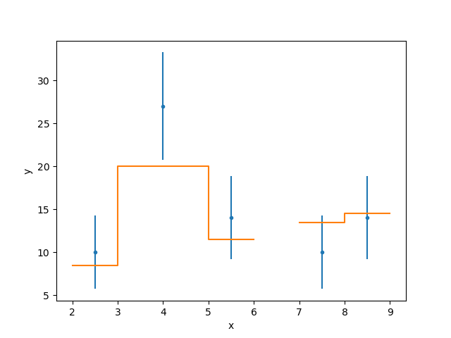
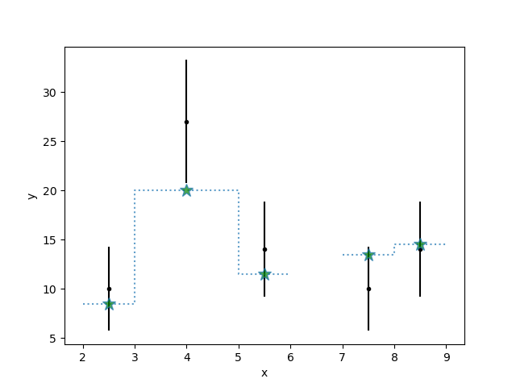

**********************************
Contributing to Sherpa development
**********************************

.. todo::

   Needs work.

Contributions to Sherpa - whether it be bug reports, documentation
updates, or new code - are highly encouraged.  Please `report any
problems or feature requests on github
<https://github.com/sherpa/sherpa/issues/>`_.

At present we do not have any explicit documentation on how
to contribute to Sherpa, but it is similar to other open-source
packages such as
`AstroPy <https://docs.astropy.org/en/stable/index.html#contributing>`_.

The developer documentation is also currently lacking.

To do code development, Sherpa needs to be installed from source so
that tests can run locally and the documentation can be build locally
to test out any additions to code or docs.  :ref:`build-from-source`
describes several ways to build Sherpa from source, but one
particularly comfortable way is described in detail in the next
section.

Pull requests
=============

We welcome pull requests on
`github <https://github.com/sherpa/sherpa/issues/>`_.

For each pull request, a set of continuous integration tests is run
automatically, including a build of the documentation on readthedocs.

Skip the continuous integration
-------------------------------

Sometimes a PR is still in development and known to fail the tests or
simply does not touch any code, because it only modifies docstrings
and the documentation. In that case, `[skip ci]` can be added to the
commit message to prevent running the github actions tests to save
time, energy, and limited resources.

Run tests locally
-----------------
Before you issue a pull request, we ask to run the test suite locally.
Assuming everything is set up to install Sherpa from source, it can be
installed in development mode with ``pip``::

  pip install -e .

"Development mode" means that the tests will pick up changes in the
Python source files without running ``pip`` again (which can take some
time). Only if you change the C++ code, you will have to explicitly run
the installation again to see the changes in the tests. After the installation,
``pytest`` can run all the tests. In the sherpa root directory call::

  pytest

``pytest`` supports a number of options which are
`detailed in the pytest documentation <https://docs.pytest.org/>`_. A
particularly useful option is to run only the tests in a specific file.
For example, if you changed the code and the tests in the `sherpa.astro.ui`
module, one might expect tests for this module to be the most likely to fail::

  pytest sherpa/astro/ui/tests/test_astro_ui.py

Once everything looks good, you can do a final run of the entire test suite. A
second option useful for develoment is ``--pdb`` which drops into the
`interactive Python debugger <https://docs.python.org/3/library/pdb.html>`_
when a test fails so that you can move up and down the stack and inspect the
value of individual variables.

The test suite can be sped up by running tests in parallel. After installing
the `pytest-xdist <https://pypi.org/project/pytest-xdist>`_ module
(``pip install pytest-xdist``), tests can be run in parallel on several cores::

  pytest -n auto

will autoselect the number of cores, an explicit number can also be given
(``pytest -n 4``). Note that if you have :term:`DS9` and :term:`XPA`
installed then it is possible that the DS9 tests may fail when running
tests in parallel (since multiple tests can end up over-writing the
DS9 data before it can be checked).

Test coverage can be included as part of the tests by installing the
`coverage <https://coverage.readthedocs.io/en/latest/index.html>`_
(``pip install coverage``) and
`pytest-cov <https://pypi.org/project/pytest-cov/>`_ packages
(``pip install pytest-cov``). Adding the ``--cov=sherpa`` option to the test
run allows us to generate a coverage report after that::

  pytest --cov=sherpa
  coverage html -d report

The report is in ``report/index.html``, which links to individual
files and shows exactly which lines were excuted while running the tests.

How do I ...
============

.. _source-install-with-conda:

Install from source in conda
----------------------------

Conda can be used to install all the dependencies for Sherpa, including
:term:`XSPEC`.

::

    conda create -n sherpaciao -c https://cxc.cfa.harvard.edu/conda/ciao -c conda-forge ds9 astropy ciao
    conda install -n sherpaciao --only-deps -c https://cxc.cfa.harvard.edu/conda/ciao -c conda-forge sherpa
    conda activate sherpaciao

The first line installs the full `CIAO release
<https://cxc.harvard.edu/ciao/>`_ and astropy, required for building
and running tests locally.

If you want to also build the documentation then add (after you have
activated the environment)::

    conda install pandoc
    pip install sphinx graphviz sphinx-astropy sphinx_rtd_theme nbsphinx ipykernel

.. note::
   Sherpa can be configured to use crates (from CIAO) or astropy for
   it's I/O backend by changing the contents of the file
   ``.sherpa-standalone.rc`` in your home directory. This file can be
   found, once CIAO is installed, by using the `~sherpa.get_config`
   routine::

     % python -c 'import sherpa; print(sherpa.get_config())'
     /home/happysherpauser/.sherpa-standalone.rc

   If Sherpa was installed as part of CIAO then the file will be
   called ``.sherpa.rc``.

   The ``io_pkg`` line in this file can be changed to select
   ``crates`` rather than ``pyfits`` which would mean that ``astropy``
   does not need to be installed (although it would be needed to build
   the documentation).

As described in :ref:`build-from-source`, the file ``setup.cfg`` in
the root directory of the sherpa source needs to be modified to
configure the build. This is particularly easy in this setup, where
all external dependencies are installed in conda and the enviroment
variable ``ASCDS_INSTALL`` (or ``CONDA_PREFIX``, which has the same
value) can be used. For most cases, the ``scripts/use_ciao_config``
script can be used::

  % ./scripts/use_ciao_config
  Found XSPEC version: 12.12.0
  Updating setup.cfg
  % git diff setup.cfg
  ...

Otherwise the file can be edited manually. First find out what
XSPEC version is present with::

  % conda list xspec-modelsonly --json | grep version
      "version": "12.12.0"

then change the ``setup.cfg`` to change the following lines, noting
that the `${ASCDS_INSTALL}` environment variable **must** be
replaced by its actual value, and the ``xspec_version`` line
should be updated to match the output above::

    bdist_wheel = sherpa_config xspec_config bdist_wheel

    install_dir=${ASCDS_INSTALL}

    configure=None

    disable-group=True
    disable-stk=True

    fftw=local
    fftw-include_dirs=${ASCDS_INSTALL}/include
    fftw-lib-dirs=${ASCDS_INSTALL}/lib
    fftw-libraries=fftw3

    region=local
    region-include_dirs=${ASCDS_INSTALL}/include
    region-lib-dirs=${ASCDS_INSTALL}/lib
    region-libraries=region ascdm
    region-use-cxc-parser=True

    wcs=local
    wcs-include-dirs=${ASCDS_INSTALL}/include
    wcs-lib-dirs=${ASCDS_INSTALL}/lib
    wcs-libraries=wcs

    with-xspec=True
    xspec_version = 12.12.0
    xspec_lib_dirs = ${ASCDS_INSTALL}/lib
    xspec_include_dirs = ${ASCDS_INSTALL}/include

.. note::
   The XSPEC version may include the patch level, such as ``12.12.0e``,
   and this can be included in the configuration file.

To avoid accidentially commiting the modified ``setup.cfg`` into git,
the file can be marked as "assumed unchanged".

::

    git update-index --assume-unchanged setup.cfg

After these steps, Sherpa can be built from source::

    pip install .

.. warning::

   Just like in the case of a normal source install, when building Sherpa
   on recent versions of macOS within a conda environment, the following
   environment variable must be set::

     export PYTHON_LDFLAGS=' '

   That is, the variable is set to a space, not the empty string.

.. warning::

   This is not guaranteed to build Sherpa in exactly the same manner
   as used by :term:`CIAO`. Please
   `create an issue <https://github.com/sherpa/sherpa/issues>`_ if
   this causes problems.

Update the Zenodo citation information
--------------------------------------

The :py:func:`sherpa.citation` function returns citation information
taken from the `Zenodo records for Sherpa <https://doi.org/10.5281/zenodo.593753>`_.
It can query the Zenodo API, but it also contains a list of known
releases in the ``sherpa._get_citation_hardcoded`` routine. To add
to this list (for when there's been a new release), run the
``scripts/make_zenodo_release.py`` script with the version number
and add the screen output to the list in ``_get_citation_hardcoded``.

For example, using release 4.12.2 would create (the author list has been
simplified)::

  % ./scripts/make_zenodo_release.py 4.12.2
      add(version='4.12.2', title='sherpa/sherpa: Sherpa 4.12.2',
          date=todate(2020, 10, 27),
          authors=['Doug Burke', 'Omar Laurino', ... 'Todd'],
          idval='4141888')

Add a new notebook
------------------

The easiest way to add a new notebook to the documentation is to
add it to the desired location in the ``docs/`` tree and add it to
the table of contents. If you want to place the notebook into the
top-level ``notebooks/`` directory and also have it included in
the documentation then add an entry to the ``notebooks/nbmapping.dat``
file, which is a tab-separated text file listing the name
of the notebook and the location in the ``docs/`` directory structure
that it should be copied to. The ``docs/conf.py`` file will ensure
it is copied (if necessary) when building the documentation. The
location of the documentation version **must** be added to the
``.gitignore`` file (see the section near the end) to make sure it
does not accidentally get added.

If the notebook is not placed in ``notebooks/`` then the
``nbsphinx_prolog`` setting in ``docs/conf.py`` will need updating.
This sets the text used to indicate the link to the notebook on the
Sherpa repository.

At present we require that the notebook be fully evaluated as we
do not run the notebooks while building the documentation.

Add a new test option?
----------------------

The ``sherpa/conftest.py`` file contains general-purpose testing
routines, fixtures, and configuration support for the test suite.
To add a new command-line option:

* add to the ``pytest_addoption`` routine, to add the option;

* add to ``pytest_collection_modifyitems`` if the option adds
  a new mark;

* and add support in ``pytest_configure``, such as registering
  a new mark.

.. _developer-update-xspec:

Update the XSPEC bindings?
--------------------------

The :py:mod:`sherpa.astro.xspec` module currently supports
:term:`XSPEC` versions 12.12.1 down to 12.9.0. It may build against
newer versions, but if it does it will not provide access to any new
models in the release. The following sections of the `XSPEC manual
<https://heasarc.gsfc.nasa.gov/xanadu/xspec/manual/XspecManual.html>`__
should be reviewed: `Appendix F: Using the XSPEC Models Library in
Other Programs
<https://heasarc.gsfc.nasa.gov/docs/xanadu/xspec/manual/XSappendixExternal.html>`_,
and `Appendix C: Adding Models to XSPEC
<http://heasarc.gsfc.nasa.gov/xanadu/xspec/manual/XSappendixLocal.html>`_.

Checking against a previous XSPEC version
^^^^^^^^^^^^^^^^^^^^^^^^^^^^^^^^^^^^^^^^^

If you have a version of Sherpa compiled with a previous XSPEC
version then you can use two helper scripts:

#. ``scripts/check_xspec_update.py``

   This will compare the supported XSPEC model classes to those
   from a ``model.dat`` file, and report on the needed changes.

#. ``scripts/add_xspec_model.py``

   This will report the basic code needed to be added to both
   the compiled code (``sherpa/astro/xspec/src/_xspec.cc``) and
   Python (``sherpa/astro/xspec/__init__.py``). Note that it
   does not deal with conditional compilation, the need to
   add a decorator to the Python class, or missing documentation
   for the class.

These routines are designed to simplify the process but are not
guaranteed to handle all cases (as the model.dat file syntax is not
strongly specified).

As an example of their use, the following output is from before
XSPEC 12.12.0 (released in HEASOFT 6.29) support was added::

  % ./scripts/check_xspec_update.py ~/local/heasoft-6.29/spectral/manager/model.dat | grep support
  We do not support grbjet (Add; xsgrbjet)
  We do not support smaug (Add; xsmaug)
  We do not support vvwdem (Add; vvwDem)
  We do not support vwdem (Add; vwDem)
  We do not support wdem (Add; wDem)
  We do not support zxipab (Mul; zxipab)
  We do not support pileup (Acn; pileup)

.. note::
   There can be other output due to parameter-value changes
   which are also important to review but this is just focussing
   on the list of models that could be added to
   :py:mod:`sherpa.astro.xspec`

The code needed to add support for the wdem module can be found with::

  % ./scripts/check_xspec_update.py ~/local/heasoft-6.29/spectral/manager/model.dat wdem
  # C++ code for sherpa/astro/xspec/src/_xspec.cc

  // Defines

  extern "C" {

  }

  // Wrapper

  static PyMethodDef Wrappers[] = {
    XSPECMODELFCT_C_NORM(C_wDem, 8),
    { NULL, NULL, 0, NULL }
  }

  # Python code for sherpa/astro/xspec/__init__.py

  class XSwdem(XSAdditiveModel):
      """XSPEC AdditiveModel: wdem

      Parameters
      ----------
      Tmax
      beta
      p
      nH
      abundanc
      Redshift
      switch
      norm

      """
      _calc = _models.C_wDem

      def __init__(self, name='wdem'):
          self.Tmax = Parameter(name, 'Tmax', 1.0, min=0.01, max=10.0, hard_min=0.01, hard_max=20.0, units='keV')
          self.beta = Parameter(name, 'beta', 0.1, min=0.01, max=1.0, hard_min=0.01, hard_max=1.0)
          self.p = Parameter(name, 'p', 0.25, min=-1.0, max=10.0, hard_min=-1.0, hard_max=10.0)
          self.nH = Parameter(name, 'nH', 1.0, min=1e-05, max=1e+19, hard_min=1e-06, hard_max=1e+20, frozen=True, units='cm^-3')
          self.abundanc = Parameter(name, 'abundanc', 1.0, min=0.0, max=10.0, hard_min=0.0, hard_max=10.0, frozen=True)
          self.Redshift = Parameter(name, 'Redshift', 0.0, min=-0.999, max=10.0, hard_min=-0.999, hard_max=10.0, frozen=True)
          self.switch = Parameter(name, '_switch', 2, alwaysfrozen=True)
          self.norm = Parameter(name, 'norm', 1.0, min=0.0, max=1e+24, hard_min=0.0, hard_max=1e+24)
          XSAdditiveModel.__init__(self, name, (self.Tmax,self.beta,self.p,self.nH,self.abundanc,self.Redshift,self.switch,self.norm))

This code then can then be added to
``sherpa/astro/xspec/src/_xspec.cc`` and
``sherpa/astro/xspec/__init__.py`` and then refined so that the tests
pass.

Updating the code
^^^^^^^^^^^^^^^^^

The following steps are needed to update to a newer version, and
assume that you have the new version of XSPEC, or its model library,
available.

#. Add a new version define in ``helpers/xspec_config.py``.

   Current version: `helpers/xspec_config.py <https://github.com/sherpa/sherpa/blob/master/helpers/xspec_config.py>`_.

   When adding support for XSPEC 12.11.1, the top-level
   ``SUPPORTED_VERSIONS`` list was changed to include the triple
   ``(12, 11, 1)``::

     SUPPORTED_VERSIONS = [(12, 9, 0), (12, 9, 1),
                           (12, 10, 0), (12, 10, 1),
                           (12, 11, 0), (12, 11, 1)]

   This list is used to select which functions to include when
   compiling the C++ interfce code. For reference, the defines are
   named ``XSPEC_<a>_<b>_<c>`` for each supported XSPEC release
   ``<a>.<b>.<c>`` (the XSPEC patch level is not included).

   .. note:: The Sherpa build system requires that the user indicate the
	     version of XSPEC being used, via the ``xspec_config.xspec_version``
	     setting in their ``setup.cfg`` file (as attempts to identify
	     this value automatically were not successful). This version is
	     the value used in the checks in ``helpers/xspec_config.py``.

#. Attempt to build the XSPEC interface with::

     python setup.py develop

   This requires that the ``xspec_config`` section of the ``setup.cfg``
   file has been set up correctly for the new XSPEC release. The exact
   settings depend on how XSPEC was built (e.g. model only or as a
   full application), and are described in the
   :ref:`building XSPEC <build-xspec>` documentation. The most-common
   changes are that the version numbers of the ``CCfits``, ``wcslib``,
   and ``hdsp`` libraries need updating, and these can be checked by
   looking in ``$HEADAS/lib``.

   If the build succeeds, you can check that it has worked by directly
   importing the XSPEC module, such as with the following, which should
   print out the correct version::

     python -c 'from sherpa.astro import xspec; print(xspec.get_xsversion())'

   It may however fail, due to changes in the XSPEC interface (unfortunately,
   such changes are often not included in the release notes).

#. Identify changes in the XSPEC models.

   .. note::
      The ``scripts/check_xspec_update.py`` and ``scripts/add_xspec_model.py``
      scripts can be used to automate some - but unfortunately not all - of this.

   A new XSPEC release can add models, change parameter settings in
   existing models, change how a model is called, or even delete a
   model (the last case is rare, and may require a discussion on
   how to proceed). The
   `XSPEC release notes <https://heasarc.gsfc.nasa.gov/xanadu/xspec/CHANGELOG.txt>`_
   page provides an overview, but the ``model.dat`` file - found
   in ``headas-<version>/Xspec/src/manager/model.dat`` (build) or
   ``$HEADAS/../spectral/manager/model.dat`` (install) - provides
   the details. It greatly simplifies things if you have a copy of
   this file from the previous XSPEC version, since then a command
   like::

     diff heasoft-6.26.1/spectral/manager/model.dat heasoft-6.27/spectral/manager/model.dat

   will tell you the differences (this example was for XSPEC 12.11.0,
   please adjust as appropriate). If you do not have the previous
   version then the release notes will tell you which models to
   look for in the ``model.dat`` file.

   The ``model.dat`` is an ASCII file which is described in
   Appendix C: Adding Models to XSPEC of the
   `XSPEC manual <https://heasarc.gsfc.nasa.gov/xanadu/xspec/manual/XspecManual.html>`_.
   The Sherpa interface to XSPEC only supports models labelled
   as ``add``, ``mul``, and ``con`` (additive, multiplicative,
   and convolution, respectively).

   Each model is represented by a set of consecutive lines in
   the file, and as of XSPEC 12.11.0, the file begins with::

     % head -5 heasoft-6.27/Xspec/src/manager/model.dat
     agauss         2   0.         1.e20          C_agauss  add  0
     LineE   A      10.0   0.      0.      1.e6      1.e6      0.01
     Sigma   A      1.0    0.      0.      1.e6      1.e6      0.01

     agnsed        15   0.03       1.e20          agnsed    add  0

   The important parts of the model definition are the first line,
   which give the XSPEC model name (first parameter), number of
   parameters (second parameter), two numbers which we ignore, the
   name of the function that evaluates the model, the type
   (e.g. ``add``), and then 1 or more values which we ignore. Then
   there are lines which define the model parameters (the number match
   the second argument of the first line), and then one or more blank
   lines. In the output above we see that the XSPEC ``agauss`` model
   has 2 parameters, is an additive model provided by the ``C_agauss``
   function, and that the parameters are ``LineE`` and ``Sigma``.
   The ``agnsed`` model is then defined (which uses the ``agnsed``
   routines), but its 15 parameters have been cut off from the output.

   The parameter lines will mostly look like this: parameter name,
   unit string (is often ``" "``), the default value, the hard and then
   soft minimum, then the soft ahd hard maximum, and then a value used
   by the XSPEC optimiser, but we only care about if it is negative
   (which indicates that the parameter should be frozen by default).
   The other common variant is the "flag" parameter - that is, a
   parameter that should never be thawed in a fit - which is indicated
   by starting the parameter name with a ``$`` symbol (although the
   documentation says these should only be followed by a single value,
   you'll see a variety of formats in the ``model.dat`` file). These
   parameters are marked by setting the ``alwaysfrozen`` argument of
   the :py:class:`~sherpa.models.parameter.Parameter` constructor
   to ``True``. Another option is the "scale" parameter, which is
   labelled with a ``*`` prefix, and these are treated as normal
   parameter values.

   a. ``sherpa/astro/xspec/src/_xspec.cc``

      Current version: `sherpa/astro/xspec/src/_xspec.cc <https://github.com/sherpa/sherpa/blob/master/sherpa/astro/xspec/src/_xspec.cc>`_.

      New functions are added to the ``XspecMethods`` array,
      using macros defined in ``sherpa/include/sherpa/astro/xspec_extension.hh``,
      and should be surrounded by a pre-processor check for the
      version symbol added to ``helpers/xspec_config.py``.

      As an example::

        #ifdef XSPEC_12_10_1
          XSPECMODELFCT_NORM( agnsed, 16 ),
        #endif

      adds support for the ``agnsed`` function, but only for XSPEC
      12.10.1 and later. Note that the symbol name used here is
      **not** the XSPEC model name (the first argument of the model
      definition from ``model.dat``), but the function name (the fifth
      argument of the model definition (although for the ``agnsed``
      example they are the same).

      Some models have changed the name of the function over time,
      so the pre-processor directive may need to be more complex, such
      as::

        #ifdef XSPEC_12_10_0
          XSPECMODELFCT_C_NORM( C_nsmaxg, 6 ),
        #else
          XSPECMODELFCT_NORM( nsmaxg, 6 ),
        #endif

      The remaining pieces are the choice of macro
      (e.g. ``XSPECMODELFCT_NORM`` or ``XSPECMODELFCT_C_NORM``) and
      the value for the second argument.  The macro depends on the
      model type and the name of the function (which defines the
      interface that XSPEC provides for the model, such as single- or
      double- precision, and Fortran- or C- style linking). Additive
      models use the suffix ``_NORM`` and convolution models use the
      suffix ``_CON``. Model functions which begin with ``C_`` use the
      ``_C`` variant, while those which begin with ``c_`` currently
      require treating them as if they have no prefix.

      The numeric argument to the template defines the number of
      parameters supported by the model once in Sherpa, and should
      equal the value given in the ``model.dat`` file for
      multiplicative and convolution style models, and one larger than
      this for additive models (i.e. those which use a macro that ends
      in ``_NORM``).

      As an example, the following three models from ``model.dat``::

        apec           3  0.         1.e20           C_apec    add  0
        phabs          1  0.03       1.e20           xsphab    mul  0
        gsmooth        2  0.         1.e20           C_gsmooth    con  0

      are encoded as (ignoring any pre-processor directives)::

        XSPECMODELFCT_C_NORM( C_apec, 4 ),
        XSPECMODELFCT( xsphab, 1 ),
        XSPECMODELFCT_CON(C_gsmooth, 2),

      Those models that do not use the ``_C`` version of the macro (or,
      for convolution-style models, have to use
      ``XSPECMODELFCT_CON_F77``), also have to declare the function
      within the ``extern "C" {}`` block. For FORTRAN models, the
      declaration should look like (replacing ``func`` with the
      function name, and note the trailing underscore)::

        void func_(float* ear, int* ne, float* param, int* ifl, float* photar, float* photer);

      and for model functions called ``c_func``, the prefixless
      version should be declared as::

        void func(const double* energy, int nFlux, const double* params, int spectrumNumber, double* flux, double* fluxError, const char* initStr);

      If you are unsure, do not add a declaration and then try to
      build Sherpa: the compiler should fail with an indication of
      what symbol names are missing.

      .. note:: Ideally we would have a sensible ordering for the declarations in this
		file, but at present it is ad-hoc.

   b. ``sherpa/astro/xspec/__init__.py``

      Current version: `sherpa/astro/xspec/__init__.py <https://github.com/sherpa/sherpa/blob/master/sherpa/astro/xspec/__init__.py>`_.

      This is where the Python classes are added for additive and multiplicative
      models. The code additions are defined by the model and parameter
      specifications from the ``model.dat`` file, and the existing classes
      should be used for inspiration. The model class should be called
      ``XS<name>``, where ``<name>`` is the XSPEC model name, and the
      ``name`` argument to its constructor be set to the XSPEC model name.

      The two main issues are:

      * Documentation: there is no machine-readable version of the text, and
	so the documentation for the XSPEC model is used for inspiration.

        The idea is to provide minimal documentation, such as the
	model name and parameter descriptions, and then to point users to
	the XSPEC model page for more information.

	One wrinkle is that the
	`XSPEC manual <https://heasarc.gsfc.nasa.gov/docs/xanadu/xspec/manual/manual.html>`__
	does not provide a stable URI for a model (as it can change with XSPEC
	version). However, it appears that you can use the following pattern:

	  https://heasarc.gsfc.nasa.gov/xanadu/xspec/manual/XSmodel<Name>.html

	where ``<Name>`` is the capitalised version of the model name (e.g.
	``Agnsed``).

      * Models that are not in older versions of XSPEC should be marked with
	the ``version_at_least`` decorator (giving it the minimum supported
	XSPEC version as a string), and the function (added to ``_xspec.cc``)
	is specified as a string using the ``__function__`` attribute. The
	:py:class:`sherpa.astro.xspec.utils.ModelMeta` metaclass performs
	a runtime check to ensure that the model can be used.

   c. ``sherpa/astro/xspec/tests/test_xspec.py``

      Current version: `sherpa/astro/xspec/tests/test_xspec.py <https://github.com/sherpa/sherpa/blob/master/sherpa/astro/xspec/tests/test_xspec.py>`_.

      The ``XSPEC_MODELS_COUNT`` version should be increased by the number
      of models classes added to ``__init__.py``.

      Additive and multiplicative models will be run as part of the test
      suite - using a simple test which runs on a default grid and
      uses the default parameter values - whereas convolution models
      are not (since their pre-conditions are harder to set up
      automatically).

   d. ``docs/model_classes/astro_xspec.rst``

      Current version: `docs/model_classes/astro_xspec.rst <https://github.com/sherpa/sherpa/blob/master/docs/model_classes/astro_xspec.rst>`_.

      New models should be added to both the ``Classes`` rubric - sorted
      by addtive and then multiplicative models, using an alphabetical
      sorting - and to the appropriate ``inheritance-diagram`` rule.

#. Documentation updates

   The ``docs/indices.rst`` file should be updated to add the new version
   to the list of supported versions, under the :term:`XSPEC` term, and
   ``docs/developer/index.rst`` also lists the supported versions
   (:ref:`developer-update-xspec`). The installation page ``docs/install.rst`` should
   be updated to add an entry for the ``setup.cfg`` changes in
   :ref:`build-xspec`.

   The ``sherpa/astro/xspec/__init__.py`` file also lists the supported
   XSPEC versions.

Never forget to update the year of the copyright notice?
--------------------------------------------------------

Git offers `pre-commit hooks <https://git-scm.com/book/en/v2/Customizing-Git-Git-Hooks>`_
that can do file checks for you before a commit is executed. The script in
`scripts/pre-commit` will check if the copyright notice in any of the files in the
current commit must be updated and, if so, add the current year to the copyright notice
and abort the commit so that you can manually check before commiting again.

To use this opt-in functionality, simply copy the file to the appropriate location::

  cp scripts/pre-commit .git/hooks

Notes
=====

Notes on the design and changes to Sherpa.

.. _model_dimensions:

The dimensionality of models
----------------------------

Originally the Sherpa model class did not enforce any requirement on
the models, so it was possible to combine 1D and 2D models, even though
the results are unlikely to make sense. With the start of the regrid
support, added in `PR #469 <https://github.com/sherpa/sherpa/pull/469>`_,
the class hierarchy included 1D- and 2D- specific classes, but there
was still no check on model expressions. This section describes the
current way that models are checked:

* the :py:class:`sherpa.models.model.Model` class defines a
  :py:attr:`sherpa.models.model.Model.ndim` attribute, which is set
  to ``None`` by default.
* the :py:class:`sherpa.models.model.RegriddableModel1D` and
  :py:class:`sherpa.models.model.RegriddableModel2D` classes set
  this attribute to 1 or 2, respectively (most user-callable classes
  are derived from one of these two classes).
* the :py:class:`sherpa.models.model.CompositeModel` class checks
  the ``ndim`` attribute for the components it is given (the
  ``parts`` argument) and checks that they all have the same
  ``ndim`` value (ignoring those models whose dimensionality
  is set to ``None``). If there is a mis-match then a
  :py:class:`sherpa.utils.err.ModelErr` is raised.

An alternative approach would have been to introdude 1D and 2D
specific classes, from which all models derive, and then require the
parent classes to match. This was not attempted as it would require
significantly-larger changes to Sherpa (but this change could still be
made in the future).

.. _pha_filter:

PHA Filtering
-------------

Filtering of a :py:class:`~sherpa.astro.data.DataPHA` object has four
complications compared to :py:class:`~sherpa.data.Data1D` objects:

* the independent axis can be referred to in channel units (normally 1
  to the maximum number of channels), energy units (e.g. 0.5 to 7
  keV), or wavelength units (e.g. 20 to 22 Angstroms);

* each channel has a width of 1, so channel filters - which are
  generally going to be integer values - map exactly, but each channel
  has a finite width in the derived units (that is, energy or
  wavelength) so multiple values will map to the same channel;

* the data can be dynamically grouped via the
  :py:attr:`~sherpa.astro.data.DataPHA.grouping` attribute, normally set
  by methods like :py:meth:`~sherpa.astro.data.DataPHA.group_counts` and
  controlled by the :py:meth:`~sherpa.astro.data.DataPHA.group` method,
  which means that the desired filter, when mapped to channel units,
  is likely to end up partially overlapping the first and last groups,
  which means that ``notice(a, b)`` and ``ignore(None, a); ignore(b, None)``
  are not guaranteed to select the same range;

* and there is the concept of the
  :py:attr:`~sherpa.astro.data.DataPHA.quality` array, which defines whether
  channels should either always be, or can temporarily be, ignored.

This means that a :py:meth:`~sherpa.astro.data.DataPHA.notice` or
:py:meth:`~sherpa.astro.data.DataPHA.ignore` call has to convert from
the units of the input - which is defined by the
:py:attr:`~sherpa.astro.data.DataPHA.units` attribute, changeable with
:py:attr:`~sherpa.astro.data.DataPHA.set_analysis` - to the "group
number" which then gets sent to the
:py:attr:`~sherpa.data.Data._data_space` attribute to track
the filter.

One result is that the :py:attr:`~sherpa.data.Data.mask` attribute
will now depend on the grouping scheme. The
:py:attr:`~sherpa.astro.data.DataPHA.get_mask` method can be used to
calculate a mask for all channels (e.g. the ungrouped data).

There are complications to this from the quality concept introduced
by the OGIP grouping scheme, which I have not been able to fully
trace through in the code.

.. _model_combination:

Combining model expressions
---------------------------

Models can be combined in several ways (for models derived from the
:py:class:`sherpa.models.model.ArithmeticModel` class):

* a unary operator, taking advantage of the ``__neg__`` and
  ``__abs__`` special methods of a class;
* a binary operator, using the ``__add__``, ``__sub__``, ``__mul__``,
  ``__div__``, ``__floordiv__``, ``__truediv__``, ``__mod__`` and ``__pow__``
  methods.

This allows models such as::

    sherpa.models.basic.Polynom1D('continuum') + sherpa.models.basic.Gauss1D('line')

to be created, and relies on the :py:class:`sherpa.models.model.UnaryOpModel`
and :py:class:`sherpa.models.model.BinaryOpModel` classes.

The :py:class:`~sherpa.models.model.BinaryOpModel` class has special-case handling
for values that are not a model expression (i.e. that do not derive
from the :py:class:`~sherpa.models.model.ArithmeticModel` class),
such as::

    32424.43 * sherpa.astro.xspec.XSpowerlaw('pl')

In this case the term ``32424.43`` is converted to an
:py:class:`~sherpa.models.model.ArithmeticConstantModel` instance and then
combined with the remaining model instance (``XSpowerlaw``).

For those models that require the
full set of elements, such as multiplication by a :term:RMF or a convolution
kernel, requires creating a model that can "wrap" another
model. The wrapping model will evaluate the wrapped model on
the requested grid, and then apply any modifications.
Examples include the
:py:class:`sherpa.instrument.PSFModel` class,
which creats :py:class:`sherpa.instrument.ConvolutionModel`
instances,
and the :py:class:`sherpa.astro.xspec.XSConvolutionKernel`
class, which creates :py:class:`sherpa.astro.xspec.XSConvolutionModel`
instances.

.. _ui_plotting:

Plotting data using the UI layer
--------------------------------

The plotting routines, such as
:py:meth:`~sherpa.ui.utils.Session.plot_data` and
:py:meth:`~sherpa.ui.utils.Session.plot_fit`,
follow the same scheme:

* The plot object is retrieved by the appropriate ``get_xxx_plot`` routine,
  such as :py:meth:`~sherpa.ui.utils.Session.get_data_plot` and
  :py:meth:`~sherpa.ui.utils.Session.get_fit_plot`.

* These ``get_xxx_plot`` calls retrieve the correct plot object -
  which is normally a sub-class of :py:class:`~sherpa.plot.Plot`
  or :py:class:`~sherpa.plot.Histogram` - from the session object.

  .. note::

     The naming of these objects in the
     :py:class:`~sherpa.ui.utils.Session` object is rather hap-hazard
     and would benefit from a more-structured approach.

  If the ``recalc`` argument is set then the ``prepare`` method
  of the plot object is called, along with the needed data,
  which depends on the plot type - e.g.
  :py:class:`sherpa.plot.DataPlot.prepare` needs data and
  statistic objects and :py:class:`sherpa.plot.ModelPlot.prepare`
  needs data and model objects (and a statistic class too but in
  this case it isn't used).

  Calls to other access other plot objects may be required,
  such as the fit plot requiring both data and model objects.
  It is also the place that specialised logic, such as selecting
  a histogram-style plot for :py:class:`~sherpa.data.Data1DInt`
  data rather than the default plot style, is made.

  These plot objects generally do not require a plotting backend,
  so they can be set and returned even without Matplotlib
  installed.

* Once the plot object has been retrieved, is is sent to a plotting
  routine - :py:meth:`sherpa.ui.utils.Session._plot` - which calls
  the ``plot`` method of the object, passing
  through the plot options. It is at this point that the plot
  backend is used to create the visualization (these settings
  are passed as ``**kwargs`` down to the plot backend routines).

The :py:class:`sherpa.astro.ui.utils.Session` class adds a number
of plot types and classes, as well as adds support for the
:py:class:`~sherpa.astro.data.DataPHA` class to relevant
plot commands, such as :py:meth:`~sherpa.astro.ui.utils.Session.plot_model`
and :py:meth:`~sherpa.astro.ui.utils.Session.plot_fit`. This
support complicates the interpretation of the model and fit types,
as different plot types are used to represent the model when drawn
directly (``plot_model``) and indirectly (``plot_fit``): these plot
classes handle binning differently (that is, whether to apply the
grouping from the source PHA dataset or use the native grid of the
response).

There are two routines that return the preference settings:
:py:class:`~sherpa.ui.utils.Session.get_data_plot_prefs` and
:py:class:`~sherpa.ui.utils.Session.get_model_plot_prefs`.
The idea for these is that they return the preference dictionary that
the relevant classes use. However, with the move to per-dataset
plot types (in particular :py:class:`~sherpa.data.Data1DInt` and
:py:class:`~sherpa.astro.data.DataPHA`). It is not entirely clear
how well this scheme works.

The contour routines follow the same scheme, although there is a
lot less specialization of these methods, which makes the
implementation easier. For these plot objects the
:py:meth:`sherpa.ui.utils.Session._contour` method is used
instead (and rather than have ``overplot`` we have ``overcontour``
as the argument).

The :py:meth:`sherpa.ui.utils.Session.plot` and
:py:meth:`sherpa.ui.utils.Session.contour` methods allow multiple
plots to be created by specifying the plot type as a list of
argumemts. For example::

    >>> s.plot('data', 'model', 'data', 2, 'model', 2)

will create four plots, in a two-by-two grid, showing the
data and model values for the default dataset and the
dataset numbered 2. The implementation builds on top of the
individual routines, by mapping the command value to the
necessary ``get_xxx_plot`` or ``get_xxx_contour`` routine.

The image routines are conceptually the same, but the actual
implementation is different, in that it uses a centralized
routine to create the image objects rather than have the
logic encoded in the relavant ``get_xxx_image`` routines. It is
planned to update the image code to match the plot and contour
routines. The main difference is that the image display is handled
via :term:`XPA` calls to an external :term:`DS9` application, rather than with
direct calls to the plotting library.

As an example, here I plot a "fit" for a :py:class:`~sherpa.data.Data1DInt`
dataset:

    >>> from sherpa.ui.utils import Session
    >>> from sherpa.data import Data1DInt
    >>> from sherpa.models.basic import Const1D
    >>> s = Session()
    >>> xlo = [2, 3, 5, 7, 8]
    >>> xhi = [3, 5, 6, 8, 9]
    >>> y = [10, 27, 14, 10, 14]
    >>> s.load_arrays(1, xlo, xhi, y, Data1DInt)
    >>> mdl = Const1D('mdl')
    >>> mdl.c0 = 6
    >>> s.set_source(mdl)
    >>> s.plot_fit()

We can see how the Matplotlib-specific options are passed
to the backend, using a combination of direct access,
such as ``color='black'``, and via the preferences
(the marker settings):

    >>> s.plot_data(color='black')
    >>> p = s.get_model_plot_prefs()
    >>> p['marker'] = '*'
    >>> p['markerfacecolor'] = 'green'
    >>> p['markersize'] = 12
    >>> s.plot_model(linestyle=':', alpha=0.7, overplot=True)

We can view the model plot object::

    >>> plot = s.get_model_plot(recalc=False)
    >>> print(type(plot))
    <class 'sherpa.plot.ModelHistogramPlot'>
    >>> print(plot)
    xlo    = [2,3,5,7,8]
    xhi    = [3,5,6,8,9]
    y      = [ 8.5,20. ,11.5,13.5,14.5]
    xlabel = x
    ylabel = y
    title  = Model
    histo_prefs = {'yerrorbars': False, 'ecolor': None, ... , 'linecolor': None}

.. _dataimg_coords:

Coordinate conversion for image data
------------------------------------

The :py:class:`sherpa.data.Data2D` class provides basic support for
fitting models to two-dimensional data; that is, data with two
independent axes (called "x0" and "x1" although they should be
accessed via the :py:attr:`~sherpa.data.Data2D.indep` attribute).  The
:py:class:`sherpa.astro.data.DataIMG` class extends the 2D support to
include the concept of a coordinate system, allowing the independent
axis to be one of:

- ``logical``
- ``image``
- ``world``

where the aim is that the logical system refers to a pixel number (no
coordinate system), image is a linear transform of the logical system,
and world identifies a projection from the image system onto the
celestial sphere. However, there is no requirement that this
categorization holds as it depends on whether the optional
:py:attr:`~sherpa.astro.data.DataIMG.sky` and
:py:attr:`~sherpa.astro.data.DataIMG.eqpos` attributes are set when
the :py:class:`~sherpa.astro.data.DataIMG` object is created.

.. _dataimg_no_shape:

Using a coordinate system directly
^^^^^^^^^^^^^^^^^^^^^^^^^^^^^^^^^^

.. note::
   It is expected that the `~sherpa.astro.data.DataIMG` object
   is used with a rectangular grid of data and a ``shape`` attribute
   set up to describe the grid shape, as used in the :ref:`next
   section <dataimg_with_shape>`, but it is not required, as shown
   here.

If the independent axes are known, and not calculated via a coordinate
transform, then they can just be set when creating the
`~sherpa.astro.data.DataIMG` object, leaving the
`~sherpa.astro.data.DataIMG.coord` attribute set to
``logical``.

  >>> x0 = np.asarray([1000, 1200, 2000])
  >>> x1 = np.asarray([-500, 500, -500])
  >>> y = np.asarray([10, 200, 30])
  >>> d = DataIMG("example", x0, x1, y)
  >>> print(d)
  name      = example
  x0        = Int64[3]
  x1        = Int64[3]
  y         = Int64[3]
  shape     = None
  staterror = None
  syserror  = None
  sky       = None
  eqpos     = None
  coord     = logical

This can then be used to evaluate a two-dimensional model,
such as `~sherpa.models.basic.Gauss2D`:

  >>> from sherpa.models.basic import Gauss2D
  >>> mdl = Gauss2D()
  >>> mdl.xpos = 1500
  >>> mdl.ypos = -100
  >>> mdl.fwhm = 1000
  >>> mdl.ampl = 100
  >>> print(mdl)
  gauss2d
     Param        Type          Value          Min          Max      Units
     -----        ----          -----          ---          ---      -----
     gauss2d.fwhm thawed         1000  1.17549e-38  3.40282e+38
     gauss2d.xpos thawed         1500 -3.40282e+38  3.40282e+38
     gauss2d.ypos thawed         -100 -3.40282e+38  3.40282e+38
     gauss2d.ellip frozen            0            0        0.999
     gauss2d.theta frozen            0     -6.28319      6.28319    radians
     gauss2d.ampl thawed          100 -3.40282e+38  3.40282e+38
  >>> d.eval_model(mdl)
  array([32.08564744, 28.71745887, 32.08564744])

Attempting to change the coordinate system with
`~sherpa.astro.data.DataIMF.set_coord` will error out with a
`~sherpa.utils.err.DataErr` instance reporting that the data
set does not specify a shape.

.. _dataimg_with_shape:

The shape attribute
^^^^^^^^^^^^^^^^^^^

The ``shape`` argument can be set when creating a
`~sherpa.astro.data.DataIMG` object to indicate that the
data represents an "image", that is a rectangular, contiguous, set of
pixels. It is defined as ``(nx1, nx0)``, and so matches the ndarray
``shape`` attribute from NumPy. Operations that treat the dataset as a
2D grid often require that the ``shape`` attribute is set.

  >>> x1, x0 = np.mgrid[1:4, 1:5]
  >>> y2 = (x0 - 2.5)**2 + (x1 - 2)**2
  >>> y = np.sqrt(y2)
  >>> d = DataIMG('img', x0.flatten(), x1.flatten(),
  ...             y.flatten(), shape=y.shape)
  >>> print(d)
  name      = img
  x0        = Int64[12]
  x1        = Int64[12]
  y         = Float64[12]
  shape     = (3, 4)
  staterror = None
  syserror  = None
  sky       = None
  eqpos     = None
  coord     = logical
  >>> d.get_x0()
  array([1, 2, 3, 4, 1, 2, 3, 4, 1, 2, 3, 4])
  >>> d.get_x1()
  array([1, 1, 1, 1, 2, 2, 2, 2, 3, 3, 3, 3])
  >>> d.get_dep()
  array([1.80277564, 1.11803399, 1.11803399, 1.80277564, 1.5       ,
         0.5       , 0.5       , 1.5       , 1.80277564, 1.11803399,
         1.11803399, 1.80277564])
  >>> d.get_axes()
  (array([1., 2., 3., 4.]), array([1., 2., 3.]))
  >>> d.get_dims()
  (4, 3)

Attempting to change the coordinate system with
`~sherpa.astro.data.DataIMF.set_coord` will error out with a
`~sherpa.utils.err.DataErr` instance reporting that the data
set does not contain the required coordinate system.

Setting a coordinate system
^^^^^^^^^^^^^^^^^^^^^^^^^^^

The `sherpa.astro.io.wcs.WCS` class is used to add a
coordinate system to an image. It has support for linear (translation
and scale) and "wcs" - currently only tangent-plane projections
are supported - conversions.

  >>> from sherpa.astro.io.wcs import WCS
  >>> sky = WCS("sky", "LINEAR", [1000,2000], [1, 1], [2, 2])
  >>> x1, x0 = np.mgrid[1:3, 1:4]
  >>> d = DataIMG("img", x0.flatten(), x1.flatten(), np.ones(x1.size), shape=x0.shape, sky=sky)
  >>> print(d)
  name      = img
  x0        = Int64[6]
  x1        = Int64[6]
  y         = Float64[6]
  shape     = (2, 3)
  staterror = None
  syserror  = None
  sky       = sky
   crval    = [1000.,2000.]
   crpix    = [1.,1.]
   cdelt    = [2.,2.]
  eqpos     = None
  coord     = logical

With this we can change to the "physical" coordinate system, which
represents the conversion sent to the ``sky`` argument, and so get the
independent axis in the converted system with the
`~sherpa.astro.data.DataIMG.set_coord` method:

  >>> d.get_axes()
  (array([1., 2., 3.]), array([1., 2.]))
  >>> d.set_coord("physical")
  >>> d.get_axes()
  (array([1000., 1002., 1004.]), array([2000., 2002.]))
  >>> d.indep
  (array([1000., 1002., 1004., 1000., 1002., 1004.]), array([2000., 2000., 2000., 2002., 2002., 2002.]))

It is possible to switch back to the original coordinate system (the
arguments sent in as ``x0`` and ``x1`` when creating the object):

  >>> d.set_coord("logical")
  >>> d.indep
  (array([1, 2, 3, 1, 2, 3]), array([1, 1, 1, 2, 2, 2]))

In Sherpa 4.14.0 and earlier, this conversion was handled by taking
the current axes pair and applying the necessary WCS objects to create
the selected coordinate system (that is, the argument to the
`~sherpa.astro.data.DataIMG.set_coord` call). This had the advantage of saving memory, as you
only needed to retain the current pair of independent axes, but at the
expense of losing fidelity when converting between the coordinate
systems. This has been changed so that the original independent axes
are now stored in the object, in the ``_orig_indep_axis`` attribute,
and this is now used whenever the coordinate system is changed. This
does increase the memory size of a `~sherpa.astro.data.DataIMG` object, and makes it
harder to load in picked files created with an old Sherpa version (the
code will do its best to create the necessary information but it is
not guaranteed to work well in all cases).
