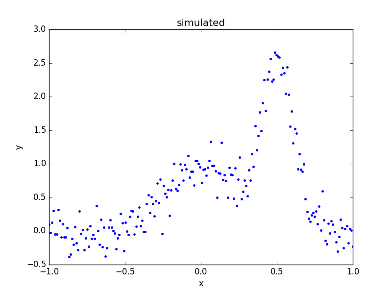
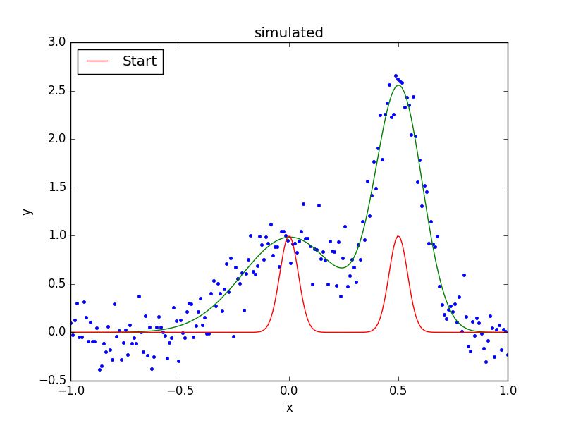

*******************************
Combining models and parameters
*******************************

.. todo::

   I want to talk about including vectors, as it can be useful,
   but perhaps it is too confusing?

Most of the examples show far have used a single model component,
such as a one-dimensional polynomial or a two-dimensional gaussian,
but individual components can be combined together by addition,
multiplication, subtraction, or even division. Components can also
be combined with scalar values or - with *great* care - NumPy vectors.
Parameter values can be "combined" by
:ref:`linking them together <params-link>` using mathematical
expressions. The case of one model requiring the results of
another model is discussed in
:doc:`the convolution section <convolution>`.

.. note::

    There is currently *no restriction* on combining models of different
    types. This means that there is no exception raised when combining
    a one-dimensional model with a two-dimensional one. It is only when
    the model is evaluated that an error *may* be raised.
    
Model Expressions
=================

A model, whether it is required to create a
:py:class:`sherpa.fit.Fit` object or the argument to
the :py:func:`sherpa.ui.set_source` call, is expected to
behace like an instance of the
:py:class:`sherpa.models.model.ArithmeticModel` class.
Instances can be combined as
`numeric types
<https://docs.python.org/3/reference/datamodel.html#emulating-numeric-types>`_
since the class defines methods for addition, subtraction,
multiplication, division, modulus, and exponentiation.

This means that Sherpa model instances can be combined with
other Python terms, such as the weighted combination of
model components ``cpt1``, ``cpt2``, and ``cpt3``::

    cpt1 * (cpt2 + 0.8 * cpt3)

Since the models are evaluated on a grid, it is possible to include
a NumPy vector in the expression, but this is only possible in
restricted situations, when the grid size is known (i.e. the model
expression is not going to be used in a general setting).

Example
=======

The following example fits two one-dimensional gaussians to a
simulated dataset.
It is based on the `AstroPy modelling documentation
<https://docs.astropy.org/en/stable/modeling/#compound-models>`_,
but has :ref:`linked the positions of the two gaussians <params-link>`
during the fit.

::
   
    >>> import numpy as np
    >>> import matplotlib.pyplot as plt
    >>> from sherpa import data, models, stats, fit, plot

Since the example uses many different parts of the Sherpa API, the
various modules are imported directly, rather than their contents,
to make it easier to work out what each symbol refers to.

.. note::

   Some Sherpa modules re-export symbols from other modules, which
   means that a symbol can be found in several modules. An example
   is :py:class:`sherpa.models.basic.Gauss1D`, which can also be
   imported as ``sherpa.models.Gauss1D``.
    
Creating the simulated data
---------------------------

To provide a repeatable example, the NumPy random number generator
is set to a fixed value::

    >>> np.random.seed(42)

The two components used to create the simulated dataset are called
``sim1`` and ``sim2``::
  
    >>> s1 = models.Gauss1D('sim1')
    >>> s2 = models.Gauss1D('sim2')

The individual components can be displayed, as the ``__str__``
method of the model class creates a display which includes the
model expression and then a list of the paramters::

    >>> print(s1)
    sim1
       Param        Type          Value          Min          Max      Units
       -----        ----          -----          ---          ---      -----
       sim1.fwhm    thawed           10  1.17549e-38  3.40282e+38           
       sim1.pos     thawed            0 -3.40282e+38  3.40282e+38           
       sim1.ampl    thawed            1 -3.40282e+38  3.40282e+38           

The :py:attr:`~sherpa.models.model.Model.pars` attribute contains
a tuple of all the parameters in a model instance. This can be
queried to find the attributes of the parameters (each element
of the tuple is a :py:class:`~sherpa.models.parameter.Parameter`
object)::

    >>> [p.name for p in s1.pars]
    ['fwhm', 'pos', 'ampl']

These components can be combined using standard mathematical
operations; for example addition::

    >>> sim_model = s1 + s2

The ``sim_model`` object represents the sum of two gaussians, and
contains both the input models (using different names when creating
model components - so here ``sim1`` and ``sim2`` - can make it
easier to follow the logic of more-complicated model combinations)::

    >>> print(sim_model)
    (sim1 + sim2)
       Param        Type          Value          Min          Max      Units
       -----        ----          -----          ---          ---      -----
       sim1.fwhm    thawed           10  1.17549e-38  3.40282e+38           
       sim1.pos     thawed            0 -3.40282e+38  3.40282e+38           
       sim1.ampl    thawed            1 -3.40282e+38  3.40282e+38           
       sim2.fwhm    thawed           10  1.17549e-38  3.40282e+38           
       sim2.pos     thawed            0 -3.40282e+38  3.40282e+38           
       sim2.ampl    thawed            1 -3.40282e+38  3.40282e+38           

The ``pars`` attribute now includes parameters from both components,
and so 
the :py:attr:`~sherpa.models.parameter.Parameter.fullname`
attribute is used to discriminate between the two components::

    >>> [p.fullname for p in sim_model.pars]
    ['sim1.fwhm', 'sim1.pos', 'sim1.ampl', 'sim2.fwhm', 'sim2.pos', 'sim2.ampl']

Since the original models are still accessible, they can be used to
change the parameters of the combined model. The following sets the
first component (``sim1``) to be centered at ``x = 0`` and the
second one at ``x = 0.5``::

    >>> s1.ampl = 1.0
    >>> s1.pos = 0.0
    >>> s1.fwhm = 0.5
    >>> s2.ampl = 2.5
    >>> s2.pos = 0.5
    >>> s2.fwhm = 0.25

The model is evaluated on the grid, and "noise" added to it
(using a normal distribution centered on 0 with a
standard deviation of 0.2)::

    >>> x = np.linspace(-1, 1, 200)
    >>> y = sim_model(x) + np.random.normal(0., 0.2, x.shape)

These arrays are placed into a Sherpa data object, using the
:py:class:`~sherpa.data.Data1D` class, since it will be fit
below, and then a plot created to show the simulated data::
    
    >>> d = data.Data1D('multiple', x, y)
    >>> dplot = plot.DataPlot()
    >>> dplot.prepare(d)
    >>> dplot.plot()
   

What is the composite model?
----------------------------

The result of the combination is a
:py:class:`~sherpa.models.model.BinaryOpModel`, which has
:py:attr:`~sherpa.models.model.BinaryOpModel.op`,
:py:attr:`~sherpa.models.model.BinaryOpModel.lhs`,
and :py:attr:`~sherpa.models.model.BinaryOpModel.rhs`
attributes which describe the structure of the combination::

    >>> sim_model
    <BinaryOpModel model instance '(sim1 + sim2)'>
    >>> sim_model.op
    <ufunc 'add'>
    >>> sim_model.lhs
    <Gauss1D model instance 'sim1'>
    >>> sim_model.rhs
    <Gauss1D model instance 'sim2'>

There is also a
:py:attr:`~sherpa.models.model.BinaryOpModel.parts` attribute
which contains all the elements of the model (in this case the
combination of the ``lhs`` and ``rhs`` attributes)::

    >>> sim_model.parts
    (<Gauss1D model instance 'sim1'>, <Gauss1D model instance 'sim2'>)
    >>> for cpt in sim_model.parts:
    ...     print(cpt)
    sim1
       Param        Type          Value          Min          Max      Units
       -----        ----          -----          ---          ---      -----
       sim1.fwhm    thawed          0.5  1.17549e-38  3.40282e+38           
       sim1.pos     thawed            0 -3.40282e+38  3.40282e+38           
       sim1.ampl    thawed            1 -3.40282e+38  3.40282e+38           
    sim2
       Param        Type          Value          Min          Max      Units
       -----        ----          -----          ---          ---      -----
       sim2.fwhm    thawed         0.25  1.17549e-38  3.40282e+38           
       sim2.pos     thawed          0.5 -3.40282e+38  3.40282e+38           
       sim2.ampl    thawed          2.5 -3.40282e+38  3.40282e+38           
    
As the ``BinaryOpModel`` class is a subclass of the
:py:class:`~sherpa.models.model.ArithmeticModel` class, the
combined model can be treated as a single model instance; for instance
it can be evaluated on a grid by passing in an array of values::

    >>> sim_model([-1.0, 0, 1])
    array([  1.52587891e-05,   1.00003815e+00,   5.34057617e-05])
    
Setting up the model
--------------------

Rather than use the model components used to simulate the data,
new instances are created and combined to create the model::

    >>> g1 = models.Gauss1D('g1')
    >>> g2 = models.Gauss1D('g2')
    >>> mdl = g1 + g2

In this particular fit, the separation of the two models is going
to be assumed to be known, so the two ``pos`` parameters can
be :ref:`linked together <params-link>`, which means that there
is one less free parameter in the fit::

    >>> g2.pos = g1.pos + 0.5

The FWHM parameters are changed as the default value of 10 is
not appropriate for this data (since the independent axis
ranges from -1 to 1)::

    >>> g1.fwhm = 0.1
    >>> g2.fwhm = 0.1

The display of the combined model shows that the ``g2.pos``
parameter is now linked to the ``g1.pos`` value::
   
    >>> print(mdl)
    (g1 + g2)
       Param        Type          Value          Min          Max      Units
       -----        ----          -----          ---          ---      -----
       g1.fwhm      thawed          0.1  1.17549e-38  3.40282e+38           
       g1.pos       thawed            0 -3.40282e+38  3.40282e+38           
       g1.ampl      thawed            1 -3.40282e+38  3.40282e+38           
       g2.fwhm      thawed          0.1  1.17549e-38  3.40282e+38           
       g2.pos       linked          0.5     expr: (g1.pos + 0.5)           
       g2.ampl      thawed            1 -3.40282e+38  3.40282e+38           

.. note::

   It is a good idea to check the parameter ranges - that is
   :ref:`their minimum and maximum values <params-limits>` - to make
   sure they are appropriate for the data.
       
The model is evaluated with its initial parameter values so that
it can be compared to the best-fit location later::
    
    >>> ystart = mdl(x)

Fitting the model
-----------------

The initial model can be added to the data plot either directly,
with matplotlib commands, or using the
:py:class:`~sherpa.plot.ModelPlot` class to overlay onto the
:py:class:`~sherpa.plot.DataPlot` display::

    >>> mplot = plot.ModelPlot()
    >>> mplot.prepare(d, mdl)
    >>> dplot.plot()
    >>> mplot.plot(overplot=True)
   
.. image:: ../_static/models/combine/model_combine_start.png

As can be seen, the initial values for the gaussian positions are
close to optimal. This is unlikely to happen in real-world situations!

As there are no errors for the data set, the least-square statistic
(:py:class:`~sherpa.stats.LeastSq`) is used (so that
the fit attempts to minimise the separation between the model and
data with no weighting), along with the default optimiser::
   
    >>> f = fit.Fit(d, mdl, stats.LeastSq())
    >>> res = f.fit()
    >>> res.succeeded
    True

When displayig the results, the :py:class:`~sherpa.plot.FitPlot`
class is used since it combines both data and model plots (after
updating the ``mplot`` object to include the new model parameter
values)::
  
    >>> fplot = plot.FitPlot()
    >>> mplot.prepare(d, mdl)
    >>> fplot.prepare(dplot, mplot)
    >>> fplot.plot()
    >>> out = plt.plot(x, ystart, label='Start')
    >>> out = plt.legend(loc=2)

As can be seen below, the position of the ``g2`` gaussian remains
linked to that of ``g1``::

    >>> print(mdl)
    (g1 + g2)
       Param        Type          Value          Min          Max      Units
       -----        ----          -----          ---          ---      -----
       g1.fwhm      thawed     0.515565  1.17549e-38  3.40282e+38           
       g1.pos       thawed   0.00431538 -3.40282e+38  3.40282e+38           
       g1.ampl      thawed     0.985078 -3.40282e+38  3.40282e+38           
       g2.fwhm      thawed     0.250698  1.17549e-38  3.40282e+38           
       g2.pos       linked     0.504315     expr: (g1.pos + 0.5)           
       g2.ampl      thawed      2.48416 -3.40282e+38  3.40282e+38           

Accessing the linked parameter
------------------------------

The ``pars`` attribute of a model instance provides access to the
individual :py:class:`~sherpa.models.parameter.Parameter` objects.
These can be used to query - as shown below - or change the model
values:
   
    >>> for p in mdl.pars:
    ...     if p.link is None:
    ...         print("{:10s} -> {:.3f}".format(p.fullname, p.val))
    ...     else:
    ...         print("{:10s} -> link to {}".format(p.fullname, p.link.name))
    g1.fwhm    -> 0.516
    g1.pos     -> 0.004
    g1.ampl    -> 0.985
    g2.fwhm    -> 0.251
    g2.pos     -> link to (g1.pos + 0.5)
    g2.ampl    -> 2.484

The linked parameter is actually an instance of the
:py:class:`~sherpa.models.parameter.CompositeParameter`
class, which allows parameters to be combined in a similar
manner to models::

    >>> g2.pos
    <Parameter 'pos' of model 'g2'>
    >>> print(g2.pos)
    val         = 0.504315379302
    min         = -3.40282346639e+38
    max         = 3.40282346639e+38
    units       = 
    frozen      = True
    link        = (g1.pos + 0.5)
    default_val = 0.504315379302
    default_min = -3.40282346639e+38
    default_max = 3.40282346639e+38
    >>> g2.pos.link
    <BinaryOpParameter '(g1.pos + 0.5)'>
    >>> print(g2.pos.link)
    val         = 0.504315379302
    min         = -3.40282346639e+38
    max         = 3.40282346639e+38
    units       = 
    frozen      = False
    link        = None
    default_val = 0.504315379302
    default_min = -3.40282346639e+38
    default_max = 3.40282346639e+38
