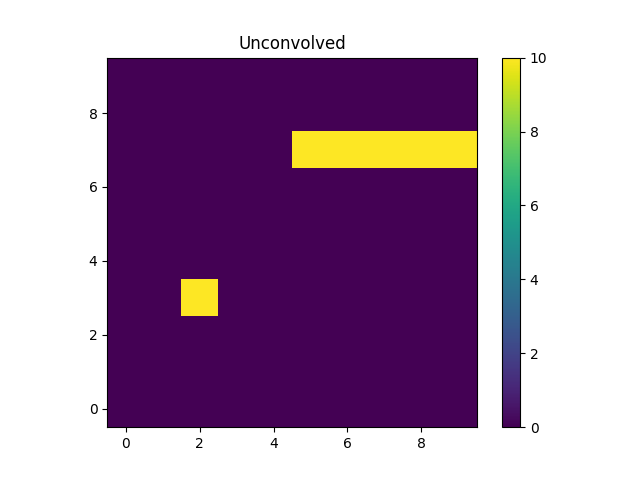
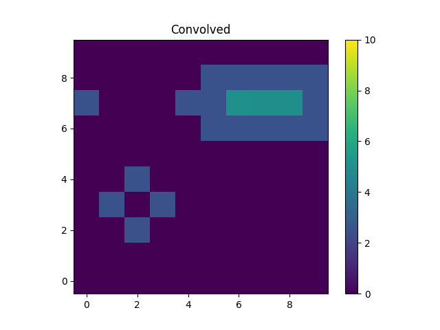

***********
Convolution
***********

.. todo::

   The convolution kernel may require grid points that are not within
   the requested range. The two-dimensional PSF models support this
   when using the Session layer, via the
   :py:func:`sherpa.astro.ui.set_psf` function. It is not yet obvious
   to me how this is handled at this level. The PHA case is handled
   by the :py:class:`sherpa.astro.instrument.RSPModelPHA` class
   (and related classes), but it is still not clear how to document
   and use.

   The example below needs to be updated to include the plotting code,
   that is the `imshow` (and other) matplotlib calls.

A convolution model requires both the evaluation grid *and* the
data to convolve. Examples include using a point-spread function
(:term:`PSF`) model to modify a two-dimensional model to account
for blurring due to the instrument (or other sources, such as
the atmosphere for ground-based Astronomical data sets),
or the redistribution of the counts as a function of energy
as modelled by the :term:`RMF` when analyzing astronomical
X-ray spectra.

.. note::

   In the following documentation we are going to use the term
   "convolution" to refer to any model that requires the data
   from another model, such as a model that reprocesses emission
   into another passband or that renormalises the data, even if
   it does not match the meaning of
   `convolution <https://en.wikipedia.org/wiki/Convolution>`_.

Creating a convolution kernel
=============================

For convolution-style models, there are normally two steps
to create a model component:

 1. create an instance of the convolution kernel

 2. apply the instance to the model components

The convolution kernel is not an instance of
:py:class:`sherpa.models.model.ArithmeticModel`, and so
can not be evaluated by passing it the data grid. Instead,
the kernel is used to wrap another model expression,
normally done by passing the model to be wrapped as the
argument to the model, and the result of this is then
a model that can be evaluated on the data grid.

.. note::

   Evaluating the kernel - such as `psf` in the example
   below - with a grid will raise an error like::

       ModelErr: attempted to create ArithmeticFunctionModel from non-callable object of type ndarray

.. _convolution-psf1d:

One-dimensional convolution with a PSF
======================================

In this example we want to convolve a model by the "kernel"
[5, 10, 3, 2], which requires creating a
:py:class:`sherpa.data.Data1D` instance to store the
data, and then pass it to :py:class:`sherpa.instrument.PSFModel`:

    >>> import numpy as np
    >>> from sherpa.data import Data1D
    >>> from sherpa.instrument import PSFModel
    >>> k = np.asarray([5, 10, 3, 2])
    >>> x = np.arange(k.size)
    >>> kernel = Data1D('kdata1', x, k)
    >>> psf1 = PSFModel('psf1', kernel=kernel)
    >>> print(psf1)
    psf1
       Param        Type          Value          Min          Max      Units
       -----        ----          -----          ---          ---      -----
       psf1.kernel  frozen       kdata1
       psf1.radial  frozen            0            0            1
       psf1.norm    frozen            1            0            1

To show how this model works we will use it to convolve
a :py:class:`~sherpa.models.basic.Box1D` model (this is chosen
since it has sharp edges and so the convolution is more obvious).

    >>> from sherpa.models.basic import Box1D
    >>> point = Box1D('pt')
    >>> point.xlow = 9.5
    >>> point.xhi = 10.5
    >>> print(point)
    pt
       Param        Type          Value          Min          Max      Units
       -----        ----          -----          ---          ---      -----
       pt.xlow      thawed          9.5 -3.40282e+38  3.40282e+38
       pt.xhi       thawed         10.5 -3.40282e+38  3.40282e+38
       pt.ampl      thawed            1           -1            1

The convolution case is created by applying the `psf1` model
to the `point` model (the :ref:`2D example <convolution-psf2d-convolve>`
below shows an example of applying a kernel to a
composite model):

    >>> convolved = psf1(point)
    >>> print(convolved)
    psf1(pt)
       Param        Type          Value          Min          Max      Units
       -----        ----          -----          ---          ---      -----
       pt.xlow      thawed          9.5 -3.40282e+38  3.40282e+38
       pt.xhi       thawed         10.5 -3.40282e+38  3.40282e+38
       pt.ampl      thawed            1           -1            1

.. _convolution-1d-fold:

The model can be evaluated both before and after convolution, by
passing it the data grid. Unlike normal model evaluation the
`PSFModel` class requires that its
:py:meth:`~sherpa.instrument.PSFModel.fold` model be called before
evaluation. This method pre-calculates terms needed for the
convolution (which is done using a fourier transform), and so needs
the grid over which it is to be applied. This is done by passing in a
:py:class:`~sherpa.data.Data` instance (in this case the Y data in the
:py:class:`~sherpa.data.Data1D` instance is not used so is set to
zero):

    >>> x = np.arange(6, 15)
    >>> blank = Data1D('blank', x, np.zeros(x.size))
    >>> psf1.fold(blank)

With this out of the way, we can compare the convolved to
un-convolved resuls::

    >>> y1 = point(x)
    >>> y2 = convolved(x)
    >>> for z in zip(x, y1, y2):
    ...     print("x: {:2d}  y: {:.0f}  convolved: {:.2f}".format(*z))
    x:  6  y: 0  convolved: 0.00
    x:  7  y: 0  convolved: 0.00
    x:  8  y: 0  convolved: 0.00
    x:  9  y: 0  convolved: 0.25
    x: 10  y: 1  convolved: 0.50
    x: 11  y: 0  convolved: 0.15
    x: 12  y: 0  convolved: 0.10
    x: 13  y: 0  convolved: 0.00
    x: 14  y: 0  convolved: 0.00

The :py:class:`~sherpa.instrument.PSFModel` instance has automatically
selected the largest pixel in the kernel as the center (in this case
the second element, 10), and has automatically re-normalized the
kernel. The parameters of the convolution kernel (in this case
``psf1``) can be changed to control the behavior.

    >>> print(psf1)
    psf1
       Param        Type          Value          Min          Max      Units
       -----        ----          -----          ---          ---      -----
       psf1.kernel  frozen       kdata1
       psf1.size    frozen            4            4            4
       psf1.center  frozen            2            2            2
       psf1.radial  frozen            0            0            1
       psf1.norm    frozen            1            0            1

.. note::

   The model parameters for the convolution kernel have changed
   :ref:`since earlier <convolution-psf1d>`, as the use of the
   :py:meth:`~sherpa.instrument.PSFModel.fold` method has added
   new parameters (in this case the ``size`` and ``center``
   parameters).

.. _convolution-psf2d:

Two-dimensional convolution with a PSF
======================================

The :py:class:`sherpa.astro.instrument.PSFModel` class augments the
behavior of :py:class:`sherpa.instrument.PSFModel` by supporting
images with a World Coordinate System (:term:`WCS`). For this example
we do not need this capability and so use the
:py:class:`sherpa.instrument.PSFModel` class directly.

.. _convolution-psf2d-create:

Including a PSF in a model expression
-------------------------------------

The "kernel" of the PSF is the actual data used to represent the
blurring, and can be given as a numeric array or as a Sherpa model.
In the following example a simple 3 by 3 array is used to represent
the PSF, but it first has to be converted into a
:py:class:`~sherpa.data.Data2D` object (this is similar to
the steps needed in the
:ref:`1D case <convolution-psf1d>` above):

    >>> from sherpa.data import Data2D
    >>> from sherpa.instrument import PSFModel
    >>> k = np.asarray([[0, 1, 0], [1, 0, 1], [0, 1, 0]])
    >>> yg, xg = np.mgrid[:3, :3]
    >>> kernel = Data2D('kdata', xg.flatten(), yg.flatten(), k.flatten(),
    ...                 shape=k.shape)
    >>> psf = PSFModel(kernel=kernel)
    >>> print(psf)
    psfmodel
       Param        Type          Value          Min          Max      Units
       -----        ----          -----          ---          ---      -----
       psfmodel.kernel frozen        kdata
       psfmodel.radial frozen            0            0            1
       psfmodel.norm frozen            1            0            1

As :ref:`shown below <convolution-psf2d-normalize>`, the data in the
PSF is renormalized so that its sum matches the ``norm`` parameter,
which here is set to 1.

The following example sets up a simple model expression which represents
the sum of a single pixel and a line of pixels, using
:py:class:`~sherpa.models.basic.Box2D` for both.

    >>> from sherpa.models.basic import Box2D
    >>> pt = Box2D('pt')
    >>> pt.xlow, pt.xhi = 1.5, 2.5
    >>> pt.ylow, pt.yhi = 2.5, 3.5
    >>> pt.ampl = 8
    >>> box = Box2D('box')
    >>> box.xlow, box.xhi = 4, 10
    >>> box.ylow, box.yhi = 6.5, 7.5
    >>> box.ampl = 10
    >>> unconvolved_mdl = pt + box
    >>> print(unconvolved_mdl)
    (pt + box)
       Param        Type          Value          Min          Max      Units
       -----        ----          -----          ---          ---      -----
       pt.xlow      thawed          1.5 -3.40282e+38  3.40282e+38
       pt.xhi       thawed          2.5 -3.40282e+38  3.40282e+38
       pt.ylow      thawed          2.5 -3.40282e+38  3.40282e+38
       pt.yhi       thawed          3.5 -3.40282e+38  3.40282e+38
       pt.ampl      thawed            8 -3.40282e+38  3.40282e+38
       box.xlow     thawed            4 -3.40282e+38  3.40282e+38
       box.xhi      thawed           10 -3.40282e+38  3.40282e+38
       box.ylow     thawed          6.5 -3.40282e+38  3.40282e+38
       box.yhi      thawed          7.5 -3.40282e+38  3.40282e+38
       box.ampl     thawed           10 -3.40282e+38  3.40282e+38

.. note::

   Although Sherpa provides the :py:class:`~sherpa.models.basic.Delta2D`
   class, it is suggested that alternatives such as
   :py:class:`~sherpa.models.basic.Box2D` be used instead, since a
   delta function is **very** sensitive to the location at which it
   is evaluated. However, including a ``Box2D`` component in a fit can still
   be problematic since the output of the model does not vary smoothly
   as any of the bin edges change, which is a challenge for the
   :doc:`optimisers provided with Sherpa <../optimisers/index>`.

.. _convolution-psf2d-convolve:

Rather than being another term in the model expression - that is,
an item that is added, subtracted, multiplied, or divided into an
existing expression - the PSF model "wraps" the model it is to convolve.
This can be a single model or - as in this case - a composite one::

    >>> convolved_mdl = psf(unconvolved_mdl)
    >>> print(convolved_mdl)
    psfmodel((pt + box))
       Param        Type          Value          Min          Max      Units
       -----        ----          -----          ---          ---      -----
       pt.xlow      thawed          1.5 -3.40282e+38  3.40282e+38
       pt.xhi       thawed          2.5 -3.40282e+38  3.40282e+38
       pt.ylow      thawed          2.5 -3.40282e+38  3.40282e+38
       pt.yhi       thawed          3.5 -3.40282e+38  3.40282e+38
       pt.ampl      thawed            8 -3.40282e+38  3.40282e+38
       box.xlow     thawed            4 -3.40282e+38  3.40282e+38
       box.xhi      thawed           10 -3.40282e+38  3.40282e+38
       box.ylow     thawed          6.5 -3.40282e+38  3.40282e+38
       box.yhi      thawed          7.5 -3.40282e+38  3.40282e+38
       box.ampl     thawed           10 -3.40282e+38  3.40282e+38

This new expression can be treated as any other Sherpa model, which means
that we can apply extra terms to it, such as adding a background
component that is not affected by the PSF::

    >>> from sherpa.models.basic import Const2D
    >>> bgnd = Const2D('bgnd')
    >>> bgnd.c0 = 0.25
    >>> print(convolved_mdl + bgnd)
    (psfmodel((pt + box)) + bgnd)
       Param        Type          Value          Min          Max      Units
       -----        ----          -----          ---          ---      -----
       pt.xlow      thawed          1.5 -3.40282e+38  3.40282e+38
       pt.xhi       thawed          2.5 -3.40282e+38  3.40282e+38
       pt.ylow      thawed          2.5 -3.40282e+38  3.40282e+38
       pt.yhi       thawed          3.5 -3.40282e+38  3.40282e+38
       pt.ampl      thawed            8 -3.40282e+38  3.40282e+38
       box.xlow     thawed            4 -3.40282e+38  3.40282e+38
       box.xhi      thawed           10 -3.40282e+38  3.40282e+38
       box.ylow     thawed          6.5 -3.40282e+38  3.40282e+38
       box.yhi      thawed          7.5 -3.40282e+38  3.40282e+38
       box.ampl     thawed           10 -3.40282e+38  3.40282e+38
       bgnd.c0      thawed         0.25 -3.40282e+38  3.40282e+38

In the following this extra term (``bgnd``) is not included to simplify
the comparison between the unconvolved and convolved versions.

.. _convolution-psf2d-evaluate:

Evaluating a model including a PSF
----------------------------------

The PSF-convolved model can be evaluated - in *most cases* - just as
is done for ordinary models. That is by supplying it with the grid
coordinates to use. However, the need to convolve the data with a
fixed grid does limit this somewhat.

For this example, a grid covering the points 0 to 9 inclusive is used
for each axis (with a unit pixel size), which means that the unconvolved
model can be evaluated with the following::

    >>> yg, xg = np.mgrid[:10, :10]
    >>> xg1d, yg1d = xg.flatten(), yg.flatten()
    >>> m1 = unconvolved_mdl(xg1d, yg1d).reshape(xg.shape)

An easier alternative, once the PSF is included, is to create an
empty dataset with the given grid (that is, a dataset for which we
do not care about the dependent axis), and use the
:py:meth:`~sherpa.models.model.Model.eval_model` method to
evaluate the model (the result for ``m1`` is the same whichever
approach is used)::

    >>> blank = Data2D('blank', xg1d, yg1d, np.ones(xg1d.shape), xg.shape)
    >>> m1 = blank.eval_model(unconvolved_mdl).reshape(xg.shape)

The "point source" is located at ``x = 2, y = 3`` and the line
starts at ``x=5`` and extends to the end of the grid (at ``y=7``).

.. note::

   In this example the image coordinates were chosen to be the same
   as those drawn by matplotlib. The ``extent`` parameter of the
   ``imshow`` call can be used when this correspondance does not
   hold.

As with :ref:`the 1D case <convolution-1d-fold>`, the
:py:meth:`~sherpa.instrument.PSFModel.fold` method must be called
before evaluation.

    >>> psf.fold(blank)
    >>> m2 = blank.eval_model(convolved_mdl).reshape(xg.shape)

The kernel used redistributes flux from the central pixel to its four
immediate neighbors equally, which is what has happened to the point
source at ``(2, 2)``. The result for the line is to blur the line
slightly, but note that the convolution has "wrapped around", so that
the flux that should have been placed into the pixel at ``(10, 7)``,
which is off the grid, has been moved to ``(0, 7)``.

.. note::

   If the `fold` method is not called then evaluating the model will
   raise the following exception::

       PSFErr: PSF model has not been folded

   Care must be taken to ensure that `fold` is called whenever the grid
   has changed. This suggests that the same PSF model should not be used
   in simultaneous fits, unless it is known that the grid is the same
   in the multiple datasets.

.. _convolution-psf2d-normalize:

The PSF Normalization
---------------------

Since the ``norm`` parameter of the PSF model was set to 1, the PSF
convolution is flux preserving, even at the edges thanks to the
wrap-around behavior of the fourier transform. This can be seen by
comparing the signal in the unconvolved and convolved images, which
are (to numerical precision) the same:

    >>> m1.sum()
    58.0
    >>> m2.sum()
    58.0

The use of a fourier transform means that low-level signal will be
found in many pixels which would expect to be 0. For example,
looking at the row of pixels at ``y = 7`` gives::

    >>> m2[7]
    array([2.50000000e+00, 1.73472348e-16, 5.20417043e-16, 4.33680869e-16,
           2.50000000e+00, 2.50000000e+00, 5.00000000e+00, 5.00000000e+00,
           5.00000000e+00, 2.50000000e+00])
