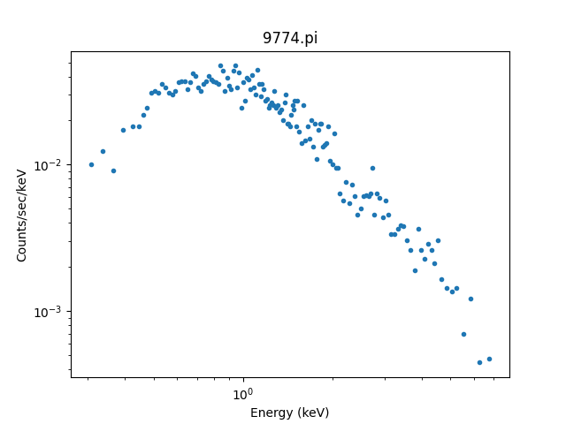
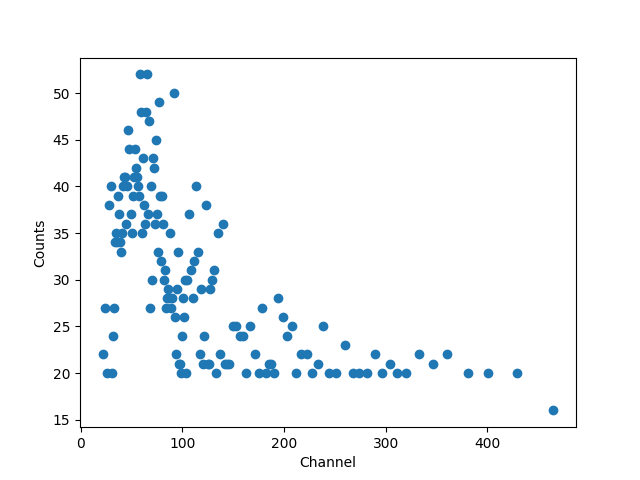
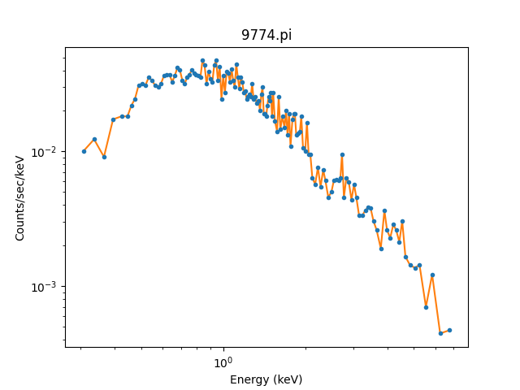
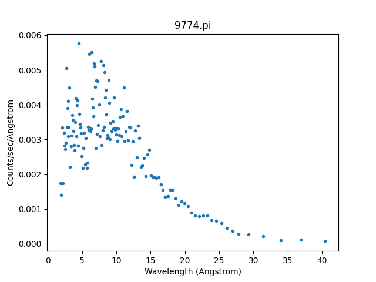
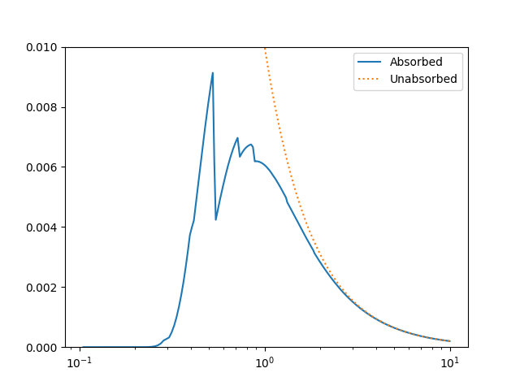
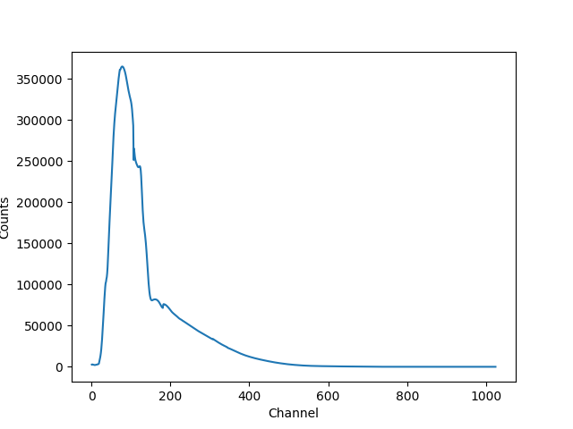
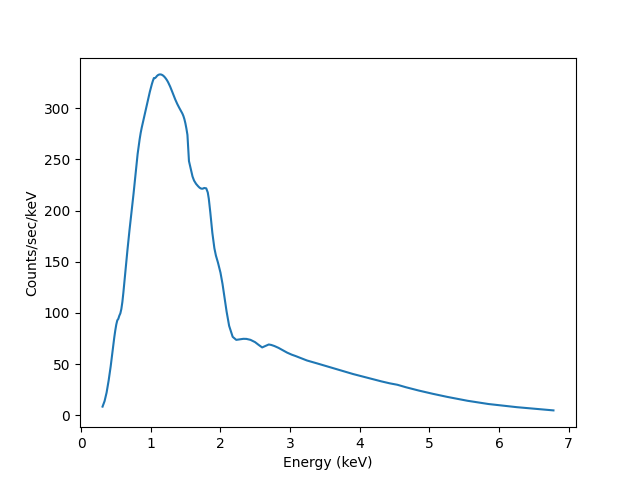
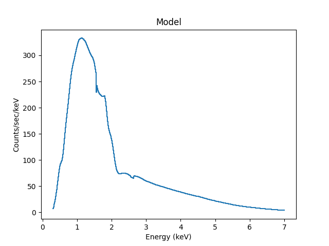
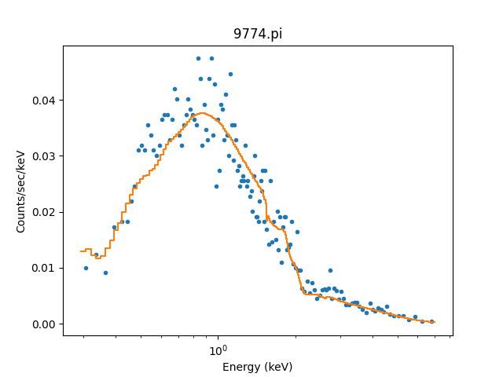

********
Examples
********

.. todo::

   The examples need a review; in particular, the PHA examples need
   to be cleaned up. There are several todo notes below.

   Maybe add a 2D image example with PSF convolution and exposure map.

   Can we link back to the section that describes each evaluation
   method (or introduces the concept)?

The following examples show the different ways that a model can
be evaluted, for a range of situations. The
:ref:`direct method <model_evaluate_example_oned_direct>` is
often sufficient, but for more complex cases it can be useful to
:ref:`ask a data object to evaluate the
model <model_evaluate_example_twod_via_data>`, particularly
if you want to include instrumental responses,
:ref:`such as a RMF and ARF <model_evaluate_example_pha>`.

.. _model_evaluate_example_oned_direct:

Evaluating a one-dimensional model directly
===========================================

In the following example a one-dimensional gaussian is evaluated
on a grid of 5 points by
:ref:`using the model object directly <evaluation_direct>`.
The first approch just calls the model with the evaluation
grid (here the array ``x``),
which uses the parameter values as defined in the model itself::

    >>> from sherpa.models.basic import Gauss1D
    >>> gmdl = Gauss1D()
    >>> gmdl.fwhm = 100
    >>> gmdl.pos = 5050
    >>> gmdl.ampl = 50
    >>> x = [4800, 4900, 5000, 5100, 5200]
    >>> y1 = gmdl(x)

The second uses the :py:meth:`~sherpa.models.model.Model.calc`
method, where the parameter values must be specified in the
call along with the grid on which to evaluate the model.
The order matches that of the parameters in the model, which can be
found from the
:py:attr:`~sherpa.models.model.Model.pars` attribute of the model::

    >>> [p.name for p in gmdl.pars]
    ['fwhm', 'pos', 'ampl']
    >>> y2 = gmdl.calc([100, 5050, 100], x)
    >>> y2 / y1
    array([ 2.,  2.,  2.,  2.,  2.])

Since in this case the amplitude (the last parameter value) is twice
that used to create ``y1`` the ratio is 2 for each bin.

.. _model_evaluate_example_twod_via_data:

Evaluating a 2D model to match a Data2D object
==============================================

In the following example the model is evaluated on a grid
specified by a dataset, in this case a set of two-dimensional
points stored in a :py:class:`~sherpa.data.Data2D` object.
First the data is set up (there are only four points
in this example to make things easy to follow).

::

    >>> from sherpa.data import Data2D
    >>> x0 = [1.0, 1.9, 2.4, 1.2]
    >>> x1 = [-5.0, -7.0, 2.3, 1.2]
    >>> y = [12.1, 3.4, 4.8, 5.2]
    >>> twod = Data2D('data', x0, x1, y)

For demonstration purposes, the :py:class:`~sherpa.models.basic.Box2D`
model is used, which represents a rectangle (any points within the
:py:attr:`~sherpa.models.basic.Box2D.xlow`
to
:py:attr:`~sherpa.models.basic.Box2D.xhi`
and
:py:attr:`~sherpa.models.basic.Box2D.ylow`
to
:py:attr:`~sherpa.models.basic.Box2D.yhi`
limits are set to the
:py:attr:`~sherpa.models.basic.Box2D.ampl`
value, those outside are zero).

::

    >>> from sherpa.models.basic import Box2D
    >>> mdl = Box2D('mdl')
    >>> mdl.xlow = 1.5
    >>> mdl.xhi = 2.5
    >>> mdl.ylow = -9.0
    >>> mdl.yhi = 5.0
    >>> mdl.ampl = 10.0

The coverage have been set so that some of the points are
within the "box", and so are set to the amplitude value
when the model is evaluated.

::

    >>> twod.eval_model(mdl)
    array([  0.,  10.,   10.,   0.])

The :py:meth:`~sherpa.data.Data.eval_model` method evaluates
the model on the grid defined by the data set, so it is the same
as calling the model directly with these values::

    >>> twod.eval_model(mdl) == mdl(x0, x1)
    array([ True,  True,  True,  True])

The :py:meth:`~sherpa.data.Data.eval_model_to_fit` method
will apply any filter associated with the data before
evaluating the model. At this time there is no filter
so it returns the same as above.

::

    >>> twod.eval_model_to_fit(mdl)
    array([  0.,  10.,   10.,   0.])

Adding a simple spatial filter - that excludes one of
the points within the box - with
:py:meth:`~sherpa.data.Data2D.ignore` now results
in a difference in the outputs of
:py:meth:`~sherpa.data.Data.eval_model`
and
:py:meth:`~sherpa.data.Data.eval_model_to_fit`,
as shown below. The call to
:py:meth:`~sherpa.data.Data.get_indep`
is used to show the grid used by
:py:meth:`~sherpa.data.Data.eval_model_to_fit`.

::

    >>> twod.ignore(x0lo=2, x0hi=3, x1lo=0, x1hi=10)
    >>> twod.eval_model(mdl)
    array([  0.,  10.,   10.,   0.])
    >>> twod.get_indep(filter=True)
    (array([ 1. ,  1.9,  1.2]), array([-5. , -7. ,  1.2]))
    >>> twod.eval_model_to_fit(mdl)
    array([  0.,  10.,   0.])

.. _model_evaluate_example_pha:

X-ray data (:py:mod:`~sherpa.astro.data.DataPHA`)
=================================================

:term:`PHA` data is more complicated than other data types in Sherpa
because of the need to convert between the units used by the model
(energy or wavelength) and the units of the data (channel). As a user
you will generally be thinking in keV or Angstroms, but the
:py:class:`~sherpa.astro.data.DataPHA` class has to convert to channel
units internally. The :term:`PHA` data format is mainly used for
astronomical X-ray observatories, such as `Chandra
<https://cxc.harvard.edu/>`_, `XMM-Newton
<https://sci.esa.int/web/xmm-newton>`_ or about a dozen other missions.

First we will load in a PHA dataset, along with its response
files (:term:`ARF` and :term:`RMF`), and have a look at how we can
interrogate the object.

::

   >>> from sherpa.astro.io import read_pha
   >>> pha = read_pha('sherpa-test-data/sherpatest/9774.pi')

This will print::

   read ARF file 9774.arf
   read RMF file 9774.rmf
   read background file 9774_bg.pi

We can see that the ARF, RMF, and a background dataset have
automatically been loaded for us. They can be loaded manually - with
:py:func:`sherpa.astro.io.read_arf`, :py:func:`sherpa.astro.io.read_rmf`,
and :py:func:`sherpa.astro.io.read_pha` -
and set with :py:meth:`~sherpa.astro.data.DataPHA.set_arf`,
:py:meth:`~sherpa.astro.data.DataPHA.set_rmf`, and
:py:meth:`~sherpa.astro.data.DataPHA.set_background`
methods of the :py:class:`~sherpa.astro.data.DataPHA` class::

   >>> pha
   <DataPHA data set instance 'sherpa-test-data/sherpatest/9774.pi'>
   >>> pha.get_background()
   <DataPHA data set instance 'sherpa-test-data/sherpatest/9774_bg.pi'>
   >>> pha.get_arf()
   <DataARF data set instance 'sherpa-test-data/sherpatest/9774.arf'>
   >>> pha.get_rmf()
   <DataRMF data set instance 'sherpa-test-data/sherpatest/9774.rmf'>

This is a Chandra imaging-mode ACIS observation, as shown
by header keywords defined by :term:`OGIP`, and so it has
1024 channels::

   >>> pha.header['INSTRUME']
   'ACIS'
   >>> pha.header['DETNAM']
   'ACIS-23567'
   >>> pha.channel.size
   1024

The raw data is available from the
:py:attr:`~sherpa.astro.data.DataPHA.channel` and
:py:attr:`~sherpa.astro.data.DataPHA.counts` attributes, but
it is better to use the various methods, such as
:py:meth:`~sherpa.astro.data.DataPHA.get_indep` and
:py:meth:`~sherpa.astro.data.DataPHA.get_dep`, to
access the data.

PHA data generally requires filtering to exclude parts of the
data, so let's pick a common energy range for ACIS data,
0.3 to 7 keV, and then use that range - which is indicated
by the :py:attr:`~sherpa.astro.data.DataPHA.mask` attribute -
to ensure we only group the data within this range::

   >>> pha.set_analysis('energy')
   >>> pha.notice(0.3, 7)
   >>> tabs = ~pha.mask
   >>> pha.group_counts(20, tabStops=tabs)

The standard :doc:`Sherpa plotting <../plots/index>` setup can
be used to display the data. However we
have a PHA-specific class, :py:class:`~sherpa.astro.plot.DataPHAPlot`,
which has better support for PHA data, as
:ref:`discussed below <examples_pha_plot_options>`::

   >>> from sherpa.astro.plot import DataPHAPlot
   >>> dplot = DataPHAPlot()
   >>> dplot.prepare(pha)
   >>> dplot.plot(xlog=True, ylog=True)

.. _example_pha_data:

It can be useful to create these plots manually, so let's step
through the steps. First we can access the data in channel
units using :py:meth:`~sherpa.astro.data.DataPHA.get_indep`
and :py:meth:`~sherpa.astro.data.DataPHA.get_dep`,
noting that `get_indep` returns a tuple so we want the
first element::

   >>> chans, = pha.get_indep(filter=True)
   >>> counts = pha.get_dep(filter=True)
   >>> chans.size, counts.size
   (460, 143)

As shown above, the data sizes do not match. The counts has been grouped
while the channels data remains ungrouped. We can use the
:py:meth:`~sherpa.astro.data.DataPHA.apply_filter` method to
group the channel data, selecting the mid-point of each group, and
show the "raw" data (you can see that each group has at least
20 counts, except for the last one)::

   >>> gchans = pha.apply_filter(chans, pha._middle)
   >>> gchans.size
   143
   >>> import matplotlib.pyplot as plt
   >>> plt.clf()
   >>> lines = plt.plot(gchans, counts, 'o')
   >>> xlabel = plt.xlabel('Channel')
   >>> ylabel = plt.ylabel('Counts')

While the channel data is important, it doesn't let us create
a plot like :ref:`above <example_pha_data>`. For this we
want to use the
:py:meth:`~sherpa.astro.data.DataPHA.get_x` and
:py:meth:`~sherpa.astro.data.DataPHA.get_y` methods,
which return data matching the analysis setting and,
for the dependent axis, normalizing by bin-width and
exposure time as appropriate. In this case we have selected
the "energy" setting so units are KeV for the X axis.
We can overplot the new data onto the previous plot to
show they match::

   >>> x = pha.get_x()
   >>> x.min(), x.max()
   (0.008030000200960785, 14.943099975585938)
   >>> x = pha.apply_filter(x, pha._middle)
   >>> y = pha.get_y(filter=True)
   >>> dplot.plot(xlog=True, ylog=True)
   >>> lines = plt.plot(x, y)

As mentioned, the :py:class:`~sherpa.astro.plot.DataPHAPlot` class
handles the units for you. Switching the analysis setting
to wavelength will create a plot in Angstroms::

   >>> pha.set_analysis('wave')
   >>> pha.get_x().max()
   1544.0122577477066
   >>> from sherpa.plot import DataPlot
   >>> wplot = DataPlot()
   >>> wplot.prepare(pha)
   >>> wplot.plot(linestyle='solid', xlog=True, ylog=True)

.. _examples_pha_plot_options:

.. note::
   By setting the ``linestyle`` option we get, along with a point
   at the center of each group, a histogram-style line is drawn
   indicating each group. Note that this is the major difference
   to the :py:class:`sherpa.plot.DataPlot` class, which would
   just draw a line connecting the points.

For now we want to make sure we complete our analysis in
energy units::

   >>> pha.set_analysis('energy')

We can finally think about evaluating a model. To start with
we look at a physically-motivated model - an
absorbed (:py:class:`~sherpa.astro.xspec.XSphabs`)
powerlaw (:py:class:`~sherpa.models.basic.PowLaw1D`)::

   >>> from sherpa.models.basic import PowLaw1D
   >>> from sherpa.astro.xspec import XSphabs
   >>> pl = PowLaw1D()
   >>> gal = XSphabs()
   >>> mdl = gal * pl
   >>> pl.gamma = 1.7
   >>> gal.nh = 0.2
   >>> print(mdl)
   (phabs * powlaw1d)
      Param        Type          Value          Min          Max      Units
      -----        ----          -----          ---          ---      -----
      phabs.nH     thawed          0.2            0        1e+06 10^22 atoms / cm^2
      powlaw1d.gamma thawed          1.7          -10           10
      powlaw1d.ref frozen            1 -3.40282e+38  3.40282e+38
      powlaw1d.ampl thawed            1            0  3.40282e+38

The model can be evaluated directly. XSPEC models use units of
KeV for the X axis, so we generate a grid between 0.1 and 10 keV
for use. As the data is binned we call the models - here the
commbined model labelled "Absorbed" and just the powerlaw
component labelled "Unabsorbed" - with both low and high edges::

   >>> import numpy as np
   >>> egrid = np.arange(0.1, 10, 0.01)
   >>> elo, ehi = egrid[:-1], egrid[1:]
   >>> emid = (elo + ehi) / 2
   >>> plt.clf()
   >>> lines = plt.plot(emid, mdl(elo, ehi), label='Absorbed')
   >>> lines = plt.plot(emid, pl(elo, ehi), ':', label='Unabsorbed')
   >>> plt.xscale('log')
   >>> ylim = plt.ylim(0, 0.01)
   >>> legend = plt.legend()

The Y axis has been restricted because the absorption is quite severe
at low energies!

However, we need to include the response information -
:term:`ARF` and :term:`RMF` - in order to be able to
compare to the data. The easiest way to do this is to
use the :py:class:`~sherpa.astro.instrument.Response1D`
class to extract the ARF amd RMF from the PHA dataset,
and then apply it to create a model expression, here
called ``full``, which includes the corrections::

   >>> from sherpa.astro.instrument import Response1D
   >>> rsp = Response1D(pha)
   >>> full = rsp(mdl)
   >>> print(full)
   apply_rmf(apply_arf((75141.227687398 * (phabs * powlaw1d))))
      Param        Type          Value          Min          Max      Units
      -----        ----          -----          ---          ---      -----
      phabs.nH     thawed          0.2            0        1e+06 10^22 atoms / cm^2
      powlaw1d.gamma thawed          1.7          -10           10
      powlaw1d.ref frozen            1 -3.40282e+38  3.40282e+38
      powlaw1d.ampl thawed            1            0  3.40282e+38

Note that the full model expression not only includes the
ARF and RMF terms, but also includes the exposure time of
the dataset. This ensures that the output has units of counts,
for XSPEC additive models whose normalization is per-second,
or defines the model amplitude to ber per-second, for models
such as ``PowLaw1D``.

.. note::

   Instead of using :py:class:`~sherpa.astro.instrument.Response1D`
   you can directly create a model using
   :py:class:`~sherpa.astro.instrument.RSPModelPHA` or
   :py:class:`~sherpa.astro.instrument.RSPModelNoPHA` with logic
   like

   >>> from sherpa.astro.instrument import RSPModelPHA
   >>> full = RSPModelPHA(arf, rmf, pha, pha.exposure * mdl)  # doctest: +SKIP

   Note that the exposure time is not automatically included for you as it
   is with ``Response1D``.

If we evaluate this model we get a surprise! The grid arguments
are ignored (as long as something is sent in), and instead the
model is evaluated on the channel group (hence the evaluated
model as 1024 bins in this example)::

   >>> elo.size
   989
   >>> full(elo, ehi).size
   1024
   >>> full([1, 2, 3]).size
   1024
   >>> np.all(full(elo, ehi) == full([1, 2, 3]))
   True

The evaluated model can therefore be displayed with a
call such as::

   >>> plt.clf()
   >>> lines = plt.plot(pha.channel, full(pha.channel))
   >>> xlabel = plt.xlabel('Channel')
   >>> ylabel = plt.ylabel('Counts')

The reason for the ridiculously-large count range is because
the powerlaw amplitude has not been changed from its
default value of 1!

The :py:meth:`~sherpa.astro.data.DataPHA.eval_model` and
:py:meth:`~sherpa.astro.data.DataPHA.eval_model_to_fit` methods
can be used, but they **must** be applied to a response model
(e.g. ``full``), otherwise the output will be meaningless::

   >>> y1 = pha.eval_model(full)
   >>> y2 = pha.eval_model_to_fit(full)
   >>> y1.size, y2.size
   (1024, 143)

The ``eval_model`` output is ungrouped whereas the
``eval_model_to_fit`` output is grouped and filtered to
match the PHA dataset. In order to create a "nice" plot
we want to use energy units, which requires converting
between channel and energy units. For this we take advantage of
the data in the ``EBOUNDS`` extension of the RMF, which provides
an **approximate** mapping from channel to energy for visualization
purposes only. These arrays are available as the
:py:attr:`~sherpa.astro.data.DataRMF.e_min`
and
:py:attr:`~sherpa.astro.data.DataRMF.e_max`
attributes of the
:py:class:`~sherpa.astro.data.DataRMF` object returned by
:py:meth:`~sherpa.astro.data.DataPHA.get_rmf`, and we can
group them as we did earlier (except for chosing the
``min`` and ``max`` labels for defining the bounds)::

   >>> rmf = pha.get_rmf()
   >>> rmf.e_min.size, rmf.e_max.size
   (1024, 1024)
   >>> xlo = pha.apply_filter(rmf.e_min, pha._min)
   >>> xhi = pha.apply_filter(rmf.e_max, pha._max)

With these, we can convert the counts values returned by
``eval_model_to_fit`` to counts per keV per second
(using the :py:attr:`~sherpa.astro.data.DataARF.exposure`
attribute to get the exposure time)::

   >>> x2 = pha.get_x()
   >>> xmid = pha.apply_filter(x2, pha._middle)
   >>> plt.clf()
   >>> lines = plt.plot(xmid, y2 / (xhi - xlo) / pha.exposure)
   >>> xlabel = plt.xlabel('Energy (keV)')
   >>> ylable = plt.ylabel('Counts/sec/keV')

We can also use the Astronomy-specific
:py:class:`~sherpa.astro.plot.ModelHistogram` plotting
class to display the model data without needing to
convert anything::

   >>> from sherpa.astro.plot import ModelHistogram
   >>> mplot = ModelHistogram()
   >>> mplot.prepare(pha, full)
   >>> mplot.plot()

The difference to the previous plot is that this one
uses a histogram to display each bin while the previous
version connected the mid-point of each bin (in this case
the bins are small so it's hard to see much difference).

We can use the model including the response to
:doc:`fit the data <../fit/index>` (here I am not going
to tweak the statistic choice or optimiser which you should
consider)::

   >>> from sherpa.fit import Fit
   >>> fit = Fit(pha, full)
   >>> res = fit.fit()
   >>> print(res.format())
   Method                = levmar
   Statistic             = chi2gehrels
   Initial fit statistic = 3.34091e+11
   Final fit statistic   = 100.348 at function evaluation 33
   Data points           = 143
   Degrees of freedom    = 140
   Probability [Q-value] = 0.995322
   Reduced statistic     = 0.716768
   Change in statistic   = 3.34091e+11
      phabs.nH       0.0129623    +/- 0.00727297
      powlaw1d.gamma   1.78432      +/- 0.0459881
      powlaw1d.ampl   7.17014e-05  +/- 2.48851e-06

We can see the amplitude has changed from 1 to :math:`\sim 10^{-4}`,
which should make the predicted counts a lot more believable!
We can display the data and model together::

   >>> dplot.prepare(pha)
   >>> dplot.plot(xlog=True)
   >>> mplot2 = ModelHistogram()
   >>> mplot2.prepare(pha, full)
   >>> mplot2.overplot()

Note that this example has not tried to subtract the background
or fit it!
