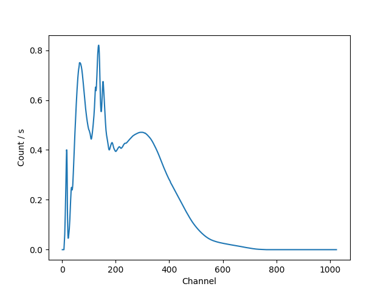
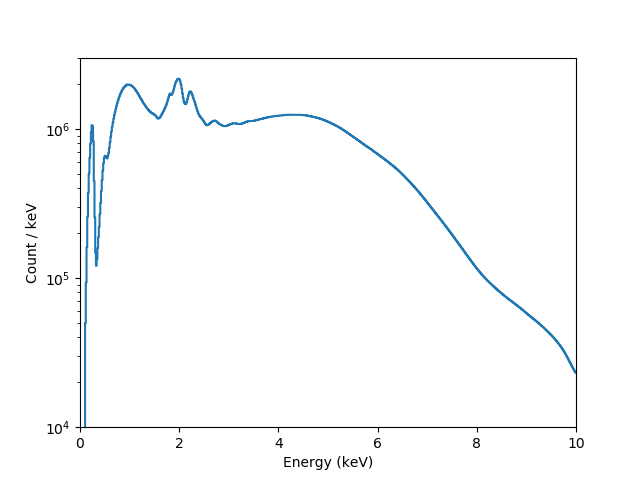
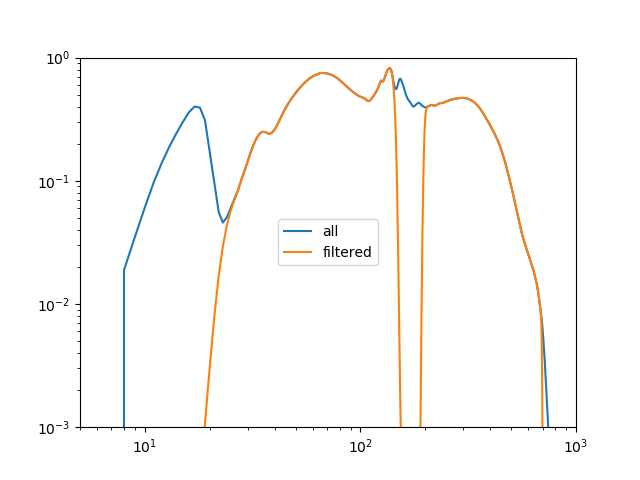

********   
Examples
********

.. todo::

   The examples need a review; in particular, the PHA examples need
   to be cleaned up. There are several todo notes below.

   Maybe add a 2D image example with PSF convolution and exposure map.

   Can we link back to the section that describes each evaluation
   method (or introduces the concept)?
   
The following examples show the different ways that a model can
be evaluted, for a range of situations. The
:ref:`direct method <model_evaluate_example_oned_direct>` is
often sufficient, but for more complex cases it can be useful to
:ref:`ask a data object to evaluate the
model <model_evaluate_example_twod_via_data>`, particularly
if you want to include instrumental responses,
:ref:`such as a RMF and ARF <model_evaluate_example_pha_via_data>`.

.. _model_evaluate_example_oned_direct:

Evaluating a one-dimensional model directly
===========================================

In the following example a one-dimensional gaussian is evaluated
on a grid of 5 points by
:ref:`using the model object directly <evaluation_direct>`.
The first approch just calls the model with the evaluation
grid (here the array ``x``),
which uses the parameter values as defined in the model itself::
  
    >>> from sherpa.models.basic import Gauss1D
    >>> gmdl = Gauss1D()
    >>> gmdl.fwhm = 100
    >>> gmdl.pos = 5050
    >>> gmdl.ampl = 50
    >>> x = [4800, 4900, 5000, 5100, 5200]
    >>> y1 = gmdl(x)

The second uses the :py:meth:`~sherpa.models.model.Model.calc`
method, where the parameter values must be specified in the
call along with the grid on which to evaluate the model.
The order matches that of the parameters in the model, which can be
found from the
:py:attr:`~sherpa.models.model.Model.pars` attribute of the model::
    
    >>> [p.name for p in gmdl.pars]
    ['fwhm', 'pos', 'ampl']
    >>> y2 = gmdl.calc([100, 5050, 100], x)
    >>> y2 / y1
    array([ 2.,  2.,  2.,  2.,  2.])

Since in this case the amplitude (the last parameter value) is twice
that used to create ``y1`` the ratio is 2 for each bin.

.. _model_evaluate_example_twod_via_data:

Evaluating a 2D model to match a Data2D object
==============================================

In the following example the model is evaluated on a grid
specified by a dataset, in this case a set of two-dimensional
points stored in a :py:class:`~sherpa.data.Data2D` object.
First the data is set up (there are only four points
in this example to make things easy to follow).

::
   
    >>> from sherpa.data import Data2D
    >>> x0 = [1.0, 1.9, 2.4, 1.2]
    >>> x1 = [-5.0, -7.0, 2.3, 1.2]
    >>> y = [12.1, 3.4, 4.8, 5.2]
    >>> twod = Data2D('data', x0, x1, y)

For demonstration purposes, the :py:class:`~sherpa.models.basic.Box2D`
model is used, which represents a rectangle (any points within the
:py:attr:`~sherpa.models.basic.Box2D.xlow`
to
:py:attr:`~sherpa.models.basic.Box2D.xhi`
and
:py:attr:`~sherpa.models.basic.Box2D.ylow`
to
:py:attr:`~sherpa.models.basic.Box2D.yhi`
limits are set to the
:py:attr:`~sherpa.models.basic.Box2D.ampl` 
value, those outside are zero).

::

    >>> from sherpa.models.basic import Box2D
    >>> mdl = Box2D('mdl')
    >>> mdl.xlow = 1.5
    >>> mdl.xhi = 2.5
    >>> mdl.ylow = -9.0
    >>> mdl.yhi = 5.0
    >>> mdl.ampl = 10.0

The coverage have been set so that some of the points are
within the "box", and so are set to the amplitude value
when the model is evaluated.

::
    
    >>> twod.eval_model(mdl)
    array([  0.,  10.,   10.,   0.])

The :py:meth:`~sherpa.data.Data.eval_model` method evaluates
the model on the grid defined by the data set, so it is the same
as calling the model directly with these values::

    >>> twod.eval_model(mdl) == mdl(x0, x1)
    array([ True,  True,  True,  True], dtype=bool)

The :py:meth:`~sherpa.data.Data.eval_model_to_fit` method
will apply any filter associated with the data before
evaluating the model. At this time there is no filter
so it returns the same as above.

::

    >>> twod.eval_model_to_fit(mdl)
    array([  0.,  10.,   10.,   0.])

Adding a simple spatial filter - that excludes one of
the points within the box - with
:py:meth:`~sherpa.data.Data2D.ignore` now results
in a difference in the outputs of
:py:meth:`~sherpa.data.Data.eval_model`
and
:py:meth:`~sherpa.data.Data.eval_model_to_fit`,
as shown below. The call to
:py:meth:`~sherpa.data.Data.get_indep`
is used to show the grid used by    
:py:meth:`~sherpa.data.Data.eval_model_to_fit`.

::
   
    >>> twod.ignore(x0lo=2, x0hi=3, x1l0=0, x1hi=10)
    >>> twod.eval_model(mdl)
    array([  0.,  10.,   10.,   0.])
    >>> twod.get_indep(filter=True)
    (array([ 1. ,  1.9,  1.2]), array([-5. , -7. ,  1.2]))
    >>> twod.eval_model_to_fit(mdl)
    array([  0.,  10.,   0.])
    
.. _model_evaluate_example_pha_via_data:

Evaluating a model using a DataPHA object
=========================================

.. todo::

   Not convinced model evaluation is correct here; do I need
   to add the instrument model in or not? I am pretty sure
   that, as written, it does *not* include the response
   information. So, could compare model evaluation without
   and with the instrument model.
   
This example is similar to the
:ref:`two-dimensional case above <model_evaluate_example_twod_via_data>`,
in that it again shows the differences between the
:py:meth:`~sherpa.astro.data.DataPHA.eval_model`
and
:py:meth:`~sherpa.astro.data.DataPHA.eval_model_to_fit`
methods. The added complication in this
case is that the response information provided with a PHA file
is used to convert between the "native" axis of the
PHA file (channels) and that of the model (energy or
wavelength). This conversion is handled automatically
by the two methods (the
:ref:`following example <model_evaluate_example_pha_directly>`
shows how this can be done manually). 

To start with, the data is loaded from a file, which also loads
in the associated :term:`ARF` and :term:`RMF` files::

    >>> from sherpa.astro.io import read_pha
    >>> pha = read_pha('3c273.pi')
    WARNING: systematic errors were not found in file '3c273.pi'
    statistical errors were found in file '3c273.pi' 
    but not used; to use them, re-read with use_errors=True
    read ARF file 3c273.arf
    read RMF file 3c273.rmf
    WARNING: systematic errors were not found in file '3c273_bg.pi'
    statistical errors were found in file '3c273_bg.pi' 
    but not used; to use them, re-read with use_errors=True
    read background file 3c273_bg.pi
    >>> pha
    <DataPHA data set instance '3c273.pi'>
    >>> pha.get_arf()
    <DataARF data set instance '3c273.arf'>
    >>> pha.get_rmf()
    <DataRMF data set instance '3c273.rmf'>

The returned object - here ``pha`` - is an instance of the
:py:class:`sherpa.astro.data.DataPHA` class - which has a number
of attributes and methods specialized to handling PHA data.

This particular file has grouping information in it, that it it contains
``GROUPING`` and ``QUALITY`` columns, so Sherpa
applies them: that is, the number of bins over which the data is
analysed is smaller than the number of channels in the file because
each bin can consist of multiple channels. For this file,
there are 46 bins after grouping (the ``filter`` argument to the
:py:meth:`~sherpa.astro.data.DataPHA.get_dep` call applies both
filtering and grouping steps, but so far no filter has been applied)::

    >>> pha.channel.size
    1024
    >>> pha.get_dep().size
    1024
    >>> pha.grouped
    True
    >>> pha.get_dep(filter=True).size
    46

A filter - in this case to restrict to only bins that cover the
energy range 0.5 to 7.0 keV - is applied with the
:py:meth:`~sherpa.astro.data.DataPHA.notice` call, which
removes four bins for this particular data set::
    
    >>> pha.set_analysis('energy')
    >>> pha.notice(0.5, 7.0)
    >>> pha.get_dep(filter=True).size
    42

A power-law model (:py:class:`~sherpa.models.basic.PowLaw1D`) is
created and evaluated by the data object::
  
    >>> from sherpa.models.basic import PowLaw1D
    >>> mdl = PowLaw1D()
    >>> y1 = pha.eval_model(mdl)
    >>> y2 = pha.eval_model_to_fit(mdl)
    >>> y1.size
    1024
    >>> y2.size
    42

The :py:meth:`~sherpa.astro.data.DataPHA.eval_model` call
evaluates the model over the full dataset and *does not*
apply any grouping, so it returns a vector with 1024 elements.
In contrast, :py:meth:`~sherpa.astro.data.DataPHA.eval_model_to_fit`
applies *both* filtering and grouping, and returns a vector that
matches the data (i.e. it has 42 elements).

The filtering and grouping information is *dynamic*, in that it
can be changed without having to re-load the data set. The
:py:meth:`~sherpa.astro.data.DataPHA.ungroup` call removes
the grouping, but leaves the 0.5 to 7.0 keV energy filter:

    >>> pha.ungroup()
    >>> y3 = pha.eval_model_to_fit(mdl)
    >>> y3.size
    644

.. todo::   

   add in a way to get the X axis after grouping, if we have it;
   maybe the apply_grouping call of the data object? Or the to_fit
   option? Also to_plot.

.. _model_evaluate_example_pha_directly:

Evaluating a model using PHA responses
======================================

.. todo::
   
   Should this just use Response1D directly?

The :py:class:`sherpa.astro.data.DataPHA` class handles the
response information automatically, but it is possible to
directly apply the response information to a model using
the :py:mod:`sherpa.astro.instrument` module. In the following
example the
:py:class:`~sherpa.astro.instrument.RSPModelNoPHA`
and    
:py:class:`~sherpa.astro.instrument.RSPModelPHA`
classes are used to wrap a power-law model
(:py:class:`~sherpa.models.basic.PowLaw1D`)
so that the
instrument responses - the :term:`ARF` and :term:`RMF` -
are included in the model evaluation.

::

    >>> from sherpa.astro.io import read_arf, read_rmf
    >>> arf = read_arf('3c273.arf')
    >>> rmf = read_rmf('3c273.rmf')
    >>> rmf.detchans
    1024

The number of channels in the RMF - that is, the number of bins over which
the RMF is defined - is 1024.
    
    >>> from sherpa.models.basic import PowLaw1D
    >>> mdl = PowLaw1D()

The :py:class:`~sherpa.astro.instrument.RSPModelNoPHA` class
models the inclusion of both the ARF and RMF::
    
    >>> from sherpa.astro.instrument import RSPModelNoPHA
    >>> inst = RSPModelNoPHA(arf, rmf, mdl)
    >>> inst
    <RSPModelNoPHA model instance 'apply_rmf(apply_arf(powlaw1d))'>
    >>> print(inst)
    apply_rmf(apply_arf(powlaw1d))
       Param        Type          Value          Min          Max      Units
       -----        ----          -----          ---          ---      -----
       powlaw1d.gamma thawed            1          -10           10           
       powlaw1d.ref frozen            1 -3.40282e+38  3.40282e+38           
       powlaw1d.ampl thawed            1            0  3.40282e+38           

.. note::

   The RMF and ARF are represented as models that "enclose" the
   spectrum - that is, they are written ``apply_rmf(model)`` and
   ``apply_arf(model)`` rather than ``rmf * model`` - since they
   may perform a convolution or rebinning (ARF) of the model
   output.
   
The return value (``inst``) behaves as a normal Shepra model, for
example::

    >>> from sherpa.models.model import ArithmeticModel
    >>> isinstance(inst, ArithmeticModel)
    True
    >>> inst.pars
    (<Parameter 'gamma' of model 'powlaw1d'>,
     <Parameter 'ref' of model 'powlaw1d'>,
     <Parameter 'ampl' of model 'powlaw1d'>)

The model can therefore be evaluated by calling it
with a grid (as used in the :ref:`first example
above <model_evaluate_example_oned_direct>`), except that
the input grid is ignored and the "native" grid of the
response information is used. In this case, no matter the
size of the one-dimensional array passed to ``inst``, the
output has 1024 elements (matching the number of channels in
the RMF)::

    >>> inst(np.arange(1, 1025))
    array([ 0.,  0.,  0., ...,  0.,  0.,  0.])
    >>> inst([0.1, 0.2, 0.3])
    array([ 0.,  0.,  0., ...,  0.,  0.,  0.])
    >>> inst([0.1, 0.2, 0.3]).size
    1024
    >>> inst([10, 20]) == inst([])
    array([ True,  True,  True, ...,  True,  True,  True], dtype=bool)

.. todo::

   Explain - as a note - the reason why it looks like the model
   evaluates to 0

   >>> inst([]).sum()
   202.6242538153944
    
The output of this call represents the number of counts expected
in each bin::

    >>> chans = np.arange(rmf.offset, rmf.offset + rmf.detchans)
    >>> ydet = inst(chans)
    >>> plt.plot(chans, ydet)
    >>> plt.xlabel('Channel')
    >>> plt.ylabel('Count / s')

.. note::

   The interpretation of the model output as being in units of "counts"
   (or a rate)
   depends on the normalisation (or amplitude) of the model components,
   and whether any term representing the exposure time has been included.
   
   XSPEC additive models - such as :py:class:`~sherpa.astro.xspec.XSapec` -
   return values that have units of photon/cm^2/s (that is, the spectrum
   is integrated across each bin), which when passed through the
   ARF and RMF results in count/s (the ARF has units of cm^2 and the
   RMF can be thought of as converting photons to counts).
   The Sherpa models, such as :py:class:`~sherpa.models.basic.PowLaw1D`,
   do not in general have units (so that the models can be applied
   to different data sets). This means that the interpretation of
   the normalization or amplitude term depends on how the model
   is being used.
   
The data in the ``EBOUNDS`` extension of the RMF - which provides
an **approximate** mapping from channel to energy for visualization
purposes only - is available as the
:py:attr:`~sherpa.astro.data.DataRMF.e_min`
and
:py:attr:`~sherpa.astro.data.DataRMF.e_max`
attributes of the
:py:class:`~sherpa.astro.data.DataRMF` object returned by
:py:func:`~sherpa.astro.io.read_rmf`.
The ARF object may contain an
exposure time, in its
:py:attr:`~sherpa.astro.data.DataARF.exposure`
attribute::

    >>> print(rmf)
    name     = 3c273.rmf
    detchans = 1024
    energ_lo = Float64[1090]
    energ_hi = Float64[1090]
    n_grp    = UInt64[1090]
    f_chan   = UInt64[2002]
    n_chan   = UInt64[2002]
    matrix   = Float64[61834]
    offset   = 1
    e_min    = Float64[1024]
    e_max    = Float64[1024]
    ethresh  = 1e-10
    >>> print(arf)
    name     = 3c273.arf
    energ_lo = Float64[1090]
    energ_hi = Float64[1090]
    specresp = Float64[1090]
    bin_lo   = None
    bin_hi   = None
    exposure = 38564.141454905
    ethresh  = 1e-10

These can be used to create a plot of energy versus counts per energy
bin::

    >>> # intersperse the low and high edges of each bin
    >>> x = np.vstack((rmf.e_min, rmf.e_max)).T.flatten()
    >>> # normalize each bin by its width and include the exposure time
    >>> y = arf.exposure * ydet / (rmf.e_max - rmf.e_min)
    >>> # Repeat for the low and high edges of each bin
    >>> y = y.repeat(2)
    >>> plt.plot(x, y, '-')
    >>> plt.yscale('log')
    >>> plt.ylim(1e3, 1e7)
    >>> plt.xlim(0, 10)
    >>> plt.xlabel('Energy (keV)')
    >>> plt.ylabel('Count / keV')

.. note::

   The bin widths are small enough that it is hard to make out each
   bin on this plot.
           
The
:py:class:`~sherpa.astro.instrument.RSPModelPHA`
class adds in a
:py:class:`~sherpa.astro.data.DataPHA` object, which lets the
evaluation grid be determined by any filter applied to the
data object. In the following, the
:py:func:`~sherpa.astro.io.read_pha` call reads in a PHA
file, along with its associated ARF and RMF (because the
``ANCRFILE`` and ``RESPFILE`` keywords are set in the
header of the PHA file), which means that there is no need
to call
:py:func:`~sherpa.astro.io.read_arf`
and
:py:func:`~sherpa.astro.io.read_rmf`
to creating the ``RSPModelPHA`` instance.    

::
   
    >>> from sherpa.astro.io import read_pha
    >>> from sherpa.astro.instrument import RSPModelPHA
    >>> pha = read_pha('3c273.pi')
    WARNING: systematic errors were not found in file '3c273.pi'
    statistical errors were found in file '3c273.pi' 
    but not used; to use them, re-read with use_errors=True
    read ARF file 3c273.arf
    read RMF file 3c273.rmf
    WARNING: systematic errors were not found in file '3c273_bg.pi'
    statistical errors were found in file '3c273_bg.pi' 
    but not used; to use them, re-read with use_errors=True
    read background file 3c273_bg.pi
    >>> arf2 = pha2.get_arf()
    >>> rmf2 = pha2.get_rmf()
    >>> mdl2 = PowLaw1D('mdl2')
    >>> inst2 = RSPModelPHA(arf2, rmf2, pha2, mdl2)
    >>> print(inst2)
    apply_rmf(apply_arf(mdl2))
       Param        Type          Value          Min          Max      Units
       -----        ----          -----          ---          ---      -----
       mdl2.gamma   thawed            1          -10           10           
       mdl2.ref     frozen            1 -3.40282e+38  3.40282e+38           
       mdl2.ampl    thawed            1            0  3.40282e+38           

The model again is evaluated on the channel grid defined by
the RMF::

    >>> inst2([]).size
    1024

The :py:class:`~sherpa.astro.data.DataPHA` object can be
adjusted to select a subset of data. The default is to use
the full channel range::

    >>> pha2.set_analysis('energy')
    >>> pha2.get_filter()
    '0.124829999695:12.410000324249'
    >>> pha2.get_filter_expr()
    '0.1248-12.4100 Energy (keV)'

This can be changed with the
:py:meth:`~sherpa.astro.data.DataPHA.notice`
and
:py:meth:`~sherpa.astro.data.DataPHA.ignore`
methods::
  
    >>> pha2.notice(0.5, 7.0)
    >>> pha2.get_filter()
    '0.518300011754:8.219800233841'
    >>> pha2.get_filter_expr()
    '0.5183-8.2198 Energy (keV)'

.. note::

   Since the channels have a finite width, the method of filtering
   (in other words, is it ``notice`` or ``ignore``)
   determines whether a channel that
   includes a boundary (in this case 0.5 and 7.0 keV) is included
   or excluded from the final range. The dataset used in this example
   includes grouping information, which is automatically applied,
   which is why the upper limit of the included range is at 8 rather
   than 7 keV::
     
       >>> pha2.grouped
       True

.. todo::

   Rewrite the following.

Ignore a range within the previous range to make the plot more
interesting.

::

   >>> pha2.ignore(2.0, 3.0)
   >>> pha2.get_filter_expr()
   '0.5183-1.9199,3.2339-8.2198 Energy (keV)'
   
When evaluate, over whole 1-1024 channels, but can take advantage
of the filter if within a pair of calls to
:py:meth:`~sherpa.models.model.Model.startup`
and
:py:meth:`~sherpa.models.model.Model.teardown`
(this is performed
automatically by certain routines, such as within a fit):

    >>> y1 = inst2([])
    >>> inst2.startup()
    >>> y2 = inst2([])
    >>> inst2.teardown()
    >>> y1.size, y2.size
    (1024, 1024)
    >>> np.all(y1 == y2)
    False

::
   
    >>> plt.plot(pha2.channel, y1, label='all')
    >>> plt.plot(pha2.channel, y2, label='filtered')
    >>> plt.xscale('log')
    >>> plt.yscale('log')
    >>> plt.ylim(0.001, 1)
    >>> plt.xlim(5, 1000)
    >>> plt.legend(loc='center')

Why is the exposure time not being included?    

Or maybe this?
==============

This could come first, although maybe need a separate section
on how to use astro.instruments (since this is geeting quite long
now).

    >>> from sherpa.astro.io import read_pha
    >>> from sherpa.models.basic import PowLaw1D
    >>> pha = read_pha('3c273.pi')
    >>> pl = PowLaw1D()

    >>> from sherpa.astro.instrument import Response1D, RSPModelPHA
    >>> rsp = Response1D(pha)
    >>> mdl = rsp(pl)
    >>> isinstance(mdl, RSPModelPHA)
    >>> print(mdl)
    apply_rmf(apply_arf((38564.608926889 * powlaw1d)))
       Param        Type          Value          Min          Max      Units
       -----        ----          -----          ---          ---      -----
       powlaw1d.gamma thawed            1          -10           10           
       powlaw1d.ref frozen            1 -3.40282e+38  3.40282e+38           
       powlaw1d.ampl thawed            1            0  3.40282e+38           

Note that the exposure time - taken from the PHA or the ARF - is
included so that the normalization is correct.

