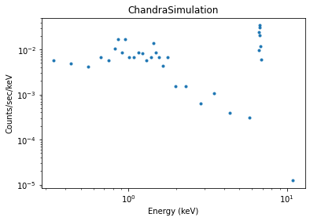

***************
Simulating data
***************

A simple case
=============

Simulating a data set normally involves:

 1. evaluate the model
 2. add in noise

This may need to be repeated several times for complex models, such
as when different components have different noise models or the noise
needs to be added before evaluation by a component.

The model evaluation would be performed using the techniques
described in this section, and then the noise term can be
handled with :py:func:`sherpa.utils.poisson_noise` or routines from
NumPy or SciPy to evaluate noise, such as `numpy.random.standard_normal`.

::

   >>> import numpy as np
   >>> from sherpa.models.basic import Polynom1D

   >>> np.random.seed(235)

   >>> x = np.arange(10, 100, 12)
   >>> mdl = Polynom1D('mdl')
   >>> mdl.offset = 35
   >>> mdl.c1 = 0.5
   >>> mdl.c2 = 0.12

   >>> ymdl = mdl(x)

   >>> from sherpa.utils import poisson_noise
   >>> ypoisson = poisson_noise(ymdl)

   >>> from numpy.random import standard_normal, normal
   >>> yconst = ymdl + standard_normal(ymdl.shape) * 10
   >>> ydata = ymdl + normal(scale=np.sqrt(ymdl))

.. _data_pha_fake:

X-ray data (:py:mod:`~sherpa.astro.data.DataPHA`)
=================================================

In principle, the same steps apply when simulating :term:`PHA` data
(:py:class:`~sherpa.astro.data.DataPHA` objects), however, the mechanics are a
little more complicated because we need to account for the
instrumental response (:term:`ARF` and :term:`RMF`) and possibly also
the background, which may contribute to the source spectrum that we
want to simulate.  Readers not interested in X-ray data analysis may
want to skip this section.

Sherpa offers a dedicated function :py:func:`sherpa.astro.fake.fake_pha` for
simulations of :term:`PHA` data. A :py:class:`~sherpa.astro.data.DataPHA` object
needs to be set up with the responses for the source and an exposure
time. So, we first create a :py:class:`~sherpa.astro.data.DataPHA` object with
the correct exposure time, but we can leave the settings for channel
and counts empty, because these will be filled in by the simulation::

  >>> from sherpa.astro.data import DataPHA
  >>> from sherpa.astro.io import read_arf, read_rmf, read_pha
  >>> data = DataPHA(name='any', channel=None, counts=None, exposure=10000.)
  >>> data.set_arf(read_arf('sherpa-test-data/sherpatest/9774.arf'))
  >>> data.set_rmf(read_rmf('sherpa-test-data/sherpatest/9774.rmf'))

Alternatively, one could read in a PHA file (``data =
read_pha('9774_bg.pi')``). In this case, the response and backgrounds
will be automatically loaded, if the relevant header keywords are
set. Also, the exposure time, background scaling etc. will be taken
from the header of the file. When new data is simulated later, the
counts in ``data`` will be overwritten, but all other information
stays the same.

Next, we set up a model. In this case, we start with a powerlaw source
where the slope and normalization of that powerlaw are already known,
e.g. from the literature. We then add a weak emission line. Our
simulation will show us if this emission line would be detectable in
a real observation::

  >>> from sherpa.models.basic import PowLaw1D, Gauss1D
  >>> pl = PowLaw1D()
  >>> line = Gauss1D()
  >>> pl.gamma = 1.8
  >>> pl.ampl = 2e-05
  >>> line.pos = 6.7
  >>> line.ampl = .0003
  >>> line.fwhm = .1
  >>> srcmdl = pl + line

The simplest case: Simulate the source spectrum only
----------------------------------------------------

With this model, it is now easy to run the simulation, which will
calculate the expected number of counts in each spectral channel
(where the number and width of the channels is given by the responses)
and then draw from a Poisson distribution with this expected
number. Thus, the simulated number of counts in each channel is always
an integer and includes Poisson noise - running
:py:func:`~sherpa.astro.fake.fake_pha` twice with identical settings will give
slightly different answers. With default settings, the input model is
convolved with the RMF and multiplied by the ARF, and properly scaled
for the exposure time.

  >>> from sherpa.astro.fake import fake_pha
  >>> fake_pha(data, srcmdl)

We bin the counts into bins of at least 5 counts per bin and display
an image of the simulated spectrum (see :ref:`model_evaluate_example_pha`
for details)::

  >>> data.set_analysis('energy')
  >>> data.notice(0.3, 8)
  >>> data.group_counts(5)
  >>> from sherpa.plot import DataPlot
  >>> dplot = DataPlot()
  >>> dplot.prepare(data)
  >>> dplot.plot(xlog=True, ylog=True)

Sometimes, more than one response is needed, e.g. in Chandra LETG/HRC-S
different orders of the grating overlap on the detector, so they all
contribute to the observed source
spectrum. :py:func:`~sherpa.astro.fake.fake_pha` works if one or more responses
are set for the input :py:class:`~sherpa.astro.data.DataPHA` object.

It is also possible that the input model already includes the
appropriate responses and scalings. In this case, ``is_source=False``
can be set to indicate to sherpa that the model is not a naked source
model, but includes all required instrumental effects. In this
way, :py:func:`~sherpa.astro.fake.fake_pha` can be used with arbitrarily
complex models which may include such components as the instrumental
backgound (which should not be folded through the ARF) or arbitary
other components::

  >>> fake_pha(data, model=inst_bkg + my_arf(my_rmf(srcmodel)), is_source=False)  # doctest: +SKIP

Adding background
-----------------

Weak spectral features can be hidden in a large (instrumental or
astrophysical) background, thus it can be important to include
background in the simulation.

Sample background from a PHA file
^^^^^^^^^^^^^^^^^^^^^^^^^^^^^^^^^

One way to include background is to sample it from a
:py:class:`~sherpa.astro.data.DataPHA` object. To do so, a background need to be
loaded into the dataset before running the simluation and, if not done
before, the scale of the background scaling has to be set::

  >>> data.set_background(read_pha('sherpa-test-data/sherpatest/9774_bg.pi'))
  >>> data.backscal = 9.6e-06
  >>> fake_pha(data, srcmdl, add_bkgs=True)

The `fake_pha` function simulates the source spectrum as above, but
then it samples from the background PHA. For each bin, it treats the
background count number as the expected value and performs a Poisson
draw. The background drawn from the Poisson distribution is than added
to the simulated source spectrum (the sum of two Poisson distributions
is a Poisson distribution again). This works best if the background is
well exposed and has a large number or counts.

Why do we need to set the ``add_bkgs=True`` argument and do not simply
use all available backgrounds? The reason for that is it is often
useful to read in a file with ``data = read_pha('9774.pi')``, which
might automatically read in the background as well. Using the
`add_bkgs` to switch the background on or off in the simulation
makes it easy to compare the same simulation with and without a
background.

Background models
^^^^^^^^^^^^^^^^^

When the number of counts in the background is low, the above
procedure amplifies the noise. The experimental background already
contains noise just from Poisson statistics. Using the observed count
numbers as background value and then performing a Poisson draw on them
again gives a higher level of noise than a real observation would
have. To avoid this problem, a background model may be used instead::

  >>> from sherpa.models.basic import Const1D
  >>> bkgmdl = Const1D('bmdl')
  >>> bkgmdl.c0 = 2
  >>> fake_pha(data, mdl, add_bkgs=True, bkg_models={'1': bkgmdl})

The keys in the `bkg_models` dictionary are the identifiers of the
backgrounds. Above, we loaded a background with the default identifyer
(which is ``1``).

More than one background
^^^^^^^^^^^^^^^^^^^^^^^^

If more than one background is set up, then the expected backgrounds
will be averaged before the Poisson draw. For some backgrounds that
expected value might be the value of the counts in a PHA file,
while for others the expected value might be calculated from a model.

Reference/API
=============

.. currentmodule:: sherpa.astro.fake

.. automodule:: sherpa.astro.fake

   .. rubric:: Functions

   .. autosummary::
      :toctree: api

      fake_pha
