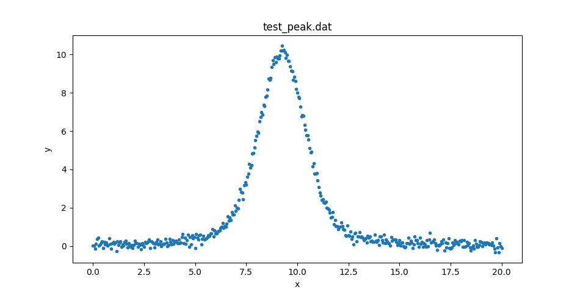
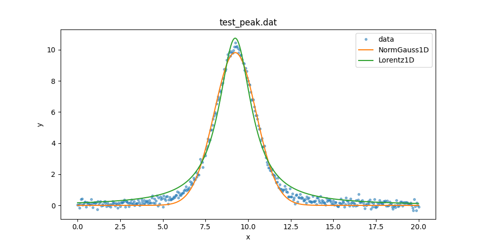
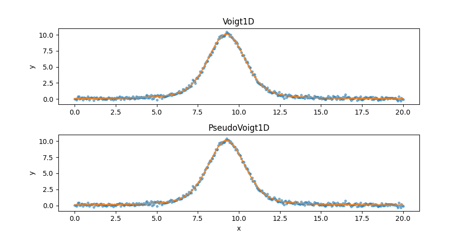
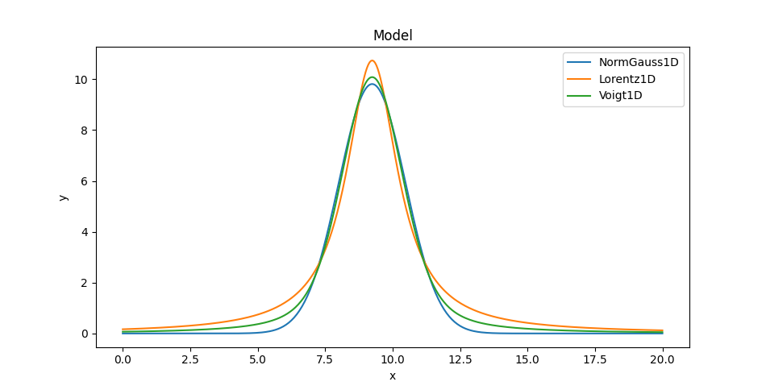

***************************************************
Comparing Gaussian, Lorentzian, and Voigt 1D models
***************************************************

Overview
========

In this example we will try to fit a peaked profile with
a range of 1D models. If you have read the
`lmfit documentation
<https://lmfit.github.io/lmfit-py/builtin_models.html?highlight=voigt#example-1-fit-peak-data-to-gaussian-lorentzian-and-voigt-profiles>`_ then this example
should seem familiar!

Setting up
==========

The following sections will load in classes from Sherpa as needed, but
it is assumed that the following module has been loaded:

   >>> import matplotlib.pyplot as plt

Loading the data
================

The data can be retrieved from the
`lmfit GitHub page <https://raw.githubusercontent.com/lmfit/lmfit-py/master/examples/test_peak.dat>`_.
It is a two-column ASCII file that can
be read in with NumPy or the :py:func:`sherpa.io.read_data`
routine:

   >>> from sherpa.io import read_data
   >>> d = read_data('test_peak.dat')
   >>> print(d)
   name      = test_peak.dat
   x         = Float64[401]
   y         = Float64[401]
   staterror = None
   syserror  = None
   None

This could be displayed with matplotlib directly, but let's create
a :py:class:`~sherpa.plot.DataPlot` to display it:

   >>> from sherpa.plot import DataPlot
   >>> dplot = DataPlot()
   >>> dplot.prepare(d)
   >>> dplot.plot()

Setting up the fits
===================

We can then fit this with a variety of models, using the
:py:class:`~sherpa.stats.LeastSq` statistic and
:py:class:`~sherpa.optmethods.NelderMead` optimiser.
For each model -
:py:class:`~sherpa.models.basic.NormGauss1D`,
:py:class:`~sherpa.astro.models.Lorentz1D`,
:py:class:`~sherpa.astro.models.PseudoVoigt1D`,
and
:py:class:`~sherpa.astro.models.Voigt1D` - we create a
:py:class:`~sherpa.fit.Fit` instance:

   >>> from sherpa.models.basic import NormGauss1D
   >>> from sherpa.astro.models import Lorentz1D, PseudoVoigt1D, Voigt1D
   >>> from sherpa.stats import LeastSq
   >>> from sherpa.optmethods import NelderMead
   >>> from sherpa.fit import Fit
   >>> models = [NormGauss1D, Lorentz1D, PseudoVoigt1D, Voigt1D]
   >>> stat = LeastSq()
   >>> method = NelderMead()
   >>> fits = {}
   >>> for model in models:
   ...     mdl = model()
   ...     fit = Fit(d, mdl, stat, method)
   ...     fits[mdl.name] = fit

The ``fits`` dictionary is indexed by the model name which, in
this case, uses the default model names (as none were given when
initializing the model), which is the lower-case value of the
model. So the keys are ``'normgauss1d'``, ``'lorentz1d'``,
``'pseudovoigt1d'``, and ``'voigt1d'``.

Fitting the NormGauss1D and Lorentz1D models
============================================

The fits could have been done in this loop, but let's run them
separately. First the ``NormGauss1D`` and ``Lorentz1D`` models,
which bracket the data, using the
:py:meth:`~sherpa.fit.FitResults.format` method to
display the fit results:

   >>> result = fits['normgauss1d'].fit()
   >>> print(result.format())
   Method                = neldermead
   Statistic             = leastsq
   Initial fit statistic = 4222.73
   Final fit statistic   = 29.9943 at function evaluation 439
   Data points           = 401
   Degrees of freedom    = 398
   Change in statistic   = 4192.74
      normgauss1d.fwhm   2.90157
      normgauss1d.pos   9.24277
      normgauss1d.ampl   30.3135

   >>> result = fits['lorentz1d'].fit()
   >>> print(result.format())
   Method                = neldermead
   Statistic             = leastsq
   Initial fit statistic = 4213.59
   Final fit statistic   = 53.7535 at function evaluation 401
   Data points           = 401
   Degrees of freedom    = 398
   Change in statistic   = 4159.84
      lorentz1d.fwhm   2.30967
      lorentz1d.pos   9.24439
      lorentz1d.ampl   38.9727

For reference, these results are essentially the same as
obtained by
`lmfit <https://lmfit.github.io/lmfit-py/builtin_models.html?highlight=voigt#example-1-fit-peak-data-to-gaussian-lorentzian-and-voigt-profiles>`_.

We can create :py:class:`~sherpa.plot.ModelPlot` objects for each
model (extracting the model from the fit structure as I forgot to
save it earlier):

   >>> from sherpa.plot import ModelPlot
   >>> mplot1 = ModelPlot()
   >>> mplot2 = ModelPlot()
   >>> mplot1.prepare(d, fits['normgauss1d'].model)
   >>> mplot2.prepare(d, fits['lorentz1d'].model)

These can be used to compare the two model plots (I added in some
matplotlib commands to set the plot legend):

   >>> dplot.plot(alpha=0.5)
   >>> ax = plt.gca()
   >>> ax.lines[-1].set_label('data')
   >>> mplot1.overplot()
   >>> ax.lines[-1].set_label('NormGauss1D')
   >>> mplot2.overplot()
   >>> ax.lines[-1].set_label('Lorentz1D')
   >>> plt.legend()

Fitting the PseudoVoigt1D and Voigt1D models
============================================

So neither model describe the data at the peak or the wings. Let's
see if the extra freedom given by the ``PseudoVoigt1D`` and ``Voigt1D``
models can help:

   >>> result = fits['pseudovoigt1d'].fit()
   >>> print(result.format())
   Method                = neldermead
   Statistic             = leastsq
   Initial fit statistic = 4220.01
   Final fit statistic   = 10.8366 at function evaluation 851
   Data points           = 401
   Degrees of freedom    = 397
   Change in statistic   = 4209.18
      pseudovoigt1d.frac   0.533597
      pseudovoigt1d.fwhm   2.71357
      pseudovoigt1d.pos   9.2436
      pseudovoigt1d.ampl   34.4984

The `Voigt1D` fit here should be compared to the "gamma unconstrained"
version from the `lmfit example <https://lmfit.github.io/lmfit-py/builtin_models.html?highlight=voigt#example-1-fit-peak-data-to-gaussian-lorentzian-and-voigt-profiles>`_.

   >>> result = fits['voigt1d'].fit()
   >>> print(result.format())
   Method                = neldermead
   Statistic             = leastsq
   Initial fit statistic = 4211.75
   Final fit statistic   = 10.9302 at function evaluation 738
   Data points           = 401
   Degrees of freedom    = 397
   Change in statistic   = 4200.82
      voigt1d.fwhm_g   2.10801
      voigt1d.fwhm_l   1.0508
      voigt1d.pos    9.24375
      voigt1d.ampl   34.1915

The first thing to note is that the final statistic value, :math:`\sim 11`,
is much lower than either of the previous models, so they should be
a better fit, and that the ``PseudoVoigt1D`` model is "better" than
the ``Voigt1D`` model, but not by much. Since the two models appear
similar let's create two plots:

   >>> from sherpa.plot import SplitPlot
   >>> mplot3 = ModelPlot()
   >>> mplot4 = ModelPlot()
   >>> mplot3.prepare(d, fits['voigt1d'].model)
   >>> mplot4.prepare(d, fits['pseudovoigt1d'].model)
   >>> splot = SplitPlot()
   >>> splot.addplot(dplot, alpha=0.5)
   >>> splot.overlayplot(mplot3)
   >>> ax = plt.gca()
   >>> ax.set_title('Voigt1D')
   >>> ax.set_xlabel('')
   >>> splot.addplot(dplot, alpha=0.5)
   >>> splot.overlayplot(mplot4)
   >>> ax = plt.gca()
   >>> ax.set_title('PseudoVoigt1D')

Comparing the models
====================

We can also overlay the models (here only showing one of the Voigt profiles
since on this plot they appear identical):

   >>> mplot1.plot()
   >>> ax = plt.gca()
   >>> ax.lines[-1].set_label('NormGauss1D')
   >>> mplot2.overplot()
   >>> ax.lines[-1].set_label('Lorentz1D')
   >>> mplot3.overplot()
   >>> ax.lines[-1].set_label('Voigt1D')
   >>> plt.legend()

