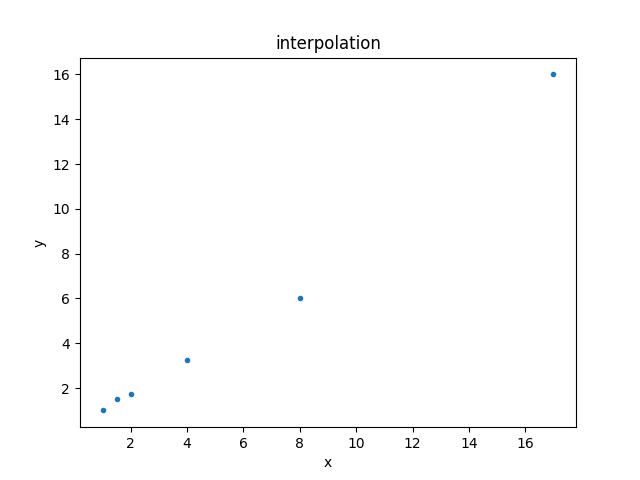
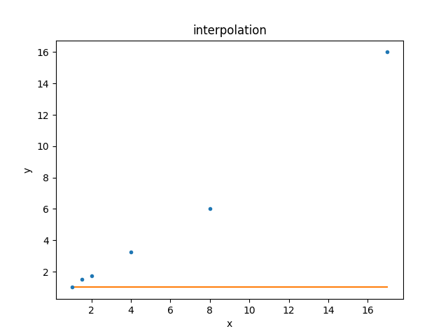
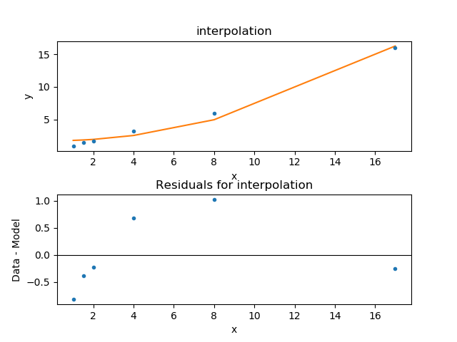
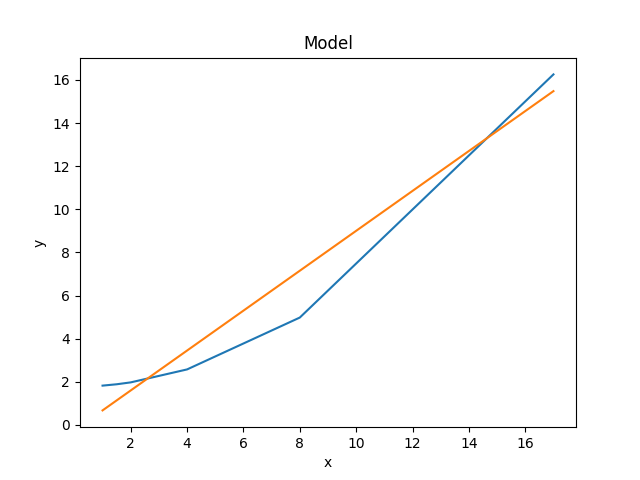

********************
Simple Interpolation
********************

Overview
========

Although Sherpa allows you to fit complex models to complex data sets
with complex statistics and complex optimisers, it can also be used
for simple situations, such as interpolating a function. In this
example a one-dimensional set of data is given - i.e.
:math:`(x_i, y_i)` - and a polynomial of order 2 is fit to the
data. The model is then used to interpolate (and extrapolate)
values. The walk through ends with changing the fit to a linear
model (i.e. polynomial of order 1) and a comparison of the two
model fits.

Setting up
==========

The following sections will load in classes from Sherpa as needed, but
it is assumed that the following modules have been loaded:

   >>> import numpy as np
   >>> import matplotlib.pyplot as plt

Loading the data
================

The data is the following:

==== =====
x    y
==== =====
1    1
1.5  1.5
2    1.75
4    3.25
8    6
17   16
==== =====

which can be "loaded" into Sherpa using the
:py:class:`~sherpa.data.Data1D` class:
    
   >>> from sherpa.data import Data1D
   >>> x = [1, 1.5, 2, 4, 8, 17]
   >>> y = [1, 1.5, 1.75, 3.25, 6, 16]
   >>> d = Data1D('interpolation', x, y)
   >>> print(d)
   name      = interpolation
   x         = [1, 1.5, 2, 4, 8, 17]
   y         = [1, 1.5, 1.75, 3.25, 6, 16]
   staterror = None
   syserror  = None
   None
   
This can be displayed using the :py:class:`~sherpa.plot.DataPlot` class:

   >>> from sherpa.plot import DataPlot
   >>> dplot = DataPlot()
   >>> dplot.prepare(d)
   >>> dplot.plot()
   

Setting up the model
====================

For this example, a second-order polynomial is going to be fit to the
data by using the :py:class:`~sherpa.models.basic.Polynom1D` class:

   >>> from sherpa.models.basic import Polynom1D
   >>> mdl = Polynom1D()
   >>> print(mdl)
   polynom1d
      Param        Type          Value          Min          Max      Units
      -----        ----          -----          ---          ---      -----
      polynom1d.c0 thawed            1 -3.40282e+38  3.40282e+38           
      polynom1d.c1 frozen            0 -3.40282e+38  3.40282e+38           
      polynom1d.c2 frozen            0 -3.40282e+38  3.40282e+38           
      polynom1d.c3 frozen            0 -3.40282e+38  3.40282e+38           
      polynom1d.c4 frozen            0 -3.40282e+38  3.40282e+38           
      polynom1d.c5 frozen            0 -3.40282e+38  3.40282e+38           
      polynom1d.c6 frozen            0 -3.40282e+38  3.40282e+38           
      polynom1d.c7 frozen            0 -3.40282e+38  3.40282e+38           
      polynom1d.c8 frozen            0 -3.40282e+38  3.40282e+38           
      polynom1d.offset frozen            0 -3.40282e+38  3.40282e+38           

The help for Polynom1D shows that the model is defined as:

.. math:: f(x) = \sum_{i=0}^8 c_i (x - {\rm offset})^i

so to get a second-order polynomial we have to
:ref:`thaw <params-freeze>` the ``c2``
parameter (the linear term ``c1`` is kept at 0 to show that the
choice of parameter to fit is up to the user):

   >>> mdl.c2.thaw()

This model can be compared to the data using the
:py:class:`~sherpa.plot.ModelPlot` class (note that, unlike
the data plot, the
:py:meth:`~sherpa.plot.ModelPlot.prepare` method takes both
the data - needed to know what :math:`x_i` to use - and the model):

   >>> from sherpa.plot import ModelPlot
   >>> mplot = ModelPlot()
   >>> mplot.prepare(d, mdl)
   >>> dplot.plot()
   >>> mplot.overplot()

Since the default parameter values are still being used, the result
is not a good description of the data. Let's fix this!

.. _simple_interpolation_fit:

Fitting the model to the data
=============================

Since we have no error bars, we are going to use least-squares
minimisation - that is, minimise the square of the distance between
the model and the data using the
:py:class:`~sherpa.stats.LeastSq` statisic and the
:py:class:`~sherpa.optmethods.NelderMead` optimiser
(for this case the :py:class:`~sherpa.optmethods.LevMar` optimiser is likely
to produce as good a result but faster, but I have chosen to
select the more robust method):

   >>> from sherpa.stats import LeastSq
   >>> from sherpa.optmethods import NelderMead
   >>> from sherpa.fit import Fit
   >>> f = Fit(d, mdl, stat=LeastSq(), method=NelderMead())
   >>> print(f)
   data      = interpolation
   model     = polynom1d
   stat      = LeastSq
   method    = NelderMead
   estmethod = Covariance
   
In this case there is no need to change any of the options for the
optimiser (the least-squares statistic has no options), so the objects
are passed straight to the :py:class:`~sherpa.fit.Fit` object.

.. _simple_interpolation_first_fit:

The :py:meth:`~sherpa.fit.Fit.fit` method is used to fit the data; as it
returns useful information (in a :py:class:`~sherpa.fit.FitResults`
object) we capture this in the ``res`` variable, and then check that
the fit was succesfull (i.e. it converged):

   >>> res = f.fit()
   >>> res.succeeded
   True
   
For this example the time to perform the fit is very short, but for
complex data sets and models the call can take a long time!

A quick summary of the fit results is available via the
:py:meth:`~sherpa.fit.FitResults.format` method, while printing the
variable retutrns more details:

   >>> print(res.format())
   Method                = neldermead
   Statistic             = leastsq
   Initial fit statistic = 255.875
   Final fit statistic   = 2.4374 at function evaluation 264
   Data points           = 6
   Degrees of freedom    = 4
   Change in statistic   = 253.438
      polynom1d.c0   1.77498     
      polynom1d.c2   0.0500999   
   >>> print(res)
   datasets       = None
   itermethodname = none
   methodname     = neldermead
   statname       = leastsq
   succeeded      = True
   parnames       = ('polynom1d.c0', 'polynom1d.c2')
   parvals        = (1.7749826216226083, 0.050099944904353017)
   statval        = 2.4374045728256455
   istatval       = 255.875
   dstatval       = 253.437595427
   numpoints      = 6
   dof            = 4
   qval           = None
   rstat          = None
   message        = Optimization terminated successfully
   nfev           = 264

The best-fit parameter values can also be retrieved from the model itself:

   >>> print(mdl)
   polynom1d
      Param        Type          Value          Min          Max      Units
      -----        ----          -----          ---          ---      -----
      polynom1d.c0 thawed      1.77498 -3.40282e+38  3.40282e+38           
      polynom1d.c1 frozen            0 -3.40282e+38  3.40282e+38           
      polynom1d.c2 thawed    0.0500999 -3.40282e+38  3.40282e+38           
      polynom1d.c3 frozen            0 -3.40282e+38  3.40282e+38           
      polynom1d.c4 frozen            0 -3.40282e+38  3.40282e+38           
      polynom1d.c5 frozen            0 -3.40282e+38  3.40282e+38           
      polynom1d.c6 frozen            0 -3.40282e+38  3.40282e+38           
      polynom1d.c7 frozen            0 -3.40282e+38  3.40282e+38           
      polynom1d.c8 frozen            0 -3.40282e+38  3.40282e+38           
      polynom1d.offset frozen            0 -3.40282e+38  3.40282e+38           

.. _simple_interpolation_stat_order2:

as can the current fit statistic (as this is for fitting a second-order
polynomial I've chosen to label the variable with a suffix of 2,
which will make more sense
:ref:`below <simple_interpolation_stat_order1>`):

   >>> stat2 = f.calc_stat()
   >>> print("Statistic = {:.4f}".format(stat2))
   Statistic = 2.4374

.. note::

   In an actual analysis session the fit would probably be repeated,
   perhaps with a different optimiser, and starting from a different
   set of parameter values, to give more confidence that the fit has
   not been caught in a local minimum. This example is simple enough
   that this is not needed here.
   
To compare the new model to the data I am going to use a
:py:class:`~sherpa.plot.FitPlot` - which combines a DataPlot
and ModelPlot - and a :py:class:`~sherpa.plot.ResidPlot` - to look
at the residuals, defined as :math:`{\rm data}_i - {\rm model}_i`,
using the :py:class:`~sherpa.plot.SplitPlot` class to orchestrate
the display (note that ``mplot`` needs to be re-created since the
model has changed since the last time its ``prepare`` method
was called):

   >>> from sherpa.plot import FitPlot, ResidPlot, SplitPlot
   >>> fplot = FitPlot()
   >>> mplot.prepare(d, mdl)
   >>> fplot.prepare(dplot, mplot)
   >>> splot = SplitPlot()
   >>> splot.addplot(fplot)
   >>> rplot = ResidPlot()
   >>> rplot.prepare(d, mdl, stat=LeastSq())
   WARNING: The displayed errorbars have been supplied with the data or calculated using chi2xspecvar; the errors are not used in fits with leastsq
   >>> rplot.plot_prefs['yerrorbars'] = False
   >>> splot.addplot(rplot)

The default behavior for the residual plot is to include error bars,
here calculated using the :py:class:`~sherpa.stats.Chi2XspecVar` class,
but they have been turned off - by setting the
``yerrorbars`` option to ``False`` - since they are not meaningful here.

Interpolating values
====================

The model can be evaluated directly by supplying it with the
independent-axis values; for instance for :math:`x` equal to
2, 5, and 10:

   >>> print(mdl([2, 5, 10]))
   [ 1.9753824   3.02748124  6.78497711]

It can also be used to extrapolate the model outside the range of the
data (as long as the model is defined for these values):

   >>> print(mdl([-100]))
   [ 502.77443167]
   >>> print(mdl([234.56]))
   [ 2758.19347071]

Changing the fit
================

Let's see how the fit looks if we use a linear model instead. This
means thawing out the ``c1`` parameter and clearing ``c2``:

   >>> mdl.c1.thaw()
   >>> mdl.c2 = 0
   >>> mdl.c2.freeze()
   >>> f.fit()
   <Fit results instance>

As this is a simple case, I am ignoring the return value from the
:py:meth:`~sherpa.fit.Fit.fit` method, but in an actual analysis
session it should be checked to ensure the fit converged.

The new model parameters are:

   >>> print(mdl)
   polynom1d
      Param        Type          Value          Min          Max      Units
      -----        ----          -----          ---          ---      -----
      polynom1d.c0 thawed    -0.248624 -3.40282e+38  3.40282e+38           
      polynom1d.c1 thawed     0.925127 -3.40282e+38  3.40282e+38           
      polynom1d.c2 frozen            0 -3.40282e+38  3.40282e+38           
      polynom1d.c3 frozen            0 -3.40282e+38  3.40282e+38           
      polynom1d.c4 frozen            0 -3.40282e+38  3.40282e+38           
      polynom1d.c5 frozen            0 -3.40282e+38  3.40282e+38           
      polynom1d.c6 frozen            0 -3.40282e+38  3.40282e+38           
      polynom1d.c7 frozen            0 -3.40282e+38  3.40282e+38           
      polynom1d.c8 frozen            0 -3.40282e+38  3.40282e+38           
      polynom1d.offset frozen            0 -3.40282e+38  3.40282e+38           

.. _simple_interpolation_stat_order1:

and the best-fit statistic value can be compared to the
:ref:`earlier version <simple_interpolation_stat_order2>`:

   >>> stat1 = f.calc_stat()
   >>> print("Statistic: order 1 = {:.3f} order 2 = {:.3f}".format(stat1, stat2))
   Statistic: order 1 = 1.898 order 2 = 2.437

.. note::

   Sherpa provides several routines for comparing statistic values,
   such as :py:func:`sherpa.utils.calc_ftest` and
   :py:func:`sherpa.utils.calc_mlr`, to see if one can be preferred
   over the other, but these are not relevant here, as the statistic
   being used is just the least-squared difference.
   
The two models can be visually compared by taking advantage of the previous
plot objects retaining the values from the previous fit:

   >>> mplot2 = ModelPlot()
   >>> mplot2.prepare(d, mdl)
   >>> mplot.plot()
   >>> mplot2.overplot()

An alternative would be to create the plots directly (the
order=2 parameter values are restored from the `res` object
created from the :ref:`first fit <simple_interpolation_first_fit>`
to the data), in which case we are not limited to calculating the
model on the independent axis of the input data (the order is chosen
to match the colors of the previous plot):

   >>> xgrid = np.linspace(0, 20, 21)
   >>> y1 = mdl(xgrid)
   >>> mdl.c0 = res.parvals[0]
   >>> mdl.c1 = 0
   >>> mdl.c2 = res.parvals[1]
   >>> y2 = mdl(xgrid)
   >>> plt.clf()
   >>> plt.plot(xgrid, y2, label='order=2');
   >>> plt.plot(xgrid, y1, label='order=1');
   >>> plt.legend();
   >>> plt.title("Manual evaluation of the models");
   
.. image:: ../_static/examples/interpolation/model_comparison_manual.png
