*****************
Simple user model
*****************

This example works through a fit to a small one-dimensional dataset
which includes errors. This means that, unlike the
:doc:`simple_interpolation` example, an analysis of the
:ref:`parameter errors <simple_user_model_estimating_parameter_errors>`
can be made. The fit begins with the use of the
:ref:`basic Sherpa models <simple_user_model_creating_the_model>`,
but this turns out to be sub-optimal - since the model parameters do not
match the required parameters - so a
:ref:`user model is created <sherpa_user_model_writing_your_own_model>`,
which recasts
the Sherpa model parameters into the desired form. It also has the
advantage of simplifying the model, which avoids the need for manual
intervention required with the Sherpa version.
     
Introduction
============

For this example, a data set from the literature was chosen,
looking at non-Astronomy papers to show that Sherpa can be
used in a variety of fields. There is no attempt made here to
interpret the results, and the model parameters, and their
errors, derived here **should not** be assumed to have any
meaning compared to the results of the paper.

The data used in this example is taken from 
Zhao Y, Tang X, Zhao X, Wang Y (2017) Effect of various nitrogen
conditions on population growth, temporary cysts and cellular biochemical
compositions of Karenia mikimotoi. PLoS ONE 12(2): e0171996.
`doi:10.1371/journal.pone.0171996
<https://dx.doi.org/10.1371/journal.pone.0171996>`_. The 
Supporting information section of the paper includes a
spreadsheet containing the data for the figures, and this was
downloaded and stored as the file ``pone.0171996.s001.xlsx``.

The aim is to fit a similar model to that described in Table 5,
that is

.. math:: y = N (1.0 + e^{a + b * t})^{-1}

where :math:`t` and :math:`y` are the abscissa (independent axis)
and ordinate (dependent axis), respectively. The idea is to see if
we can get a similar result rather than to make any inferences
based on the data. For this example only the "NaNO3" dataset is
going to be used.

Setting up
==========

Both NumPy and Matplotlib are required::

   >>> import numpy as np
   >>> import matplotlib.pyplot as plt

Reading in the data
===================

The
`openpyxl <https://openpyxl.readthedocs.io/>`_ package (version
2.5.3) is used
to read in the data from the Excel spreadsheet. This is not guaranteed
to be the optimal means of reading in the data (and relies on hard-coded
knowledge of the column numbers):

   >>> from openpyxl import load_workbook
   >>> wb = load_workbook('pone.0171996.s001.xlsx')
   >>> fig4 = wb['Fig4data']
   >>> t = []; y = []; dy = []
   >>> for r in list(fig4.values)[2:]:
   ...     t.append(r[0])
   ...     y.append(r[3])
   ...     dy.append(r[4])
   ...

With these arrays, a :doc:`data object <../data/index>`
can be created:

   >>> from sherpa.data import Data1D
   >>> d = Data1D('NaNO_3', t, y, dy)

Unlike the :doc:`first worked example <simple_interpolation>`,
this data set includes an error column, so the data plot
created by :class:`~sherpa.plot.DataPlot` contains
error bars (although not obvious for the first point,
which has an error of 0):

   >>> from sherpa.plot import DataPlot
   >>> dplot = DataPlot()
   >>> dplot.prepare(d)
   >>> dplot.plot()

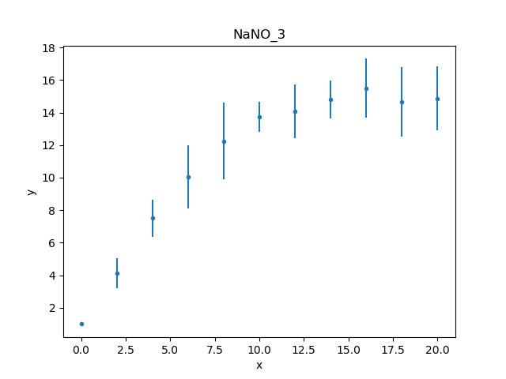

The data can also be inspected directly (as there aren't many
data points)::

   >>> print(d)
   name      = NaNO_3
   x         = Int64[11]
   y         = Float64[11]
   staterror = [0, 0.9214, 1.1273, 1.9441, 2.3363, 0.9289, 1.6615, 1.1726, 1.8066, 2.149, 1.983]
   syserror  = None

.. _simple_user_model_restrict:

Restricting the data
====================

Trying to fit the whole data set will fail because the first data
point has an error of 0, so it is necessary to
:ref:`restrict, or filter out, <data_filter>`
this data point. The simplest way is to select a data range to ignore using
:py:meth:`~sherpa.data.Data1D.ignore`, in this
case everything where :math:`x < 1`:

   >>> d.get_filter()
   '0.0000:20.0000'
   >>> d.ignore(None, 1)
   >>> d.get_filter()
   '2.0000:20.0000'

The :py:meth:`~sherpa.data.Data1D.get_filter` routine returns a
text description of the filters applied to the data; it starts
with all the data being included (0 to 20) and then after
excluding all points less than 1 the filter is now 2 to 20.
The format can be changed to something more appropriate for
this data set:

   >>> d.get_filter(format='%d')
   '2:20'

Since the data has been changed, the data plot object is updated
so that the following plots reflect the new filter:

   >>> dplot.prepare(d)

.. _simple_user_model_creating_the_model:

Creating the model
==================

Table 5 lists the model fit to this dataset as

.. math:: y = 14.89 (1.0 + e^{1.941 - 0.453 t})^{-1}

which can be constructed from components using the
:py:class:`~sherpa.models.basic.Const1D`
and :py:class:`~sherpa.models.basic.Exp` models, as shown below::

   >>> from sherpa.models.basic import Const1D, Exp
   >>> plateau = Const1D('plateau')
   >>> rise = Exp('rise')
   >>> mdl = plateau / (1 + rise)
   >>> print(mdl)
   (plateau / (1 + rise))
      Param        Type          Value          Min          Max      Units
      -----        ----          -----          ---          ---      -----
      plateau.c0   thawed            1 -3.40282e+38  3.40282e+38           
      rise.offset  thawed            0 -3.40282e+38  3.40282e+38           
      rise.coeff   thawed           -1 -3.40282e+38  3.40282e+38           
      rise.ampl    thawed            1            0  3.40282e+38           

The amplitude of the exponential is fixed at 1, but the other
terms will remain free in the fit, with ``plateau.c0`` representing
the normalization, and the ``rise.offset`` and ``rise.coeff`` terms
the exponent term. The ``offset`` and ``coeff`` terms do not
match the form used in the paper, namely :math:`a + b t`,
which has some interesting consequences for the fit, as will
be discussed below in the
:ref:`user-model section <simple_user_model_parameter_optimisation>`.

.. _simple_user_model_freeze_ampl:
   
   >>> rise.ampl.freeze()
   >>> print(mdl)
   (plateau / (1 + rise))
      Param        Type          Value          Min          Max      Units
      -----        ----          -----          ---          ---      -----
      plateau.c0   thawed            1 -3.40282e+38  3.40282e+38           
      rise.offset  thawed            0 -3.40282e+38  3.40282e+38           
      rise.coeff   thawed           -1 -3.40282e+38  3.40282e+38           
      rise.ampl    frozen            1            0  3.40282e+38           
   
The funtional form of the exponential model provided
by Sherpa, assuming an amplitude of unity, is

.. math:: f(x) = e^{{\rm coeff} * (x - {\rm offset})}
  
which means that I expect the final values to be 
:math:`{\rm coeff} \simeq -0.5` and, as
:math:`- {\rm coeff} * {\rm offset} \simeq 1.9`, then
:math:`{\rm offset} \simeq 4`.
The plateau value should be close to 15.
   
The model and data can be shown together, but as the fit has not
yet been made then showing on the same plot is not very instructive,
so here's two plots one above the other, created by mixing the
Sherpa and Matplotlib APIs::
  
   >>> from sherpa.plot import ModelPlot
   >>> mplot = ModelPlot()
   >>> mplot.prepare(d, mdl)
   >>> plt.subplot(2, 1, 1)
   >>> mplot.plot(clearwindow=False)
   >>> plt.subplot(2, 1, 2)
   >>> dplot.plot(clearwindow=False)
   >>> plt.title('')

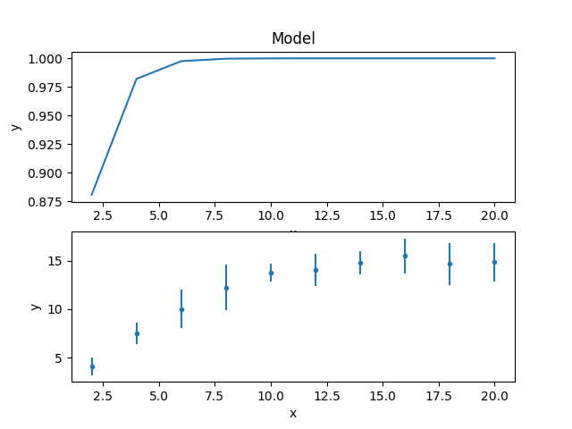

The title of the data plot was removed since it overlaped the X axis
of the model plot above it.

Fitting the data
================

The main difference to :ref:`fitting the first example
<simple_interpolation_fit>` is that the
:py:class:`~sherpa.stats.Chi2` statistic is used,
since the data contains error values.

   >>> from sherpa.stats import Chi2
   >>> from sherpa.fit import Fit
   >>> f = Fit(d, mdl, stat=Chi2())
   >>> print(f)
   data      = NaNO_3
   model     = (plateau / (1 + rise))
   stat      = Chi2
   method    = LevMar
   estmethod = Covariance
   >>> print("Starting statistic: {}".format(f.calc_stat()))
   Starting statistic: 633.2233812020354

The use of a Chi-square statistic means that the fit also calculates
the reduced statistic (the final statistic value divided by the
degrees of freedom), which should be :math:`\sim 1` for a "good"
fit, and an estimate of the probability (Q value) that the fit is
good (this is also
based on the statistic and number of degrees of freedom).

   >>> fitres = f.fit()
   >>> print(fitres.format())
   Method                = levmar
   Statistic             = chi2
   Initial fit statistic = 633.223
   Final fit statistic   = 101.362 at function evaluation 17
   Data points           = 10
   Degrees of freedom    = 7
   Probability [Q-value] = 5.64518e-19
   Reduced statistic     = 14.4802
   Change in statistic   = 531.862
      plateau.c0     10.8792      +/- 0.428815    
      rise.offset    457.221      +/- 0           
      rise.coeff     24.3662      +/- 0           

.. versionchanged:: 4.10.1
          
   The implementation of the :py:class:`~sherpa.optmethods.LevMar`
   class has been changed from Fortran to C++ in the 4.10.1 release.
   The results of the optimiser are expected not to change
   significantly, but one of the more-noticeable changes is that
   the covariance matrix is now returned directly from a fit,
   which results in an error estimate provided as part of the
   fit output (the values after the +/- terms above).

The reduced chi-square value is large, as shown in the screen
output above and the explicit access below, the probability
value is essentially 0, and the parameters are
nowhere near the expected values. 

   >>> print("Reduced chi square = {:.2f}".format(fitres.rstat))
   Reduced chi square = 14.48

Visually comparing the model and data values highlights how poor
this fit is (the data plot does not need regenerating in this
case, but :py:meth:`~sherpa.plot.DataPlot.prepare` is called
just to make sure that the correct data is being displayed)::

  >>> dplot.prepare(d)
  >>> mplot.prepare(d, mdl)
  >>> dplot.plot()
  >>> mplot.overplot()
  
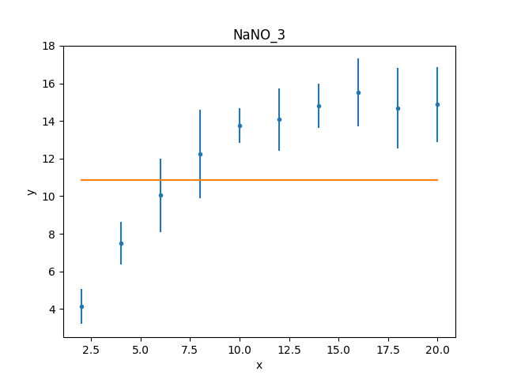

Either the model has got caught in a local minimum, or it is not
a good description of the data. To investigate further, a useful technique
is to switch the optimiser and re-fit; the hope is that the different
optimiser will be able to escape the local minima in the search
space. The default optimiser used by
:py:class:`~sherpa.fit.Fit` is
:py:class:`~sherpa.optmethods.LevMar`, which is often a good
choice for data with errors. The other standard optimiser
provided by Sherpa is
:py:class:`~sherpa.optmethods.NelderMead`, which is often slower
than ``LevMar`` - as it requires more model evaluations - but
less-likely to get stuck:

   >>> from sherpa.optmethods import NelderMead
   >>> f.method = NelderMead()
   >>> fitres2 = f.fit()
   >>> print(mdl)
   (plateau / (1 + rise))
      Param        Type          Value          Min          Max      Units
      -----        ----          -----          ---          ---      -----
      plateau.c0   thawed      10.8792 -3.40282e+38  3.40282e+38           
      rise.offset  thawed      457.221 -3.40282e+38  3.40282e+38           
      rise.coeff   thawed      24.3662 -3.40282e+38  3.40282e+38           
      rise.ampl    frozen            1            0  3.40282e+38           

An alternative to replacing the
:py:attr:`~sherpa.fit.Fit.method` attribute, as done above, would be
to create a new :py:class:`~sherpa.fit.Fit` object - changing the
method using the ``method`` attribute of the initializer, and use
that to fit the model and data.
      
As can be seen, the parameter values have not changed; the
:py:attr:`~sherpa.fit.FitResults.dstatval` attribute contains the
change in the statsitic value, and as shown below, it has
not improved:

   >>> fitres2.dstatval
   0.0

The failure of this fit is actually down to the coupling of
the ``offset`` and ``coeff`` parameters of the
:py:class:`~sherpa.models.basic.Exp` model, as will be
discussed :ref:`below <simple_user_model_parameter_optimisation>`,
but a good solution can be found by tweaking the starting
parameter values.
   
Restarting the fit
==================

The :py:meth:`~sherpa.models.model.Model.reset` will change the
parameter values back to the
:ref:`last values you set them to <simple_user_model_freeze_ampl>`,
which may not be the same as their
:ref:`default settings <simple_user_model_creating_the_model>`
(in this case the difference is in the state of the ``rise.ampl``
parameter, which has remained frozen):

   >>> mdl.reset()
   >>> print(mdl)
   (plateau / (1 + rise))
      Param        Type          Value          Min          Max      Units
      -----        ----          -----          ---          ---      -----
      plateau.c0   thawed            1 -3.40282e+38  3.40282e+38           
      rise.offset  thawed            0 -3.40282e+38  3.40282e+38           
      rise.coeff   thawed           -1 -3.40282e+38  3.40282e+38           
      rise.ampl    frozen            1            0  3.40282e+38           

.. note::

   It is not always necessary to reset the parameter values when
   trying to get out of a local minimum, but it can be a useful 
   strategy to avoid getting trapped in the same area.
   
One of the simplest changes to make here is to set the plateau term
to the maximum data value, as the intention is for this term to
represent the asymptote of the curve.

   >>> plateau.c0 = np.max(d.y)
   >>> mplot.prepare(d, mdl)
   >>> dplot.plot()
   >>> mplot.overplot()

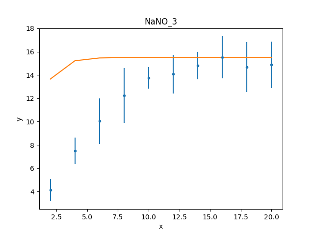

.. _simple_user_model_refit:

A new fit object could be created, but it is also possible
to re-use the existing object. This leaves the optimiser set to
:py:class:`~sherpa.optmethods.NelderMead`, although in this
case the same parameter values are found if the method
attribute had been changed back to
:py:class:`~sherpa.optmethods.LevMar`:

   >>> fitres3 = f.fit()
   >>> print(fitres3.format())
   Method                = neldermead
   Statistic             = chi2
   Initial fit statistic = 168.42
   Final fit statistic   = 0.299738 at function evaluation 42
   Data points           = 10
   Degrees of freedom    = 7
   Probability [Q-value] = 0.9999
   Reduced statistic     = 0.0428198
   Change in statistic   = 168.12
      plateau.c0     14.9694      +/- 0.859633    
      rise.offset    4.17729      +/- 0.630148    
      rise.coeff     -0.420696    +/- 0.118487
   
These results already look a lot better than the previous attempt;
the reduced statistic is much smaller, and the values are similar
to the reported values. As shown in the plot below, the model
also well describes the data:

   >>> mplot.prepare(d, mdl)
   >>> dplot.plot()
   >>> mplot.overplot()

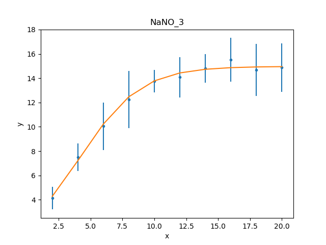
   
The residuals can also be displayed, in this case normalizing by
the error values by using a
:py:class:`~sherpa.plot.DelchiPlot` plot:

   >>> from sherpa.plot import DelchiPlot
   >>> residplot = DelchiPlot()
   >>> residplot.prepare(d, mdl, f.stat)
   >>> residplot.plot()

Unlike the data and model plots, the
:py:meth:`~sherpa.plot.DelchiPlot.prepare` method of the
residual plot requires a statistic object, so the value
in the fit object (using the :py:attr:`~sherpa.fit.Fit.stat`
attribute) is used.

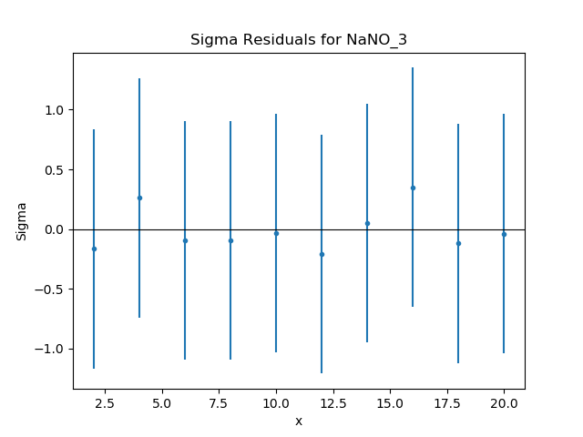

Given that the reduced statistic for the fit is a lot smaller
than 1 (:math:`\sim 0.04`), the residuals are all close to 0:
the ordinate axis shows :math:`(d - m) / e` where
:math:`d`, :math:`m`, and :math:`e` are data, model, and
error value respectively.

What happens at :math:`t = 0`?
==============================

The :ref:`filtering applied earlier <simple_user_model_restrict>`
can be removed, to see how the model behaves at low times. Calling
the :py:meth:`~sherpa.data.Data1D.notice` without any arguments
removes any previous filter:

   >>> d.notice()
   >>> d.get_filter(format='%d')
   '0:20'

For this plot, the :py:class:`~sherpa.plot.FitPlot` class is going
to be used to show both the data and model rather than doing it
manually as above:

   >>> from sherpa.plot import FitPlot
   >>> fitplot = FitPlot()
   >>> dplot.prepare(d)
   >>> mplot.prepare(d, mdl)
   >>> fitplot.prepare(dplot, mplot)
   >>> fitplot.plot()
   
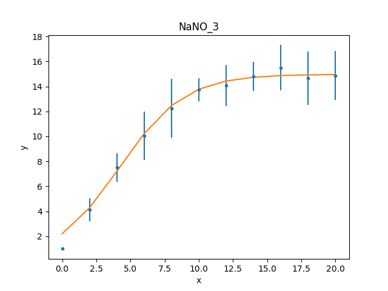

.. note::

   The :py:class:`~sherpa.plot.Plot.prepare` method on the
   components of the Fit plot (in this case ``dplot`` and
   ``mplot``) must be called with their appropriate arguments
   to ensure that the latest changes - such as filters and
   parameter values - are picked up.

.. warning::

   Trying to create a residual plot for this new data range,
   will end up with a division-by-zero warning from the
   ``prepare`` call, as the first data point has an error
   of 0 and the residual plot shows :math:`(d - m) / e`.

For the rest of this example the first data point has been
removed:

   >>> d.ignore(None, 1)

.. _simple_user_model_estimating_parameter_errors:

Estimating parameter errors
===========================

The :py:meth:`~sherpa.fit.Fit.calc_stat_info` method returns
an overview of the current fit::

   >>> statinfo = f.calc_stat_info()
   >>> print(statinfo)
   name      = 
   ids       = None
   bkg_ids   = None
   statname  = chi2
   statval   = 0.2997382864907501
   numpoints = 10
   dof       = 7
   qval      = 0.999900257642653
   rstat     = 0.04281975521296431

It is another way of getting at some of the information in the
:py:class:`~sherpa.fit.FitResults` object; for instance

   >>> statinfo.rstat == fitres3.rstat
   True

.. note::

   The ``FitResults`` object refers to the model at the time
   the fit was made, whereas ``calc_stat_info`` is calculated
   based on the current values, and so the results can be
   different.
   
The :py:meth:`~sherpa.fit.Fit.est_errors` method is used to
estimate error ranges for the parameter values. It does this by
:ref:`varying the parameters around the best-fit location
<estimating_errors>`
until the statistic value has increased by a set amount.
The default method for estimating errors is
:py:class:`~sherpa.estmethods.Covariance`

   >>> f.estmethod.name
   'covariance'

which has the benefit of being fast, but may not be as robust
as other techniques.

   >>> coverrs = f.est_errors()
   >>> print(coverrs.format())
   Confidence Method     = covariance
   Iterative Fit Method  = None
   Fitting Method        = levmar
   Statistic             = chi2
   covariance 1-sigma (68.2689%) bounds:
      Param            Best-Fit  Lower Bound  Upper Bound
      -----            --------  -----------  -----------
      plateau.c0        14.9694    -0.880442     0.880442
      rise.offset       4.17729    -0.646012     0.646012
      rise.coeff      -0.420696     -0.12247      0.12247

These errors are similar to those reported
:ref:`during the fit <simple_user_model_refit>`.

As :ref:`shown below <simple_user_model_compare_errors>`,
the error values can be extracted from the output of
:py:meth:`~sherpa.fit.Fit.est_errors`.

The default is to calculate "one sigma" error bounds
(i.e. those that cover 68.3% of the expected parameter range),
but this can be changed by altering the
:py:attr:`~sherpa.estmethods.EstMethod.sigma` attribute
of the error estimator.

   >>> f.estmethod.sigma
   1

Changing this value to 1.6 means that the errors are close to the
90% bounds (for a single parameter):

   >>> f.estmethod.sigma = 1.6
   >>> coverrs90 = f.est_errors()
   >>> print(coverrs90.format())
   Confidence Method     = covariance
   Iterative Fit Method  = None
   Fitting Method        = neldermead
   Statistic             = chi2
   covariance 1.6-sigma (89.0401%) bounds:
      Param            Best-Fit  Lower Bound  Upper Bound
      -----            --------  -----------  -----------
      plateau.c0        14.9694     -1.42193      1.42193
      rise.offset       4.17729     -1.04216      1.04216
      rise.coeff      -0.420696     -0.19679      0.19679

The covariance method uses the covariance matrix to estimate
the error surface, and so the parameter errors are symmetric.
A more-robust, but often significantly-slower, approach is to
use the :py:class:`~sherpa.estmethods.Confidence` approach:

   >>> from sherpa.estmethods import Confidence
   >>> f.estmethod = Confidence()
   >>> conferrs = f.est_errors()
   plateau.c0 lower bound: -0.804259
   rise.offset lower bound:	-0.590258
   rise.coeff lower bound: -0.148887
   rise.offset upper bound:	0.714407
   plateau.c0 upper bound: 0.989664
   rise.coeff upper bound: 0.103391

.. _simple_user_model_confidence_bounds:
   
The :ref:`error estimation for the confidence technique
is run in parallel <fit_multi_core>` - if the machine
has multiple cores usable by the Python multiprocessing module -
which can mean that the screen output above is not always in
the same order. As shown below, the confidence-derived error
bounds are similar to the covariance bounds, but are not
symmetric.

   >>> print(conferrs.format())
   Confidence Method     = confidence
   Iterative Fit Method  = None
   Fitting Method        = neldermead
   Statistic             = chi2
   confidence 1-sigma (68.2689%) bounds:
      Param            Best-Fit  Lower Bound  Upper Bound
      -----            --------  -----------  -----------
      plateau.c0        14.9694    -0.804259     0.989664
      rise.offset       4.17729    -0.590258     0.714407
      rise.coeff      -0.420696    -0.148887     0.103391

The default is to use all
:ref:`thawed parameters <params-freeze>`
in the error analysis, but the :py:meth:`~sherpa.fit.Fit.est_errors`
method has a ``parlist`` attribute which can be used to restrict
the parameters used, for example to just the ``offset`` term:

   >>> offseterrs = f.est_errors(parlist=(mdl.pars[1], ))
   rise.offset lower bound:	-0.590258
   rise.offset upper bound:	0.714407
   >>> print(offseterrs)
   datasets    = None
   methodname  = confidence
   iterfitname = none
   fitname     = neldermead
   statname    = chi2
   sigma       = 1
   percent     = 68.26894921370858
   parnames    = ('rise.offset',)
   parvals     = (4.177287700807689,)
   parmins     = (-0.5902580352584237,)
   parmaxes    = (0.7144070082643514,)
   nfits       = 8

.. _simple_user_model_compare_errors:

The covariance and confidence limits can be compared by
accessing the fields of the 
:py:class:`~sherpa.fit.ErrorEstResults` object:

   >>> fmt = "{:13s} covar=±{:4.2f}  conf={:+5.2f} {:+5.2f}"
   >>> for i in range(len(conferrs.parnames)):
   ...     print(fmt.format(conferrs.parnames[i], coverrs.parmaxes[i],
   ...                      conferrs.parmins[i], conferrs.parmaxes[i]))
   ...
   plateau.c0    covar=±0.88  conf=-0.80 +0.99
   rise.offset   covar=±0.65  conf=-0.59 +0.71
   rise.coeff    covar=±0.12  conf=-0.15 +0.10

The :py:meth:`~sherpa.fit.Fit.est_errors` method returns a
range, but often it is important to visualize the error
surface, which can be done using the interval projection
(for one parameter) and region projection (for two parameter)
routines. The one-dimensional version is created with the
:py:class:`~sherpa.plot.IntervalProjection`
class, as shown in the following, which shows how the statistic
varies with the plateau term (the vertical dashed line indicates
the best-fit location for the parameter, and the horizontal
line the statistic value for the best-fit location):

   >>> from sherpa.plot import IntervalProjection
   >>> intproj = IntervalProjection()
   >>> intproj.calc(f, plateau.c0)
   >>> intproj.plot()
   
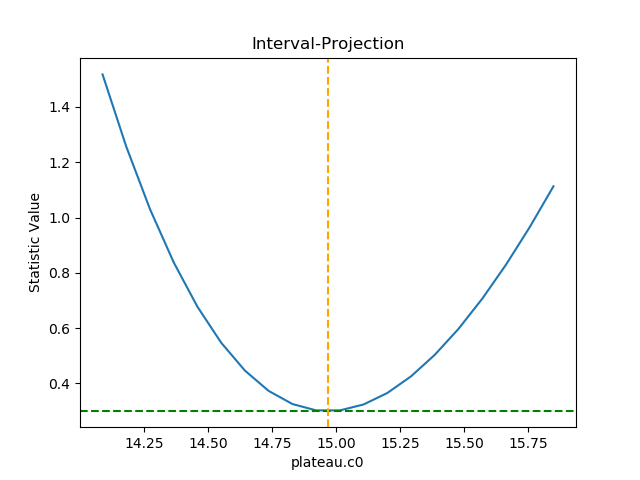

Unlike the previous plots, this requires calling the
:py:meth:`~sherpa.plot.IntervalProjection.calc` method
before :py:meth:`~sherpa.plot.IntervalProjection.plot`. As
the :py:meth:`~sherpa.plot.IntervalProjection.prepare`
method was not called, it used the default options to
calculate the plot range (i.e. the range over which
``plateau.c0`` would be varied), which turns out in this
case to be close to the one-sigma limits.
The range, and number of points, can also be set explicitly:

   >>> intproj.prepare(min=12.5, max=20, nloop=51)
   >>> intproj.calc(f, plateau.c0)
   >>> intproj.plot()
   >>> s0 = f.calc_stat()
   >>> for ds in [1, 4, 9]:
   ...     intproj.hline(s0 + ds, overplot=True, linestyle='dot', linecolor='gray')
   ...
   
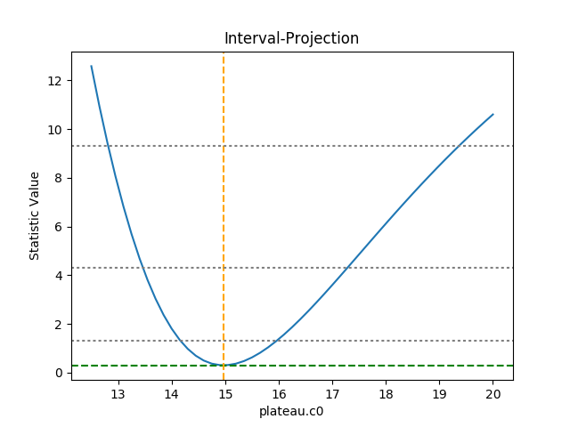

The horizontal lines indicate the statistic value for one, two, and
three sigma limits for a single parameter value (and assuming a
Chi-square statistic). The plot shows how, as the parameter moves
away from its best-fit location, the search space becomes less
symmetric.

Following the same approach, the :py:class:`~sherpa.plot.RegionProjection`
class calculates the statistic value as two parameters are varied,
displaying the results as a contour plot. It requires two parameters
and the visualization is
created with the :py:meth:`~sherpa.plot.IntervalProjection.contour`
method:

   >>> from sherpa.plot import RegionProjection
   >>> regproj = RegionProjection()
   >>> regproj.calc(f, rise.offset, rise.coeff)
   >>> regproj.contour()
   
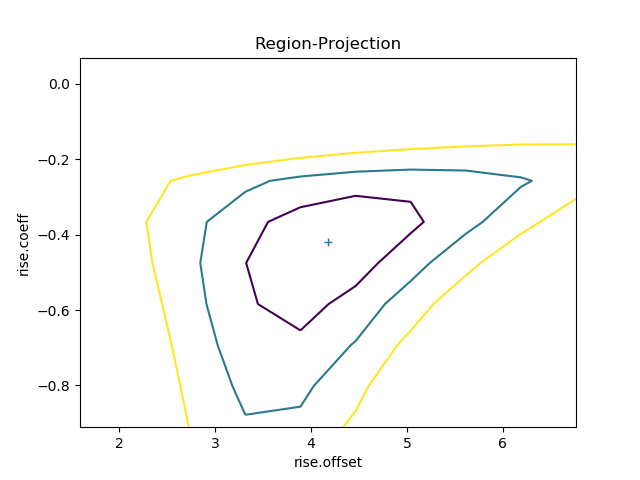

The contours show the one, two, and three sigma contours, with the
cross indicating the best-fit value. As with the interval-projection plot,
the :py:meth:`~sherpa.plot.RegionProjection.prepare` method can
be used to define the grid of points to use; the values below are
chosen to try and cover the full three-sigma range as well as improve
the smoothness of the contours by increasing the number of points
that are looped over:

   >>> regproj.prepare(min=(2, -1.2), max=(8, -0.1), nloop=(21, 21))
   >>> regproj.calc(f, rise.offset, rise.coeff)
   >>> regproj.contour()

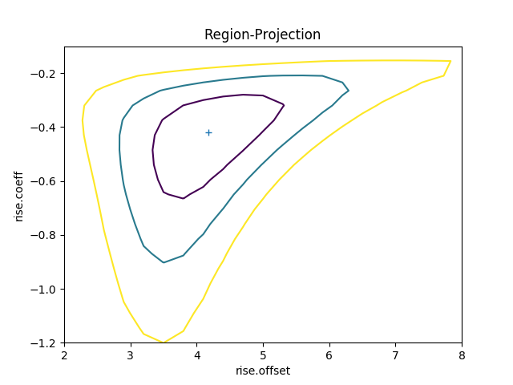

.. _sherpa_user_model_writing_your_own_model:

Writing your own model
======================

The approach above has provided fit results, but they do not match
those of the paper and, since

.. math:: a & = & - {\rm coeff} * {\rm offset} \\
          b & = & \, {\rm coeff}
          
it is hard to transform the values from above to get
accurate results. An alternative approach is to
:ref:`create a model <usermodel>` with the parameters
in the required form, which requires a small amount
of code (by using the 
:py:class:`~sherpa.models.basic.Exp` class to do the actual
model evaluation).

The following class (``MyExp``) creates a model that has
two parameters (``a`` and ``b``) that represents
:math:`f(x) = e^{a + b x}`. The starting values for these
parameters are chosen to match the default values of the
:py:class:`~sherpa.models.basic.Exp` parameters,
where :math:`{\rm coeff} = -1` and :math:`{\rm offset} = 0`::

    from sherpa.models.basic import RegriddableModel1D
    from sherpa.models.parameter import Parameter
    
    class MyExp(RegriddableModel1D):
        """A simpler form of the Exp model.
    
        The model is f(x) = exp(a + b * x).
        """
    
        def __init__(self, name='myexp'):

            self.a = Parameter(name, 'a', 0)
            self.b = Parameter(name, 'b', -1)

            # The _exp instance is used to perform the model calculation,
            # as shown in the calc method.
            self._exp = Exp('hidden')
            
            return RegriddableModel1D.__init__(self, name, (self.a, self.b))
    
        def calc(self, pars, *args, **kwargs):
            """Calculate the model"""
            
            # Tell the exp model to evaluate the model, after converting
            # the parameter values to the required form, and order, of:
            # offset, coeff, ampl.
            #
            coeff = pars[1]
            offset = -1 * pars[0] / coeff
            ampl = 1.0
            return self._exp.calc([offset, coeff, ampl], *args, **kwargs)
   
This can be used as any other Sherpa model::

   >>> plateau2 = Const1D('plateau2')
   >>> rise2 = MyExp('rise2')
   >>> mdl2 = plateau2 / (1 + rise2)
   >>> print(mdl2)
   (plateau2 / (1 + rise2))
      Param        Type          Value          Min          Max      Units
      -----        ----          -----          ---          ---      -----
      plateau2.c0  thawed            1 -3.40282e+38  3.40282e+38           
      rise2.a      thawed            0 -3.40282e+38  3.40282e+38           
      rise2.b      thawed           -1 -3.40282e+38  3.40282e+38           
   >>> fit2 = Fit(d, mdl2, stat=Chi2())
   >>> res2 = fit2.fit()
   >>> print(res2.format())
   Method                = levmar
   Statistic             = chi2
   Initial fit statistic = 633.223
   Final fit statistic   = 0.299738 at function evaluation 52
   Data points           = 10
   Degrees of freedom    = 7
   Probability [Q-value] = 0.9999
   Reduced statistic     = 0.0428198
   Change in statistic   = 632.924
      plateau2.c0    14.9694      +/- 0.859768    
      rise2.a        1.75734      +/- 0.419169    
      rise2.b        -0.420685    +/- 0.118473    

   >>> dplot.prepare(d)
   >>> mplot2 = ModelPlot()
   >>> mplot2.prepare(d, mdl2)
   >>> dplot.plot()
   >>> mplot2.overplot()
   

.. _simple_user_model_parameter_optimisation:

Unlike the :ref:`initial attempt <simple_user_model_creating_the_model>`,
this version did not require any manual intervention to find the
best-fit solution. This is because the degeneracy between the two
terms of the exponential in the
:py:class:`~sherpa.models.basic.Exp` model have been broken in
this version, and so the optimiser work better.
It also has the advantage that the parameters match the
problem, and so the parameter limits determined below can be
used directly, without having to transform them.

   >>> fit2.estmethod = Confidence()
   >>> conferrs2 = fit2.est_errors()
   plateau2.c0 lower bound:	-0.804444
   rise2.b lower bound:	-0.148899
   rise2.a lower bound:	-0.38086
   rise2.b upper bound:	0.10338
   plateau2.c0 upper bound:	0.989623
   rise2.a upper bound:	0.489919
   >>> print(conferrs2.format())
   Confidence Method     = confidence
   Iterative Fit Method  = None
   Fitting Method        = levmar
   Statistic             = chi2
   confidence 1-sigma (68.2689%) bounds:
      Param            Best-Fit  Lower Bound  Upper Bound
      -----            --------  -----------  -----------
      plateau2.c0       14.9694    -0.804444     0.989623
      rise2.a           1.75734     -0.38086     0.489919
      rise2.b         -0.420685    -0.148899      0.10338

The difference in the model parameterisation can also be seen
in the various error-analysis plots, such as the region-projection
contour plot (where the limits have been chosen to cover
the three-sigma contour), and a marker has been added to show
the result listed in Table 5 of Zhao et al:

   >>> regproj2 = RegionProjection()
   >>> regproj2.prepare(min=(0.5, -1.2), max=(5, -0.1), nloop=(21, 21))
   >>> regproj2.calc(fit2, rise2.a, rise2.b)
   >>> regproj2.contour()
   >>> plt.plot(1.941, -0.453, 'ko', label='NaNO$_3$ Table 5')
   >>> plt.legend(loc=1)
      
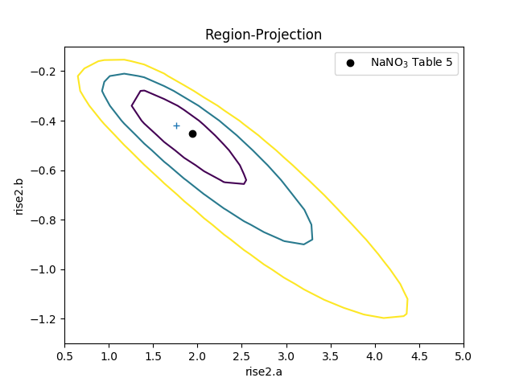
      
