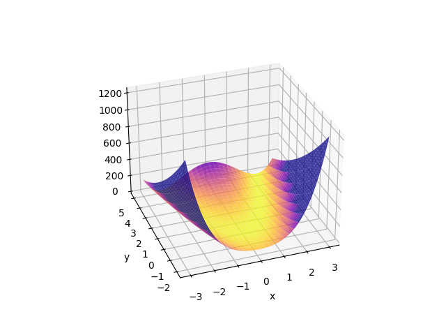
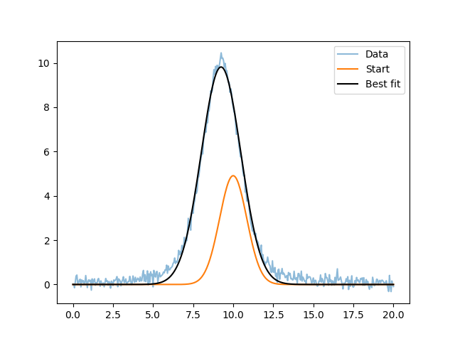
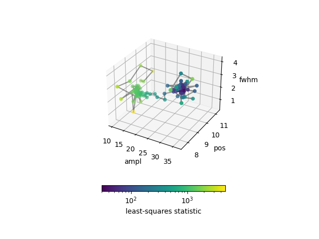

********************
Optimizing functions
********************

The :py:mod:`sherpa.optmethods` module provides classes that let you
optimize :doc:`models <../models/index>` when applied to :doc:`data
<../data/index>` instances, and this is handled by the :doc:`fit
<../fit/index>` module.  You can apply the optimizers directly to
functions if you do not need to take advantage of Sherpa's model and
data classes.

The optimizers in :py:mod:`sherpa.optmethods.optfcts` are functions
which follow the same interface::

  optimizer(cb, start, lolims, hilims, **kwargs)

where `cb` is a callable that given a set or parameters returns the
current statistic, `start` is the starting positions of the
parameters, `lolims` and `hilims` are the bounds of the parameters,
and the remaining keyword arguments are specific to the optimizer.

These optimizers can be compared to `SciPy's optimiaztion routines
<https://docs.scipy.org/doc/scipy/reference/tutorial/optimize.html>`_.

Examples
========

The following imports have been made::

  >>> import numpy as np
  >>> from matplotlib import pyplot as plt
  >>> from matplotlib import colors
  >>> from mpl_toolkits.mplot3d import Axes3D
  >>> from astropy.table import Table
  >>> from sherpa.optmethods import optfcts

A simple function
-----------------

The function we want to optimize is a version of the
`Rosenbrock function <https://en.wikipedia.org/wiki/Rosenbrock_function>`_,
where `a=2` and `b=10`, so the best-fit location is at::

  x = a = 2
  y = a**2 = 4

.. note::
   The Sherpa test suite contains a number of test cases based on
   functions like this, taken from
   `More, J. J., Garbow, B. S., and Hillstrom, K. E.. Testing unconstrained optimization software. United States: N. p., 1978. Web. doi:10.2172/6650344. <https://www.osti.gov/biblio/6650344>`_.

   The `SciPy optimization tutorial <https://docs.scipy.org/doc/scipy/reference/tutorial/optimize.html>`_
   uses `a=1` and `b=100`.

The function is::

  def rosenbrock(x, y):
      a, b = 2, 10
      return (a - x)**2 + b * (y - x**2)**2

We can look at the surface close to the best-fit location
What does the function look like?

  >>> y, x = np.mgrid[-2:5.1:0.1, -3:3.1:0.1]
  >>> surface = rosenbrock(x, y)
  >>> print(surface.shape)
  (71, 61)
  >>> print(surface.min())
  0.0
  >>> print(surface.max())
  1235.0

This can be visualized as::

  >>> fig, ax = plt.subplots(subplot_kw={"projection": "3d"})
  >>> surf = ax.plot_surface(x, y, surface,
  ...                        cmap=cm.plasma_r, alpha=0.8,
  ...                        vlim=0, vmax=300)
  >>> ax.set_xlabel('x')
  >>> ax.set_ylabel('y')
  >>> ax.view_init(30, -100)

In order to optimize this function we need to determine how we
want to define the "search surface"; that is the value that the
optimizer is going to try and minimize. For this dataset, where
the minimum is 0, we can use the square of the function (i.e. a
least-squares model). Now, the function we pass to the minimizer
requires two values - the "statistic" and a per-parameter breakdown
of the parameter - but for now we are going to ignore the latter,
as it's only needed for some optimizers. This gives us::

  def to_optimize1(args):
      x = args[0]
      y = args[1]
      pa = (2 - x)**2
      pb = 10 * (y - x**2)**2
      stat = pa**2 + pb**2
      return stat, None

The function can then be minimized by passing the routine, the
starting point, and the bounds, to the optimizer - in this case the
`~sherpa.optmethods.optfcts.minim` routine:

  >>> start = [-1.2, 1]
  >>> lo = [-100, -100]
  >>> hi = [100, 100]
  >>> res = optfcts.minim(to_optimize1, start, lo, hi)

The return value is a tuple which contains a success flag,
the best-fit parameters, the value at this location, a
message, and a dictionary with optimizer-specific information:

  >>> print(f"Success: {res[0]}")
  Success: True
  >>> print(f"Message: {res[3]}")
  Message: successful termination
  >>> print(f"extra:   {res[4]}")
  extra:   {'info': 0, 'nfev': 80}
  >>> print(f"best-fit location: {res[1]}")
  best-fit location: [2.00219515 4.00935405]
  >>> print(f"          minimum: {res[2]}")
            minimum: 3.3675019403007895e-11

So, the correct location is (2, 4) and we can see we got close.

As the different optimizers use the same interface we can easily try
different optimizers:

  >>> tbl = Table(names=['method', 'stat0', 'x', 'y'],
  ...             dtype=[str, float, float, float])
  >>> for method in [optfcts.minim, optfcts.neldermead, optfcts.lmdif, optfcts.montecarlo]:
  ...     res = method(to_optimize1, start, lo, hi)
  ...     if res[0]:
  ...         tbl.add_row([method.__name__, res[2], res[1][0], res[1][1]])
  ...     else:
  ...         print(f"Failed {method.__name__}: {res[3]}")
  ...
  Failed lmdif: improper input parameters
  >>> print(tbl)
      method           stat0                 x                  y
    ---------- --------------------- ------------------ ------------------
       minim 3.3675019403007895e-11 2.0021951482261993 4.009354048420242
  neldermead  1.269579878170357e-16  2.000079242383145  4.00028638884874
  montecarlo  5.028337191787579e-16  2.000144877499188 4.000607622717231

In this particular case `~sherpa.optmethods.optfcts.lmdif`
failed, and this is because the ``to_optimize1`` function returned None
as its second argument. For the other cases we can see that they all
found the minimum location.

In order to use `~sherpa.optmethods.optfcts.lmdif` we need
the per-parameter statistic, which we can get with a small tweak::

  def to_optimize2(args):
      x = args[0]
      y = args[1]
      pa = (a - x)**2
      pb = b * (y - x**2)**2
      stat = pa**2 + pb**2
      return stat, [pa, pb]

This lets us use `lmdif`::

  >>> res2 = optfcts.lmdif(to_optimize2, start, lo, hi)
  >>> res2[0]
  True
  >>> res2[1]
  [1.99240555 3.9690085 ]

The `lmdif` optimizer is one of those that returns a number of
elements in the "extra" dictionary::

  >>> res2[4]
  {'info': 0, 'nfev': 514, 'covar': array([[4.75572913e+03, 1.44740585e+06],
         [1.44740585e+06, 4.43876953e+08]]), 'num_parallel_map': 0}

Optimizing a model
------------------

We can re-create the :ref:`Fitting the NormGauss1D and Lorentz1D models <fit_peaked_data_normgauss1d_lorentz1d>`
section - at least for the `~sherpa.models.basic.NormGauss1D` fit.

The normalized gaussian model can be expressed as

::

  def ngauss(x, ampl, pos, fwhm):
      term = 4 * np.log(2)
      numerator = ampl * np.exp(-term * (x - pos)**2 / fwhm**2)
      denominator = np.sqrt(np.pi / term) * fwhm
      return numerator / denominator

and the data we are going to fit is read from a file:

  >>> d = np.loadtxt('test_peak.dat')
  >>> x = d[:, 0]
  >>> y = d[:, 1]

In this case we want to minimize the least-squares difference between
the model - evaluated on the `x` axis - and the `y` values.

::

  def cb(pars):
      model = ngauss(x, pars[0], pars[1], pars[2])
      delta = model - y
      statval = (delta * delta).sum()
      # Keep a record of the parameters we've visited
      store.add_row([statval] + list(pars))
      return statval, delta

.. note::
   The use of `store` is not required here; it just lets the user
   find out how the parameter space was searched, which will
   be :ref:`discussed below <optimize_function_model_store>`.
   Users of the full Sherpa system to model and fit data can
   take advantage of the `outfile` argument of the
   `sherpa.fit.Fit.fit` method to save the per-iteration parameter
   values.

   This function would normally be written as a class or a closure to
   ensure that the use of global terms like `x`, `y`, `ngauss`, and
   `store` do not cause problems.

For the starting point and bounds let us use an estimate - in Sherpa
parameter terms a `~sherpa.models.model.ArithmeticModel.guess` - based on the data:

  >>> start = [y.max(), (x[0] + x[-1]) / 2, (x[-1] - x[0]) / 10]
  >>> lows = [0, x[0], 0]
  >>> his = [1e4, x[-1], x[-1] - x[0]]

which can be used with the `~sherpa.optmethods.optfcts.neldermead` optimizer:

  >>> store = Table(names=['stat', 'ampl', 'pos', 'fwhm'])
  >>> flag, bestfit, statval, msg, opts = optfcts.neldermead(cb, start, lows, his)
  >>> flag
  True
  >>> print(bestfits)
  [30.31354039  9.24277042  2.90156672]
  >>> statval
  29.994315740189727
  >>> opts
  {'info': True, 'nfev': 267}
  >>> len(store)
  267

and displayed:

  >>> plt.plot(x, y, label='Data', alpha=0.5)
  >>> plt.plot(x, ngauss(x, *start), label='Start')
  >>> plt.plot(x, ngauss(x, *bestfit), label='Best fit', c='k')
  >>> plt.legend()

This result matches the
:ref:`Fitting the NormGauss1D and Lorentz1D models <fit_peaked_data_normgauss1d_lorentz1d>`
result. Note that at this point you are close to replicating the
main parts of Sherpa (but with a lot-less functionality)!

.. _optimize_function_model_store:

One tweak that was added to the `cb` routine, compared to
`to_optimize1` and `to_optimize2`, is the ability to store the
parameter values at each iteration:

  >>> print(store)
         stat               ampl               pos                fwhm
  ------------------ ------------------ ----------------- -------------------
  1995.1782885013076          10.452393              10.0                 2.0
  1830.6327671752738          11.652393              10.0                 2.0
  3522.2622560146397          10.452393              11.2                 2.0
    2156.39741128647          10.452393              10.0                 3.2
   1764.261448064872 11.252393000000001               8.8                 2.8
   2715.012206450446 11.652393000000004 7.600000000000001  3.1999999999999993
   1366.678033289349 11.785726333333333               9.2   1.333333333333333
    4770.95772056462          12.452393 8.799999999999997 0.39999999999999947
  1504.4139142274962 12.674615222222219 8.666666666666668  2.0888888888888886
  2731.7112487850172 12.156096703703703 7.777777777777779   2.148148148148148
  1379.1243615097005 11.778318925925927 9.444444444444445   2.037037037037037
  1946.1190085808503 12.906713987654314 9.407407407407408  0.8395061728395059
   1495.009488013458  11.66597324691358 8.951851851851853  2.3098765432098762
  1684.8390859851572  10.81206378189301 9.730864197530863  1.6979423868312757
  1355.3671486446174 12.208977362139915 8.932716049382716  1.9911522633744854
  1399.8451502742626 12.182708500685873 9.432921810699586   1.264471879286694
  1279.2923719811783 12.053524687242799 9.312654320987653  1.5258230452674897
  1610.2269471113636 12.253833329218104 8.852469135802467  1.1965020576131686
    1294.57012665695 11.897197526748972  9.29645061728395  1.8269032921810702
     1304.4764033764 12.320740050754459 9.161213991769547  2.2292524005486967
  1391.2754856701451 11.971997481024239  9.58082990397805  1.7301668952903522
  1285.6978966131558 12.149732391860997  9.09474451303155   1.925905921353452
   1393.127377914764  11.74622968648072  9.30801897576589  1.2898357719859779
  1272.3465874443266 12.177112459686025 9.197915237768633   1.994398243408017
  1238.4310470386065 12.356382165777575 9.107092097241276  1.8038481811715688
  1241.4603983878433 12.585974485291878 9.012412837219937   1.792320625666818
                 ...                ...               ...                 ...
   30.06395831055505 30.212991086763584 9.244215467610896   2.884083338173955
   30.01817372053474 30.398954377628876  9.24317281485574   2.904866075865189
   30.04367764579035 30.354983581046667 9.237479777065492   2.908685892005043
   30.01084181691227 30.353975570593022 9.239861257457108   2.905079691779978
   30.02346960997154 30.367629772282577 9.242083552984774   2.913048992873203
  30.005505202917142  30.35033752084683 9.241560130704027   2.900240251358774
  30.015978227327043  30.28083759383391 9.239221271971669  2.9010697048577017
   30.00357680322557  30.31036678978265 9.240209157692686  2.9020187976095735
  29.995983764926883 30.296743880329522 9.242764762860688  2.8988154928293106
  30.005633018056866 30.268128035197773 9.244216515562478   2.895683393353977
   30.00947198755381 30.264652836397516 9.241868977718209   2.902705094230872
  29.997881922784604   30.3289163497345 9.241637342457572  2.9008564620767983
  29.997993892783974  30.31698994076293 9.244172073906142  2.9001516576248894
   29.99494948606653 30.315334153017858 9.243181344852779  2.9006184426210604
  29.997958649779395 30.289385582999984 9.243773224071393  2.9011553135205057
  29.995260397879527  30.31903365805087 9.242171312861029   2.900931174937725
   29.99445003074114  30.31162163928815 9.242571790663618    2.90098720958342
   30.00122895716913 30.305366261844505  9.24324187163635  2.8966596789798125
  29.994507347858953  30.31287271477688 9.242437774469073   2.901852715704142
   29.99459765965769 30.310996101543786 9.242638798760893  2.9005544565230594
  29.994365579932794  30.31410343389737 9.242809559660927   2.901235579162601
  29.994674729702172 30.315953186413875  9.24230454366505   2.901391945320934
  29.994710843829058   30.3048082975532 9.242601268664881  2.9003341042667263
  29.994741915725644 30.317183905534364 9.242676328856904   2.900774808779393
  29.995132223487687  30.30603901667369 9.242973053856733  2.8997169677251855
  29.995115838183946 30.307888769190196 9.242468037860858  2.8998733338835176
  29.994315740189727 30.313540392830394 9.242770421408574  2.9015667179738505
  Length = 267 rows

We can use this to see how the optimizer worked, color-coding each point by
the statistic (using a log-normalized scale as we go from
:math:`\gt 2000` to :math:`\sim 30`):

  >>> fig, ax = plt.subplots(subplot_kw={"projection": "3d"})
  >>> vmin = store['stat'].min()
  >>> vmax = store['stat'].max()
  >>> norm = colors.LogNorm(vmin=vmin, vmax=vmax)
  >>> ax.plot(store['ampl'], store['pos'], store['fwhm'], c='k', alpha=0.4)
  >>> scatter = ax.scatter(store['ampl'], store['pos'], store['fwhm'],
  ...                      c=store['stat'], norm=norm)
  >>> ax.set_xlabel('ampl')
  >>> ax.set_ylabel('pos')
  >>> ax.set_zlabel('fwhm')
  >>> cbar = fig.colorbar(scatter, shrink=0.5. orientation='horizontal')
  >>> cbar.set_label('least-squares statistic')

