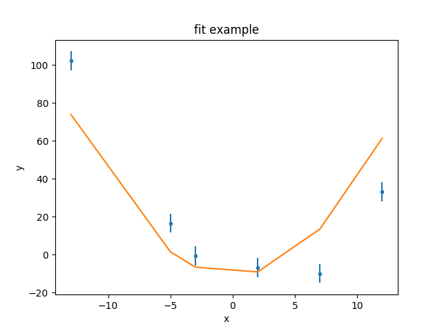
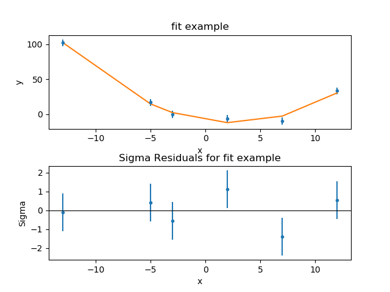
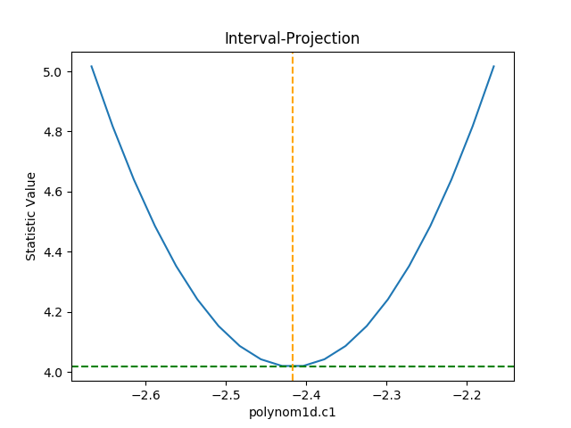
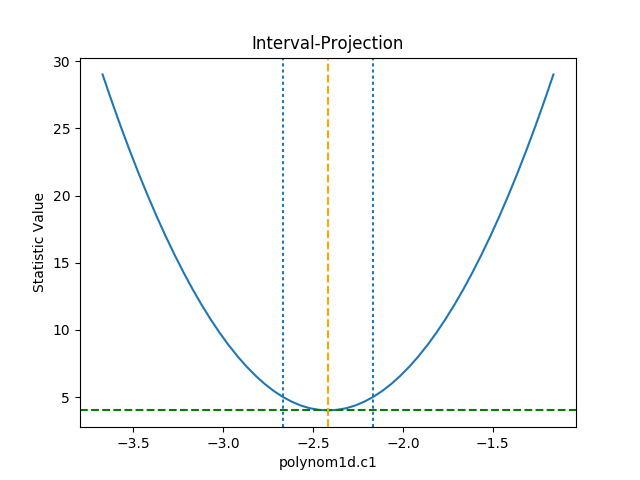
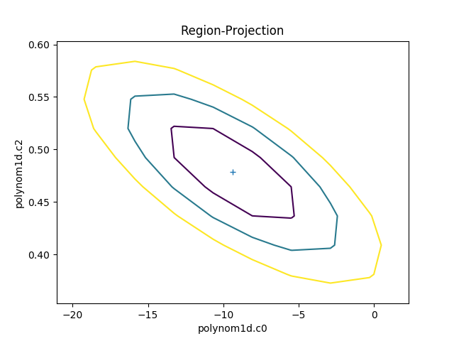
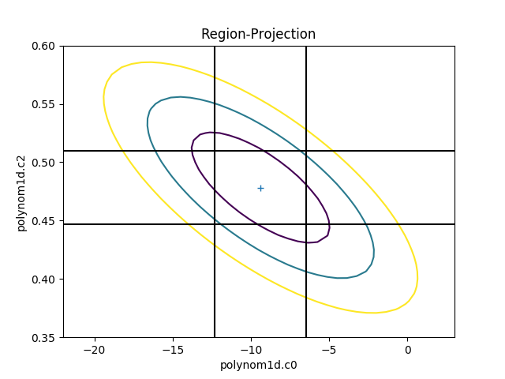
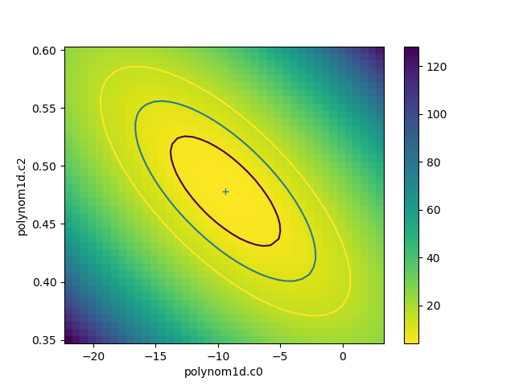

****************
Fitting the data
****************

.. todo::

   In "Estimating Errors", the warning block needs work.
   The "Simultaneous Fits" section probably needs an example, maybe
   moving to a separate page.
   The "Poisson stats" section needs looking at.
   
The :py:class:`~sherpa.fit.Fit` class takes the
:doc:`data <../data/index>` and :doc:`model expression <../models/index>`
to be fit, and uses the
:doc:`optimiser <../optimisers/index>` to minimise the
:doc:`chosen statistic <../statistics/index>`. The basic
approach is to:

 - create a :py:class:`~sherpa.fit.Fit` object;
 - call its :py:meth:`~sherpa.fit.Fit.fit` method one or more times,
   potentially varying the ``method`` attribute to change the
   optimiser;
 - inspect the :py:class:`~sherpa.fit.FitResults` object returned
   by ``fit()`` to extract information about the fit;
 - review the fit quality, perhaps re-fitting with a different set
   of parameters or using a different optimiser;
 - once the "best-fit" solution has been found, calculate error estimates by
   calling the
   :py:meth:`~sherpa.fit.Fit.est_errors` method, which returns
   a :py:class:`~sherpa.fit.ErrorEstResults` object detailing
   the results;
 - visualize the parameter errors with classes such as
   :py:class:`~sherpa.plot.IntervalProjection` and
   :py:class:`~sherpa.plot.RegionProjection`.

The following discussion uses a one-dimensional data set
with gaussian errors (it was
:doc:`simulated with gaussian noise <../evaluation/simulate>`
with :math:`\sigma = 5`):     

   >>> import numpy as np
   >>> import matplotlib.pyplot as plt
   >>> from sherpa.data import Data1D
   >>> d = Data1D('fit example', [-13, -5, -3, 2, 7, 12],
   ...            [102.3, 16.7, -0.6, -6.7, -9.9, 33.2],
   ...            np.ones(6) * 5)

It is going to be fit with the expression:

.. math:: y = c_0 + c_1 x + c_2 x^2

which is represented by the :py:class:`~sherpa.models.basic.Polynom1D`
model:

   >>> from sherpa.models.basic import Polynom1D
   >>> mdl = Polynom1D()

To start with, just the :math:`c_0` and :math:`c_2` terms are
used in the fit:

   >>> mdl.c2.thaw()
   >>> print(mdl)
   polynom1d
      Param        Type          Value          Min          Max      Units
      -----        ----          -----          ---          ---      -----
      polynom1d.c0 thawed            1 -3.40282e+38  3.40282e+38           
      polynom1d.c1 frozen            0 -3.40282e+38  3.40282e+38           
      polynom1d.c2 thawed            0 -3.40282e+38  3.40282e+38           
      polynom1d.c3 frozen            0 -3.40282e+38  3.40282e+38           
      polynom1d.c4 frozen            0 -3.40282e+38  3.40282e+38           
      polynom1d.c5 frozen            0 -3.40282e+38  3.40282e+38           
      polynom1d.c6 frozen            0 -3.40282e+38  3.40282e+38           
      polynom1d.c7 frozen            0 -3.40282e+38  3.40282e+38           
      polynom1d.c8 frozen            0 -3.40282e+38  3.40282e+38           
      polynom1d.offset frozen            0 -3.40282e+38  3.40282e+38           
    
.. _fitting_data:

Creating a fit object
=====================

A :py:class:`~sherpa.fit.Fit` object requires both a
:doc:`data set <../data/index>` and a
:doc:`model <../models/index>` object, and will use the
:py:class:`~sherpa.stats.Chi2Gehrels`
:doc:`statistic <../statistics/index>` with the
:py:class:`~sherpa.optmethods.LevMar`     
:doc:`optimiser <../optimisers/index>`
unless explicitly over-riden with the ``stat`` and
``method`` parameters (when creating the object) or the
:py:attr:`~sherpa.fit.Fit.stat` and
:py:attr:`~sherpa.fit.Fit.method` attributes
(once the object has been created).    

   >>> from sherpa.fit import Fit
   >>> f = Fit(d, mdl)
   >>> print(f)
   data      = fit example
   model     = polynom1d
   stat      = Chi2Gehrels
   method    = LevMar
   estmethod = Covariance
   >>> print(f.data)
   name      = fit example
   x         = [-13, -5, -3, 2, 7, 12]
   y         = [102.3, 16.7, -0.6, -6.7, -9.9, 33.2]
   staterror = Float64[6]
   syserror  = None
   >>> print(f.model)
   polynom1d
      Param        Type          Value          Min          Max      Units
      -----        ----          -----          ---          ---      -----
      polynom1d.c0 thawed            1 -3.40282e+38  3.40282e+38           
      polynom1d.c1 thawed            0 -3.40282e+38  3.40282e+38           
      polynom1d.c2 thawed            0 -3.40282e+38  3.40282e+38           
      polynom1d.c3 frozen            0 -3.40282e+38  3.40282e+38           
      polynom1d.c4 frozen            0 -3.40282e+38  3.40282e+38           
      polynom1d.c5 frozen            0 -3.40282e+38  3.40282e+38           
      polynom1d.c6 frozen            0 -3.40282e+38  3.40282e+38           
      polynom1d.c7 frozen            0 -3.40282e+38  3.40282e+38           
      polynom1d.c8 frozen            0 -3.40282e+38  3.40282e+38           
      polynom1d.offset frozen            0 -3.40282e+38  3.40282e+38

The fit object stores references to objects, such as the model, which
means that the fit object reflects the current state, and not just
the values when it was created or used. For example, in the following
the model is changed directly, and the value stored in the fit
object is also changed:

   >>> f.model.c2.val
   0.0
   >>> mdl.c2 = 1
   >>> f.model.c2.val
   1.0
   
Using the optimiser and statistic
=================================

With a Fit object can calculate the statistic value for
the current data and model
(:py:meth:`~sherpa.fit.Fit.calc_stat`),
summarise how well the current model represents the
data (:py:meth:`~sherpa.fit.Fit.calc_stat_info`),
calculate the per-bin chi-squared value (for chi-square
statistics; :py:meth:`~sherpa.fit.Fit.calc_stat_chisqr`),
fit the model to the data
(:py:meth:`~sherpa.fit.Fit.fit` and
:py:meth:`~sherpa.fit.Fit.simulfit`), and
:ref:`calculate the parameter errors <estimating_errors>`
(:py:meth:`~sherpa.fit.Fit.est_errors`).

   >>> print("Starting statistic: {:.3f}".format(f.calc_stat()))
   Starting statistic: 840.251
   >>> sinfo1 = f.calc_stat_info()
   >>> print(sinfo1)
   name      = 
   ids       = None
   bkg_ids   = None
   statname  = chi2
   statval   = 840.2511999999999
   numpoints = 6
   dof       = 4
   qval      = 1.46616165292e-180
   rstat     = 210.06279999999998

The fields in the :py:class:`~sherpa.fit.StatInfoResults` depend on
the choice of statistic; in particular,
:py:attr:`~sherpa.fit.StatInfoResults.rstat` and
:py:attr:`~sherpa.fit.StatInfoResults.qval` are set to ``None``
if the statistic is not based on chi-square. The current data set
has a reduced statistic of :math:`\sim 200` which indicates
that the fit is not very good (if the error bars in the
dataset are correct then a good fit is indicated by
a reduced statistic :math:`\simeq 1` for
chi-square based statistics).      

As with the model and statistic, if the data object is changed then
the results of calculations made on the fit object can be changed.
As shown below, when one data point is
:ref:`removed <data_filter>`, the calculated statistics
are changed (such as the
:py:attr:`~sherpa.fit.StatInfoResults.numpoints` value).

   >>> d.ignore(0, 5)
   >>> sinfo2 = f.calc_stat_info()
   >>> d.notice()
   >>> sinfo1.numpoints
   6
   >>> sinfo2.numpoints
   5

.. note::

   The objects returned by the fit methods, such as
   :py:class:`~sherpa.fit.StatInfoResults` and
   :py:class:`~sherpa.fit.FitResults`, do not contain references
   to any of the input objects. This means that the values stored
   in these objects are not changed when the input values change.

The :py:meth:`~sherpa.fit.Fit.fit` method uses the optimiser to
vary the
:ref:`thawed parameter values <params-freeze>`
in the model in an attempt to minimize the statistic value.
The method returns a
:py:class:`~sherpa.fit.FitResults` object which contains
information on the fit, such as whether it succeeded (found a minimum,
:py:attr:`~sherpa.fit.FitResults.succeeded`),
the start and end statistic value
(:py:attr:`~sherpa.fit.FitResults.istatval` and
:py:attr:`~sherpa.fit.FitResults.statval`),
and the best-fit parameter values
(:py:attr:`~sherpa.fit.FitResults.parnames` and
:py:attr:`~sherpa.fit.FitResults.parvals`).

   >>> res = f.fit()
   >>> if res.succeeded: print("Fit succeeded")
   Fit succeeded

The return value has a :py:meth:`~sherpa.fit.FitResults.format` method which
provides a summary of the fit:

   >>> print(res.format())
   Method                = levmar
   Statistic             = chi2
   Initial fit statistic = 840.251
   Final fit statistic   = 96.8191 at function evaluation 6
   Data points           = 6
   Degrees of freedom    = 4
   Probability [Q-value] = 4.67533e-20
   Reduced statistic     = 24.2048
   Change in statistic   = 743.432
      polynom1d.c0   -11.0742    
      polynom1d.c2   0.503612    

The information is also available directly as fields of the
:py:class:`~sherpa.fit.FitResults` object:

   >>> print(res)
   datasets       = None
   itermethodname = none
   methodname     = levmar
   statname       = chi2
   succeeded      = True
   parnames       = ('polynom1d.c0', 'polynom1d.c2')
   parvals        = (-11.074165156709268, 0.50361247735062253)
   statval        = 96.8190901009578
   istatval       = 840.2511999999999
   dstatval       = 743.432109899
   numpoints      = 6
   dof            = 4
   qval           = 4.67533320771e-20
   rstat          = 24.20477252523945
   message        = successful termination
   nfev           = 6
    
The reduced chi square fit is now lower, :math:`\sim 25`, but still
not close to 1.

Visualizing the fit
-------------------

The :py:class:`~sherpa.plot.DataPlot`, :py:class:`~sherpa.plot.ModelPlot`,
and :py:class:`~sherpa.plot.FitPlot` classes can be used to
:doc:`see how well the model represents the data <../plots/index>`.

   >>> from sherpa.plot import DataPlot, ModelPlot
   >>> dplot = DataPlot()
   >>> dplot.prepare(f.data)
   >>> mplot = ModelPlot()
   >>> mplot.prepare(f.data, f.model)
   >>> dplot.plot()
   >>> mplot.overplot()

As can be seen, the model isn't able to fully describe the data. One
check to make here is to change the optimiser in case the fit is stuck
in a local minimum. The default optimiser is
:py:class:`~sherpa.optmethods.LevMar`:

   >>> f.method.name
   'levmar'
   >>> original_method = f.method

This can be changed to :py:class:`~sherpa.optmethods.NelderMead`
and the data re-fit.

   >>> from sherpa.optmethods import NelderMead
   >>> f.method = NelderMead()
   >>> resn = f.fit()

In this case the statistic value has not changed, as shown by
:py:attr:`~sherpa.fit.FitResults.dstatval` being zero:
    
   >>> print("Change in statistic: {}".format(resn.dstatval))
   Change in statistic: 0.0

.. note::

   An alternative approach is to create a new Fit object, with the
   new method, and use that instead of changing the
   :py:attr:`~sherpa.fit.Fit.method` attribute. For instance:

   >>> fit2 = Fit(d, mdl, method=NelderMead())
   >>> fit2.fit()
   
Adjusting the model
-------------------
   
This suggests that the problem is not that a local minimum has been
found, but that the model is not expressive enough to represent the
data. One possible approach is to change the set of points used for
the comparison, either by removing data points - perhaps
because they are not well calibrated or there are known to be
issues - or adding extra ones (by removing a previously-applied
filter). The approach taken here is to change the model being fit;
in this case by allowing the linear term (:math:`c_1`) of the
polynomial to be fit, but a new model could have been tried.

.. _fit_thaw_c1:

   >>> mdl.c1.thaw()
   
For the remainder of the analysis the original (Levenberg-Marquardt)
optimiser will be used:

   >>> f.method = original_method

.. _fit_c0_c1_c2:

With :math:`c_1` allowed to vary, the fit finds a much better
solution, with a reduced chi square value of :math:`\simeq 1.3`:

   >>> res2 = f.fit()
   >>> print(res2.format())
   Method                = levmar
   Statistic             = chi2
   Initial fit statistic = 96.8191
   Final fit statistic   = 4.01682 at function evaluation 8
   Data points           = 6
   Degrees of freedom    = 3
   Probability [Q-value] = 0.259653
   Reduced statistic     = 1.33894
   Change in statistic   = 92.8023
      polynom1d.c0   -9.38489    
      polynom1d.c1   -2.41692    
      polynom1d.c2   0.478273       

The previous plot objects can be used, but the model plot has to be
updated to reflect the new model values. Three new plot styles are used:
:py:class:`~sherpa.plot.FitPlot` shows both the data and model values,
:py:class:`~sherpa.plot.DelchiPlot` to show the residuals, and
:py:class:`~sherpa.plot.SplotPlot` to control the layout of the plots:

   >>> from sherpa.plot import DelchiPlot, FitPlot, SplitPlot
   >>> fplot = FitPlot()
   >>> rplot = DelchiPlot()
   >>> splot = SplitPlot()
   >>> mplot.prepare(f.data, f.model)
   >>> fplot.prepare(dplot, mplot)
   >>> splot.addplot(fplot)
   >>> rplot.prepare(f.data, f.model, f.stat)
   >>> splot.addplot(rplot)

The residuals plot shows, on the ordinate, :math:`\sigma = (d - m) / e` where
:math:`d`, :math:`m`, and :math:`e` are the data, model, and error value
for each bin respectively.

.. _change_fit_starting_point:

Refit from a different location
-------------------------------

It may be useful to repeat the fit starting the model off at
different parameter locations to check that the fit solution is
robust. This can be done manually, or the
:py:meth:`~sherpa.models.model.Model.reset` method used to change
the parameters back to
:ref:`the last values they were explicitly set to <parameter_reset>`:

   >>> mdl.reset()

Rather than print out all the components, most of which are fixed at
0, the first three can be looped over using the model's
:py:attr:`~sherpa.models.model.Model.pars` attribute:

   >>> [(p.name, p.val, p.frozen) for p in mdl.pars[:3]]
   [('c0', 1.0, False), ('c1', 0.0, False), ('c2', 1.0, False)]

There are many ways to choose the starting location; in this case
the value of 10 is picked, as it is "far away" from the original
values, but hopefully not so far away that the optimiser will not
be able to find the best-fit location.

   >>> for p in mdl.pars[:3]:
   ...     p.val = 10
   ...

.. note::

   Since the parameter object - an instance of the
   :py:class:`~sherpa.models.parameter.Parameter` class - is being
   accessed directly here, the value is changed via the
   :py:attr:`~sherpa.models.parameter.Parameter.val` attribute,
   since it does not contain the same overloaded accessor functionality
   that allows the setting of the parameter directly from the model.
   The fields of the parameter object are:
   
   >>> print(mdl.pars[1])
   val         = 10.0
   min         = -3.40282346639e+38
   max         = 3.40282346639e+38
   units       = 
   frozen      = False
   link        = None
   default_val = 10.0
   default_min = -3.40282346639e+38
   default_max = 3.40282346639e+38

How did the optimiser vary the parameters?
------------------------------------------

It can be instructive to see the "search path" taken by
the optimiser; that is, how the parameter values are changed per
iteration. The :py:meth:`~sherpa.fit.Fit.fit` method will write
these results to a file if the ``outfile`` parameter is set
(``clobber`` is set here
to make sure that any existing file is overwritten):

   >>> res3 = f.fit(outfile='fitpath.txt', clobber=True)
   >>> print(res3.format())
   Method                = levmar
   Statistic             = chi2
   Initial fit statistic = 196017
   Final fit statistic   = 4.01682 at function evaluation 8
   Data points           = 6
   Degrees of freedom    = 3
   Probability [Q-value] = 0.259653
   Reduced statistic     = 1.33894
   Change in statistic   = 196013
      polynom1d.c0   -9.38489    
      polynom1d.c1   -2.41692    
      polynom1d.c2   0.478273    

The output file is a simple ASCII file where the columns give the
function evaluation number, the statistic, and the parameter values::
  
   # nfev statistic polynom1d.c0 polynom1d.c1 polynom1d.c2
   0.000000e+00 1.960165e+05 1.000000e+01 1.000000e+01 1.000000e+01
   1.000000e+00 1.960165e+05 1.000000e+01 1.000000e+01 1.000000e+01
   2.000000e+00 1.960176e+05 1.000345e+01 1.000000e+01 1.000000e+01
   3.000000e+00 1.960172e+05 1.000000e+01 1.000345e+01 1.000000e+01
   4.000000e+00 1.961557e+05 1.000000e+01 1.000000e+01 1.000345e+01
   5.000000e+00 4.016822e+00 -9.384890e+00 -2.416915e+00 4.782733e-01
   6.000000e+00 4.016824e+00 -9.381649e+00 -2.416915e+00 4.782733e-01
   7.000000e+00 4.016833e+00 -9.384890e+00 -2.416081e+00 4.782733e-01
   8.000000e+00 4.016879e+00 -9.384890e+00 -2.416915e+00 4.784385e-01
   9.000000e+00 4.016822e+00 -9.384890e+00 -2.416915e+00 4.782733e-01

As can be seen, a solution is found quickly in this situation. Is it
the same as
:ref:`the previous attempt <fit_c0_c1_c2>`? Although the final statistic
values are not the same, they are very close:

   >>> res3.statval == res2.statval
   False
   >>> res3.statval - res2.statval
   1.7763568394002505e-15

as are the parameter values:

   >>> res2.parvals
   (-9.384889507344186, -2.416915493735619, 0.4782733426100644)
   >>> res3.parvals
   (-9.384889507268973, -2.4169154937357664, 0.47827334260997567)
   >>> for p2, p3 in zip(res2.parvals, res3.parvals):
   ...     print("{:+.2e}".format(p3 - p2))
   ...
   +7.52e-11
   -1.47e-13
   -8.87e-14

The fact that the parameter values are very similar 
is good evidence for having found the "best fit" location, although
this data set was designed to be easy to fit.
Real-world examples often require more in-depth analysis.

Comparing models
----------------

Sherpa contains the :py:func:`~sherpa.utils.calc_mlr` and
:py:func:`~sherpa.utils.calc_ftest` routines which can be
used to compare the model fits (using the change in the
number of degrees of freedom and chi-square statistic) to
see if freeing up :math:`c_1` is statistically meaningful.

   >>> from sherpa.utils import calc_mlr
   >>> calc_mlr(res.dof - res2.dof, res.statval - res2.statval)
   5.7788876325820937e-22

This provides evidence that the three-term model (with :math:`c_1`
free) is a statistically better fit, but
the results of these routines should be reviewed carefully
to be sure that they are valid; a
suggested reference is
`Protassov et al. 2002, Astrophysical Journal, 571, 545
<https://ui.adsabs.harvard.edu/#abs/2002ApJ...571..545P>`_.

.. _estimating_errors:

Estimating errors
=================

.. note::

   Should I add a paragraph mentioning it can be a good idea to
   rerun ``f.fit()`` to make sure any changes haven't messsed up
   the location?

There are two methods available to estimate errors from the fit object:
:py:class:`~sherpa.estmethods.Covariance` and
:py:class:`~sherpa.estmethods.Confidence`. The method to use can be set
when creating the fit object - using the ``estmethod`` parameter - or
after the object has been created, by changing the
:py:attr:`~sherpa.fit.Fit.estmethod` attribute. The default method
is covariance

   >>> print(f.estmethod.name)
   covariance

which can be significantly faster faster, but less robust, than the
confidence technique
:ref:`shown below <fit_confidence_output>`.

.. _fit_covariance_output:

The :py:meth:`~sherpa.fit.Fit.est_errors` method is used to calculate
the errors on the parameters and returns a
:py:class:`~sherpa.fit.ErrorEstResults` object:

   >>> coverrs = f.est_errors()
   >>> print(coverrs.format())
   Confidence Method     = covariance
   Iterative Fit Method  = None
   Fitting Method        = levmar
   Statistic             = chi2gehrels
   covariance 1-sigma (68.2689%) bounds:
      Param            Best-Fit  Lower Bound  Upper Bound
      -----            --------  -----------  -----------
      polynom1d.c0     -9.38489     -2.91751      2.91751
      polynom1d.c1     -2.41692    -0.250889     0.250889
      polynom1d.c2     0.478273   -0.0312677    0.0312677

The ``EstErrResults`` object can also be displayed directly
(in a similar manner to the ``FitResults`` object returned
by ``fit``):

   >>> print(coverrs)
   datasets    = None
   methodname  = covariance
   iterfitname = none
   fitname     = levmar
   statname    = chi2gehrels
   sigma       = 1
   percent     = 68.2689492137
   parnames    = ('polynom1d.c0', 'polynom1d.c1', 'polynom1d.c2')
   parvals     = (-9.3848895072689729, -2.4169154937357664, 0.47827334260997567)
   parmins     = (-2.9175079401565722, -0.25088931712955043,-0.031267664298717336)
   parmaxes    = (2.9175079401565722, 0.25088931712955043, 0.031267664298717336)
   nfits       = 0

The default is to calculate the one-sigma (68.3%) limits for
each thawed parameter. The
:ref:`error range  can be changed <fit_change_sigma>`
with the
:py:attr:`~sherpa.estmethods.EstMethod.sigma` attribute of the
error estimator, and the
:ref:`set of parameters used <fit_error_subset>` in the
analysis can be changed with the ``parlist``
attribute of the
:py:meth:`~sherpa.fit.Fit.est_errors`
call.

.. warning::

   The error estimate should only be run when at a "good" fit. The
   assumption is that the search statistic is chi-square distributed
   so the change in statistic as a statistic varies can be related to
   a confidence bound. One requirement is that - for chi-square
   statistics - is that the reduced statisitic value is small
   enough. See the ``max_rstat`` field of the
   :py:class:`~sherpa.estmethods.EstMethod` object.

   Give the error if this does not happen (e.g. if c1 has not
   been fit)?

.. _fit_change_sigma:
   
Changing the error bounds
-------------------------

The default is to calculate one-sigma errors, since:

   >>> f.estmethod.sigma
   1

This can be changed, e.g. to calculate 90% errors which are
approximately :math:`\sigma = 1.6`:

   >>> f.estmethod.sigma = 1.6
   >>> coverrs90 = f.est_errors()
   >>> print(coverrs90.format())
   Confidence Method     = covariance
   Iterative Fit Method  = None
   Fitting Method        = levmar
   Statistic             = chi2gehrels
   covariance 1.6-sigma (89.0401%) bounds:
      Param            Best-Fit  Lower Bound  Upper Bound
      -----            --------  -----------  -----------
      polynom1d.c0     -9.38489     -4.66801      4.66801
      polynom1d.c1     -2.41692    -0.401423     0.401423
      polynom1d.c2     0.478273   -0.0500283    0.0500283

.. note::
   
   As can be seen, 1.6 sigma isn't quite 90%
   
   >>> coverrs90.percent
   89.0401416600884

.. _fit_covar_matrix:

Accessing the covariance matrix
-------------------------------

The errors created by :py:class:`~sherpa.estmethods.Covariance` provides
access to the covariance matrix via the
:py:attr:`~sherpa.fit.ErrorEstResults.extra_output` attribute:

   >>> print(coverrs.extra_output)
   [[  8.51185258e+00  -4.39950074e-02  -6.51777887e-02]
    [ -4.39950074e-02   6.29454494e-02   6.59925111e-04]
    [ -6.51777887e-02   6.59925111e-04   9.77666831e-04]]

The order of these rows and columns matches that of the
:py:attr:`~sherpa.fit.ErrorEstResults.parnames` field:
    
   >>> print([p.split('.')[1] for p in coverrs.parnames])
   ['c0', 'c1', 'c2']

Changing the estimator
----------------------

.. note::

   There appears to be a
   `bug in Sherpa <https://github.com/sherpa/sherpa/issues/342>`_
   whereby calling ``est_errors`` with the ``Confidence``
   method here will fail with the message::

       IndexError: tuple index out of range

   If you see this message then it appears that the ``thaw_indices``
   attribute of the fit object has got out of synchronization and
   needs to be reset with:
   
   >>> f.thaw_indices = tuple(i for i, p in enumerate(f.model.pars)
   ...                        if not p.frozen)

   It should not be needed in most cases (it is only needed here
   because of the
   :ref:`earlier change to thaw c1 <fit_thaw_c1>`).

.. _fit_confidence_call:

The :py:class:`~sherpa.estmethods.Confidence` method takes each
thawed parameter and varies it until it finds the point where the
statistic has increased enough (the value is determined by the
``sigma`` parameter and assumes the statistic is chi-squared
distributed). This is repeated separately for the upper and
lower bounds for each parameter. Since this can take time for
complicated fits, the default behavior is to display a message
when each limit is found (the
:ref:`order these messages are displayed can change <fit_multi_core>`
from run to run):
   
   >>> from sherpa.estmethods import Confidence
   >>> f.estmethod = Confidence()
   >>> conferrs = f.est_errors()
   polynom1d.c0 lower bound:	-2.91751
   polynom1d.c1 lower bound:	-0.250889
   polynom1d.c0 upper bound:	2.91751
   polynom1d.c2 lower bound:	-0.0312677
   polynom1d.c1 upper bound:	0.250889
   polynom1d.c2 upper bound:	0.0312677

As with the :ref:`covariance run <fit_covariance_output>`, the
return value is a :py:class:`~sherpa.fit.ErrorEstResults` object:

.. _fit_confidence_output:

   >>> print(conferrs.format())
   Confidence Method     = confidence
   Iterative Fit Method  = None
   Fitting Method        = levmar
   Statistic             = chi2gehrels
   confidence 1-sigma (68.2689%) bounds:
      Param            Best-Fit  Lower Bound  Upper Bound
      -----            --------  -----------  -----------
      polynom1d.c0     -9.38489     -2.91751      2.91751
      polynom1d.c1     -2.41692    -0.250889     0.250889
      polynom1d.c2     0.478273   -0.0312677    0.0312677

Unlike the covariance errors, these are
:ref:`not guaranteed to be symmetrical <simple_user_model_confidence_bounds>`
(although in this example they are).

.. _fit_multi_core:

Using multiple cores
--------------------

The example data and model used here does not require many
iterations to fit and calculate errors. However, for real-world
situations the error analysis can often take significantly-longer
than the fit. When using the
:py:class:`~sherpa.estmethods.Confidence` technique, the default
is to use all available CPU cores on the machine (the error range
for each parameter can be thought of as a separate task, and the
Python multiprocessing module is used to evaluate these tasks).
This is why the order of the 
:ref:`screen output <fit_confidence_call>` from the
:py:meth:`~sherpa.fit.Fit.est_errors` call can vary.

The
:py:attr:`~sherpa.estmethod.EstMethod.parallel`
attribute of the error estimator controls whether the
calculation should be run in parallel (``True``) or
not, and the 
:py:attr:`~sherpa.estmethod.EstMethod.numcores` attribute
determines how many CPU cores are used (the default is
to use all available cores).

   >>> f.estmethod.name
   'confidence'
   >>> f.estmethod.parallel
   True

The :py:class:`~sherpa.estmethods.Covariance` technique does not
provide a parallel option.

.. _fit_error_subset:
   
Using a subset of parameters
----------------------------

To save time, the error calculation can be restricted to a subset
of parameters by setting the ``parlist`` parameter of the
:py:meth:`~sherpa.fit.Fit.est_errors` call. As an example, the
errors on just :math:`c_1` can be evaluated with the following:

   >>> c1errs = f.est_errors(parlist=(mdl.c1, ))
   polynom1d.c1 lower bound:	-0.250889
   polynom1d.c1 upper bound:	0.250889
   >>> print(c1errs)
   datasets    = None
   methodname  = confidence
   iterfitname = none
   fitname     = levmar
   statname    = chi2gehrels
   sigma       = 1
   percent     = 68.2689492137
   parnames    = ('polynom1d.c1',)
   parvals     = (-2.4169154937357664,)
   parmins     = (-0.25088931712955054,)
   parmaxes    = (0.25088931712955054,)
   nfits       = 2

Visualizing the errors
----------------------

The :py:class:`~sherpa.plot.IntervalProjection` class is used to
show how the statistic varies with a single parameter. It steps
through a range of values for a single parameter, fitting the
other thawed parameters, and displays the statistic value
(this gives an indication if the assumptions used to
:ref:`calculate the errors <fit_confidence_call>`
are valid):

   >>> from sherpa.plot import IntervalProjection
   >>> iproj = IntervalProjection()
   >>> iproj.calc(f, mdl.c1)
   >>> iproj.plot()
   

.. _fit_iproj_manual:

The default options display around one sigma from the best-fit
location (the range is estimated from the covariance error estimate).
The :py:meth:`~sherpa.plot.IntervalProjection.prepare` method is used
to change these defaults - e.g. by explicitly setting the ``min``
and ``max`` values to use - or, as shown below, by scaling the
covariance error estimate using the ``fac`` argument:

   >>> iproj.prepare(fac=5, nloop=51)

The number of points has also been increased (the ``nloop`` argument)
to keep the curve smooth. Before re-plotting, the 
:py:meth:`~sherpa.plot.IntervalProjection.calc`
method needs to be re-run to calculate the new data.
The one-sigma range is also added as vertical dotted
lines using
:py:meth:`~sherpa.plot.IntervalProjection.vline`:
    
   >>> iproj.calc(f, mdl.c1)
   >>> iproj.plot()
   >>> pmin = c1errs.parvals[0] + c1errs.parmins[0]
   >>> pmax = c1errs.parvals[0] + c1errs.parmaxes[0]
   >>> iproj.vline(pmin, overplot=True, linestyle='dot')
   >>> iproj.vline(pmax, overplot=True, linestyle='dot')

.. note::

   The :py:meth:`~sherpa.plot.IntervalProjection.vline`
   method is a simple wrapper routine. Direct calls to
   matplotlib can also be used to :ref:`annotate the
   visualization <fit_rproj_manual>`.
   
The :py:class:`~sherpa.plot.RegionProjection` class allows the
correlation between two parameters to be shown as a contour plot.
It follows a similar approach as
:py:class:`~sherpa.plot.IntervalProjection`, although the
final visualization is created with a call to
:py:meth:`~sherpa.plot.RegionProjection.contour` rather than
plot:    

   >>> from sherpa.plot import RegionProjection
   >>> rproj = RegionProjection()
   >>> rproj.calc(f, mdl.c0, mdl.c2)
   >>> rproj.contour()
   

.. _fit_rproj_manual:

The limits can be changed, either using the
``fac`` parameter (as shown in the
:ref:`interval-projection case <fit_iproj_manual>`), or
with the ``min`` and ``max`` parameters:

   >>> rproj.prepare(min=(-22, 0.35), max=(3, 0.6), nloop=(41, 41))
   >>> rproj.calc(f, mdl.c0, mdl.c2)
   >>> rproj.contour()
   >>> xlo, xhi = plt.xlim()
   >>> ylo, yhi = plt.ylim()
   >>> def get_limits(i):
   ...     return conferrs.parvals[i] + \
   ...            np.asarray([conferrs.parmins[i],
   ...                        conferrs.parmaxes[i]])
   ...
   >>> plt.vlines(get_limits(0), ymin=ylo, ymax=yhi)
   >>> plt.hlines(get_limits(2), xmin=xlo, xmax=xhi)

The vertical lines are added to indicate the one-sigma errors
:ref:`calculated by the confidence method earlier <fit_confidence_call>`.

The :py:class:`~sherpa.plot.RegionProjection.calc` call
sets the fields of the 
:py:class:`~sherpa.plot.RegionProjection` object with the
data needed to create the plot. In the following example the
data is used to show the search statistic as an image, with the
contours overplotted. First, the axes of the image
are calculated (the ``extent`` argument to matplotlib's
``imshow`` command requires the pixel edges, not the
centers):

   >>> xmin, xmax = rproj.x0.min(), rproj.x0.max()
   >>> ymin, ymax = rproj.x1.min(), rproj.x1.max()
   >>> nx, ny = rproj.nloop
   >>> hx = 0.5 * (xmax - xmin) / (nx - 1)
   >>> hy = 0.5 * (ymax - ymin) / (ny - 1)
   >>> extent = (xmin - hx, xmax + hx, ymin - hy, ymax + hy)

The statistic data is stored as a one-dimensional array, and
needs to be reshaped before it can be displayed:

   >>> y = rproj.y.reshape((ny, nx))

   >>> plt.clf()
   >>> plt.imshow(y, origin='lower', extent=extent, aspect='auto', cmap='viridis_r')
   >>> plt.colorbar()
   >>> plt.xlabel(rproj.xlabel)
   >>> plt.ylabel(rproj.ylabel)
   >>> rproj.contour(overplot=True)

   
.. _fit_simultaneous:

Simultaneous fits
=================

Sherpa uses the 
:py:class:`~sherpa.data.DataSimulFit` and
:py:class:`~sherpa.models.model.SimulFitModel`
classes to fit multiple data seta and models simultaneously.
This can be done explicitly, by combining individual data sets
and models into instances of these classes, or implicitly
with the :py:meth:`~sherpa.fit.Fit.simulfit` method.

It only makes sense to perform a simultaneous fit if there is
some "link" between the various data sets or models, such
as sharing one or model components or
:ref:`linking model parameters <params-link>`.

Poisson stats
=============

Should there be something about using Poisson stats?    

Reference/API
=============

.. toctree::
   :maxdepth: 2

   fit
   estmethods
