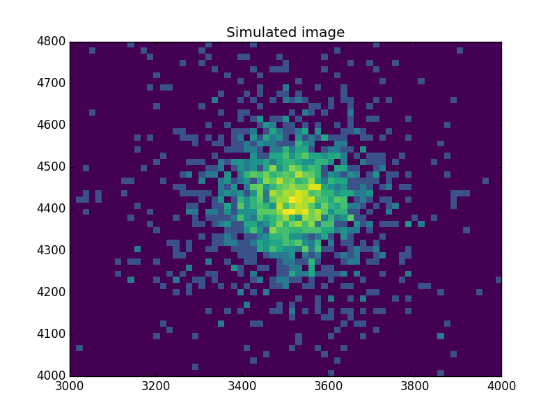
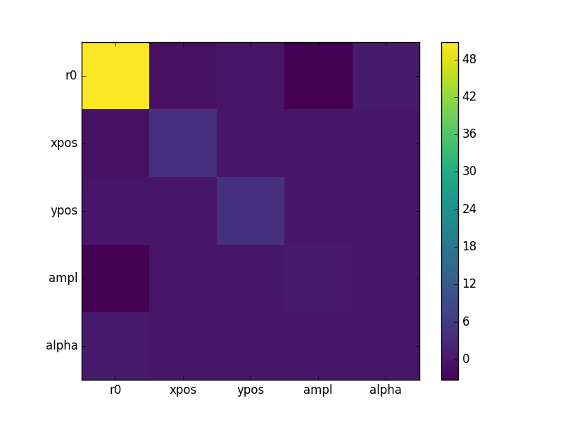
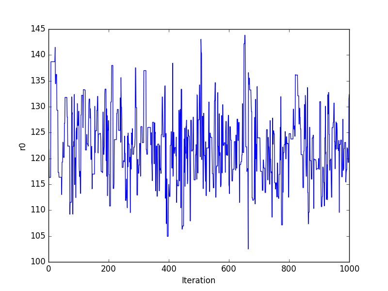
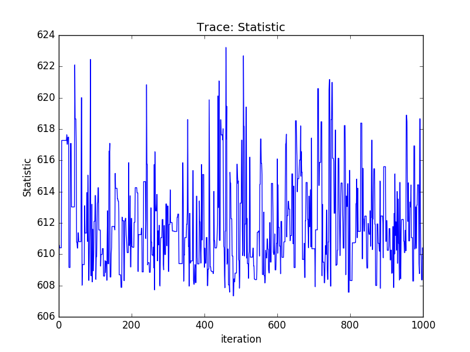
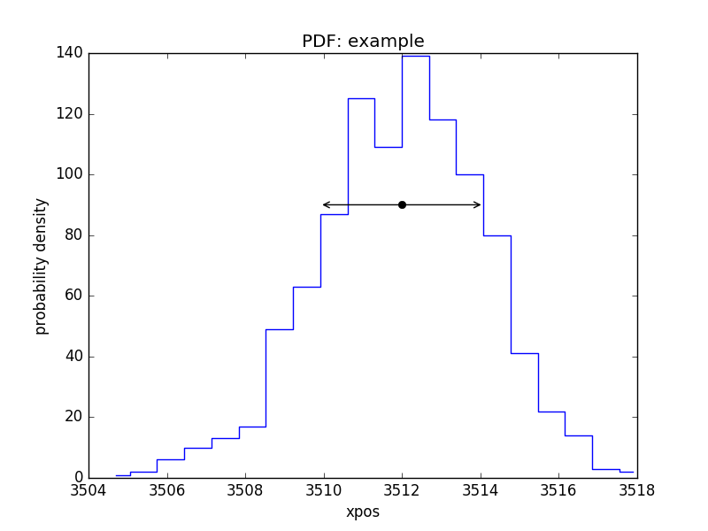
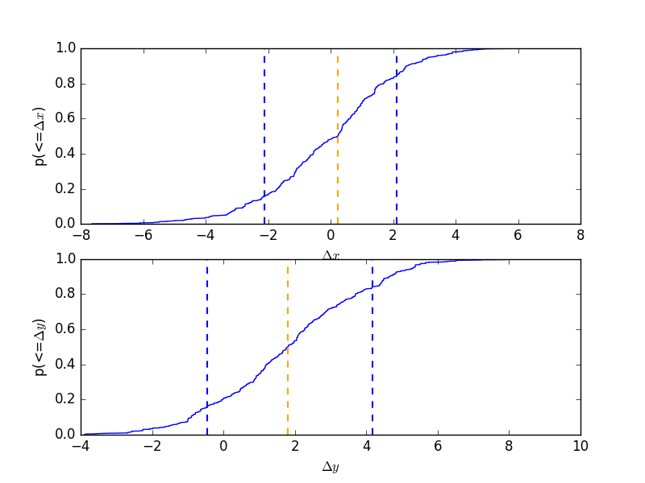
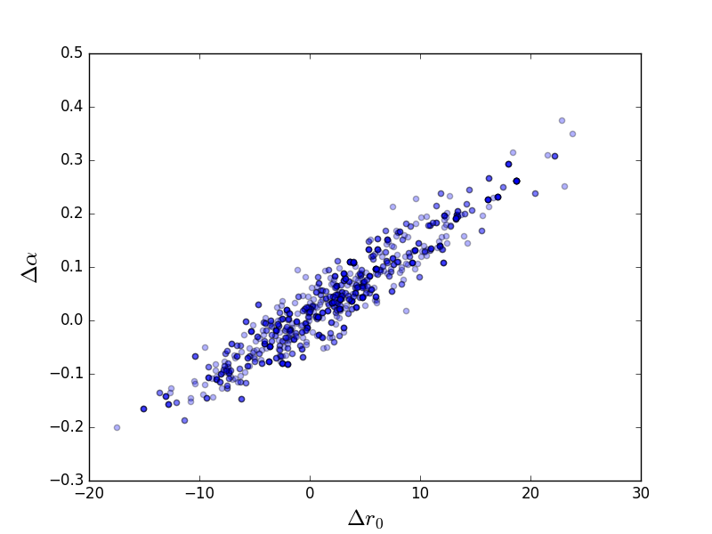
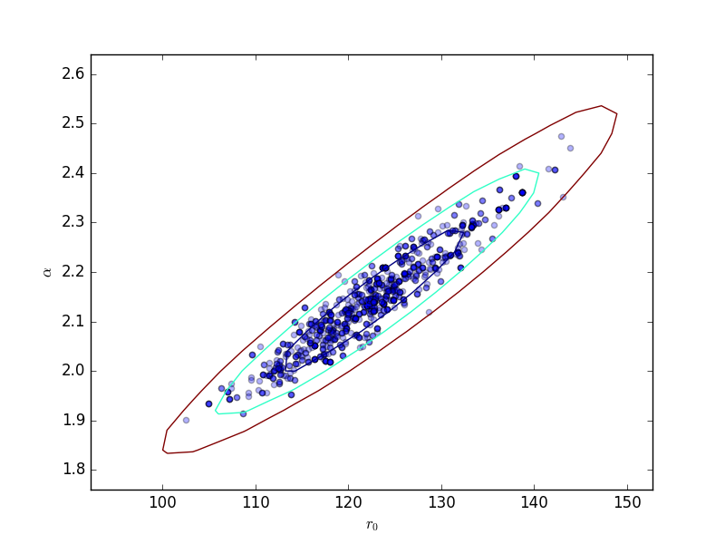

=========================================
Markov Chain Monte Carlo and Poisson data
=========================================

.. todo::

   The documentation needs a full review; an example of setting priors
   on parameters is needed; should the example be simplified?
   
Sherpa provides a
`Markov Chain Monte Carlo (MCMC)
<https://en.wikipedia.org/wiki/Markov_chain_Monte_Carlo>`_
method designed for Poisson-distributed data.
It was originally developed as the
`Bayesian Low-Count X-ray Spectral (pyBLoCXS)
<https://hea-www.harvard.edu/astrostat/pyblocxs/>`_
[1]_ package based on the algorithm presented in
`Analysis of Energy Spectra with Low Photon Counts
via Bayesian Posterior Simulation
<https://ui.adsabs.harvard.edu/#abs/2001ApJ...548..224V>`_
by van Dyk et al. (2001) [2]_.

Markov Chain Monte Carlo (MCMC) is a complex computational technique and one
needs to ensure that it both converges and explores the posterior distribution properly. 
The original pyBLoCXS code has been tested with a
number of simple single-component spectral models. It should be used with
great care in more complex settings. The code is based on the methods in
[2]_ but employs a different MCMC sampler than is described in that article.
A general description of the techniques employed along with their
convergence diagnostics can be found in the Appendices of [2]_
and in [3]_.

MCMC as implemented in Sherpa explores parameter space at a suspected minimum - i.e. after a standard Sherpa fit. It supports 
a flexible definition of priors and allows for variations in the calibration information. 
It can be used to compute posterior predictive p-values for the likelihood ratio test
[4]_. It can also accounts for instrument calibration uncertainty [5]_.

MCMC in Sherpa selects random samples from the posterior probability 
distribution of the model parameters starting from the best fit (maximum likelihood)
given by the standard optimization methods in Sherpa (i.e. result of the ``fit()``). ``get_draws()`` runs MCMC 
chains for a specific dataset, the selected sampler, the priors, and the specified number of iterations. 
It returns an array of statistic values, an array of acceptance Booleans, 
and an array of sampled parameter values (i.e. draws) from the posterior distribution.

The multivariate t-distribution is the default proposal distribution in ``get_draws()``. 
This distribution is defined by the multivariate normal (for the model parameter values and the covariance matrix), 
and chi2 distribution for a given degrees of freedom. The algorithm provides a choice of MCMC samplers with different
jumping rules for acceptance of the proposed parameters: Metropolis (symmetric) and Metropolis-Hastings (asymmetric).

Note that the multivariate normal distribution which requires the parameter values and 
the corresponding covariance matrix. ``covar()`` should be run beforehand.

Additional scale parameter allows to adjust the scale size of the multivariate normal
in the definition of the t-distribution. This could improve the efficiency of the sampler and can be used to obtain
the required acceptance rates.

Jumping Rules
-------------

The jumping rule determines how each step in the MCMC is calculated. 
The setting can be changed using ``set_sampler``. The ``sherpa.sim`` module provides 
the following rules, which may be augmented by other modules:

- ``MH`` uses a Metropolis-Hastings jumping rule that is a multivariate
  t-distribution with user-specified degrees of freedom centered on the
  best-fit parameters, and with multivariate scale determined by the
  ``covar`` function applied at the best-fit location.

- ``MetropolisMH`` mixes this Metropolis and Metropolis-Hastings jumping rule with a
  Metropolis jumping rule centered at the current draw, in both cases
  drawing from the same t-distribution as used with ``MH``. The
  probability of using the best-fit location as the start of the jump
  is given by the ``p_M`` parameter of the rule (use ``get_sampler`` or
  ``get_sampler_opt`` to view and ``set_sampler_opt`` to set this value),
  otherwise the jump is from the previous location in the chain.

Options for the sampler are retrieved and set by ``get_sampler`` or
``get_sampler_opt``, and ``set_sampler_opt`` respectively. The list of
available samplers is given by ``list_samplers``.

Choosing priors
----------------

By default, the prior on each parameter is taken to be flat, varying
from the parameter minima to maxima values. This prior can be changed
using the ``set_prior`` function, which can set the prior for a
parameter to a function or Sherpa model. The list of currently set
prior-parameter pairs is returned by the ``list_priors`` function, and the
prior function associated with a particular Sherpa model parameter may be
accessed with ``get_prior``.

Running the chain
-----------------

The ``get_draws`` function runs a pyBLoCXS chain using fit information
associated with the specified data set(s), and the currently set sampler and
parameter priors, for a specified number of iterations. It returns an array of
statistic values, an array of acceptance Booleans, and a 2-D array of
associated parameter values.

Analyzing the results
---------------------

The `sherpa.sim` module contains several routines to visualize the results of the chain,
including ``plot_trace``, ``plot_cdf``, and ``plot_pdf``, along with
``sherpa.utils.get_error_estimates`` for calculating the limits from a
parameter chain.

References
----------
.. [1] http://hea-www.harvard.edu/AstroStat/pyBLoCXS/
.. [2] "Analysis of Energy Spectra with Low Photon Counts via Bayesian
       Posterior Simulation", van Dyk et al. 2001, ApJ, 548, 224
       http://adsabs.harvard.edu/abs/2001ApJ...548..224V
.. [3] Chapter 11 of Gelman, Carlin, Stern, and Rubin
       (Bayesian Data Analysis, 2nd Edition, 2004, Chapman & Hall/CRC).
.. [4] "Statistics, Handle with Care: Detecting Multiple Model Components
       with the Likelihood Ratio Test", Protassov et al., 2002, ApJ, 571, 545
       http://adsabs.harvard.edu/abs/2002ApJ...571..545P
.. [5] "Accounting for Calibration Uncertainties in X-ray Analysis:
       Effective Areas in Spectral Fitting", Lee et al., 2011, ApJ, 731, 126
       http://adsabs.harvard.edu/abs/2011ApJ...731..126L

       
Example
=======

.. note::

   This example probably needs to be simplified to reduce the run time

Simulate the data
------------------

Create a simulated data set::

    >>> np.random.seed(2)
    >>> x0low, x0high = 3000, 4000
    >>> x1low, x1high = 4000, 4800
    >>> dx = 15
    >>> x1, x0 = np.mgrid[x1low:x1high:dx, x0low:x0high:dx]

Convert to 1D arrays::
  
    >>> shape = x0.shape
    >>> x0, x1 = x0.flatten(), x1.flatten()

Create the model used to simulate the data::
  
    >>> from sherpa.astro.models import Beta2D
    >>> truth = Beta2D()
    >>> truth.xpos, truth.ypos = 3512, 4418
    >>> truth.r0, truth.alpha = 120, 2.1
    >>> truth.ampl = 12

Evaluate the model to calculate the expected values::
  
    >>> mexp = truth(x0, x1).reshape(shape)

Create the simulated data by adding in Poisson-distributed noise::
  
    >>> msim = np.random.poisson(mexp)

What does the data look like?
-----------------------------

Use an arcsinh transform to view the data, based on the work of
`Lupton, Gunn & Szalay (1999)
<https://ui.adsabs.harvard.edu/#abs/1999AJ....118.1406L>`_.
   
::

    >>> plt.imshow(np.arcsinh(msim), origin='lower', cmap='viridis',
    ...            extent=(x0low, x0high, x1low, x1high),
    ...            interpolation='nearest', aspect='auto')
    >>> plt.title('Simulated image')

Find the starting point for the MCMC
------------------------------------

Set up a model and use the standard Sherpa approach to find a good
starting place for the MCMC analysis::

    >>> from sherpa import data, stats, optmethods, fit
    >>> d = data.Data2D('sim', x0, x1, msim.flatten(), shape=shape)
    >>> mdl = Beta2D()
    >>> mdl.xpos, mdl.ypos = 3500, 4400

Use a Likelihood statistic and Nelder-Mead algorithm::
  
    >>> f = fit.Fit(d, mdl, stats.Cash(), optmethods.NelderMead())
    >>> res = f.fit()
    >>> print(res.format())
    Method                = neldermead
    Statistic             = cash
    Initial fit statistic = 20048.5
    Final fit statistic   = 607.229 at function evaluation 777
    Data points           = 3618
    Degrees of freedom    = 3613
    Change in statistic   = 19441.3
       beta2d.r0      121.945     
       beta2d.xpos    3511.99     
       beta2d.ypos    4419.72     
       beta2d.ampl    12.0598     
       beta2d.alpha   2.13319     
    
Now calculate the covariance matrix (the default error estimate)::

    >>> f.estmethod
    <Covariance error-estimation method instance 'covariance'>
    >>> eres = f.est_errors()
    >>> print(eres.format())
    Confidence Method     = covariance
    Iterative Fit Method  = None
    Fitting Method        = neldermead
    Statistic             = cash
    covariance 1-sigma (68.2689%) bounds:
       Param            Best-Fit  Lower Bound  Upper Bound
       -----            --------  -----------  -----------
       beta2d.r0         121.945     -7.12579      7.12579
       beta2d.xpos       3511.99     -2.09145      2.09145
       beta2d.ypos       4419.72     -2.10775      2.10775
       beta2d.ampl       12.0598    -0.610294     0.610294
       beta2d.alpha      2.13319    -0.101558     0.101558

The covariance matrix is stored in the ``extra_output`` attribute::
  
    >>> cmatrix = eres.extra_output
    >>> pnames = [p.split('.')[1] for p in eres.parnames]
    >>> plt.imshow(cmatrix, interpolation='nearest', cmap='viridis')
    >>> plt.xticks(np.arange(5), pnames)
    >>> plt.yticks(np.arange(5), pnames)
    >>> plt.colorbar()

Run the chain
-------------

Finally, run a chain (use a small number to keep the run time low
for this example)::

    >>> from sherpa.sim import MCMC
    >>> mcmc = MCMC()
    >>> mcmc.get_sampler_name()
    >>> draws = mcmc.get_draws(f, cmatrix, niter=1000)
    >>> svals, accept, pvals = draws
    
    >>> pvals.shape
    (5, 1001)
    >>> accept.sum() * 1.0 / 1000
    0.48499999999999999

Trace plots
-----------

::
   
    >>> plt.plot(pvals[0, :])
    >>> plt.xlabel('Iteration')
    >>> plt.ylabel('r0')

Or using the :py:mod:`sherpa.plot` module::

    >>> from sherpa import plot
    >>> tplot = plot.TracePlot()
    >>> tplot.prepare(svals, name='Statistic')
    >>> tplot.plot()

   
PDF of a parameter
------------------

::

    >>> pdf = plot.PDFPlot()
    >>> pdf.prepare(pvals[1, :], 20, False, 'xpos', name='example')
    >>> pdf.plot()

Add in the covariance estimate::
  
   >>> xlo, xhi = eres.parmins[1] + eres.parvals[1], eres.parmaxes[1] + eres.parvals[1]
   
   >>> plt.annotate('', (xlo, 90), (xhi, 90), arrowprops={'arrowstyle': '<->'})
   >>> plt.plot([eres.parvals[1]], [90], 'ok')

CDF for a parameter
-------------------

Normalise by the actual answer to make it easier to see how well
the results match reality::

    >>> cdf = plot.CDFPlot()
    >>> plt.subplot(2, 1, 1)
    >>> cdf.prepare(pvals[1, :] - truth.xpos.val, r'$\Delta x$')
    >>> cdf.plot(clearwindow=False)
    >>> plt.title('')
    >>> plt.subplot(2, 1, 2)
    >>> cdf.prepare(pvals[2, :] - truth.ypos.val, r'$\Delta y$')
    >>> cdf.plot(clearwindow=False)
    >>> plt.title('')

Scatter plot
------------

::

    >>> plt.scatter(pvals[0, :] - truth.r0.val,
    ...             pvals[4, :] - truth.alpha.val, alpha=0.3)
    >>> plt.xlabel(r'$\Delta r_0$', size=18)
    >>> plt.ylabel(r'$\Delta \alpha$', size=18)

   
This can be compared to the
:py:class:`~sherpa.plot.RegionProjection` calculation::

    >>> plt.scatter(pvals[0, :], pvals[4, :], alpha=0.3)

    >>> from sherpa.plot import RegionProjection
    >>> rproj = RegionProjection()
    >>> rproj.prepare(min=[95, 1.8], max=[150, 2.6], nloop=[21, 21])
    >>> rproj.calc(f, mdl.r0, mdl.alpha)
    >>> rproj.contour(overplot=True)
    >>> plt.xlabel(r'$r_0$'); plt.ylabel(r'$\alpha$')

Reference/API
=============

.. toctree::
   :maxdepth: 2

   sim
   mh
   sample
   simulate

