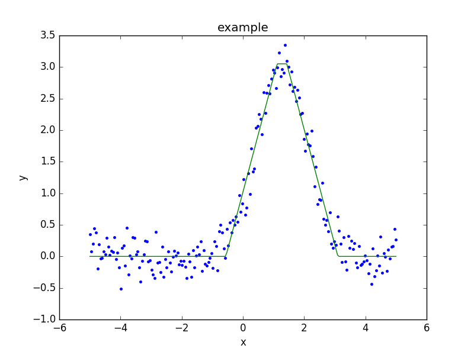

.. _usermodel:

**********************
Writing your own model
**********************

A model class can be created to fit any function, or interface with
external code.

.. todo::

   There should be some description of what needs to be done, as well
   as examples.
   Does the 1D example need to be cleaned up to separate out unnescessary code,
   perhaps just hiding the setup code (and it would be nice if
   this could be shared with the setup).
   Should the 2D example add commentary to point out the following
   note I added at the time:
   "Hmmm, this looks similar to the Sherpa results. In particular
   the 0,0 value is -80 not 1. Aha, is it a normalization at
   (0,0) vs (1,1) sort of thing?"
   

A one-dimensional model
=======================

An example is the
`AstroPy trapezoidal model <http://docs.astropy.org/en/stable/api/astropy.modeling.functional_models.Trapezoid1D.html>`_,
which has four parameters: the amplitude of the central region, the center
and width of this region, and the slope. The following model class,
which was not written for efficiancy or robustness, implements this
interface:

.. literalinclude:: ../code/trap.py

This can be used in the same manner as the
:py:class:`~sherpa.models.basic.Gauss1D` model
in the :ref:`quick guide to Sherpa<quick-gauss1d>`.

First, create the data to fit::

    >>> import numpy as np
    >>> import matplotlib.pyplot as plt
    >>> np.random.seed(0)
    >>> x = np.linspace(-5., 5., 200)
    >>> ampl_true = 3
    >>> pos_true = 1.3
    >>> sigma_true = 0.8
    >>> err_true = 0.2
    >>> y = ampl_true * np.exp(-0.5 * (x - pos_true)**2 / sigma_true**2)
    >>> y += np.random.normal(0., err_true, x.shape)

Now create a Sherpa data object::
  
    >>> from sherpa.data import Data1D
    >>> d = Data1D('example', x, y)

Set up the user model::
  
    >>> from trap import Trap1D
    >>> t = Trap1D()
    >>> print(t)
    trap1d
       Param        Type          Value          Min          Max      Units
       -----        ----          -----          ---          ---      -----
       trap1d.ampl  thawed            1            0  3.40282e+38           
       trap1d.center thawed            1 -3.40282e+38  3.40282e+38           
       trap1d.width thawed            1            0  3.40282e+38           
       trap1d.slope thawed            1            0  3.40282e+38           

Finally, perform the fit::
  
    >>> from sherpa.fit import Fit
    >>> from sherpa.stats import LeastSq
    >>> from sherpa.optmethods import LevMar
    >>> tfit = Fit(d, t, stat=LeastSq(), method=LevMar())
    >>> tres = tfit.fit()
    >>> if not tres.succeeded: print(tres.message)

Rather than use a :py:class:`~sherpa.plot.ModelPlot` object,
the ``overplot`` argument can be set to allow multiple values
in the same plot::

    >>> from sherpa import plot
    >>> dplot = plot.DataPlot()
    >>> dplot.prepare(d)
    >>> dplot.plot()
    >>> mplot = plot.ModelPlot()
    >>> mplot.prepare(d, t)
    >>> mplot.plot(overplot=True)

.. _example-usermodel-2d:

A two-dimensional model
=======================

The two-dimensional case is similar to the one-dimensional case,
with the major difference being the number of independent axes to
deal with. In the following example the model is assumed to only be
applied to non-integrated data sets, as it simplifies the implementation
of the ``calc`` method.

It also shows one way of embedding models from a different system,
in this case the
`two-dimemensional polynomial model 
<http://docs.astropy.org/en/stable/api/astropy.modeling.polynomial.Polynomial2D.html>`_
from the AstroPy package.

.. literalinclude:: ../code/poly.py

Repeating the 2D fit by first setting up the data to fit::

    >>> np.random.seed(0)
    >>> y2, x2 = np.mgrid[:128, :128]
    >>> z = 2. * x2 ** 2 - 0.5 * y2 ** 2 + 1.5 * x2 * y2 - 1.
    >>> z += np.random.normal(0., 0.1, z.shape) * 50000.

Put this data into a Sherpa data object::
    
    >>> from sherpa.data import Data2D
    >>> x0axis = x2.ravel()
    >>> x1axis = y2.ravel()
    >>> d2 = Data2D('img', x0axis, x1axis, z.ravel(), shape=(128,128))

Create an instance of the user model::
  
    >>> from poly import WrapPoly2D
    >>> wp2 = WrapPoly2D('wp2')
    >>> wp2.c1_0.frozen = True
    >>> wp2.c0_1.frozen = True

Finally, perform the fit::
  
    >>> f2 = Fit(d2, wp2, stat=LeastSq(), method=LevMar())
    >>> res2 = f2.fit()
    >>> if not res2.succeeded: print(res2.message)
    >>> print(res2)
    datasets       = None
    itermethodname = none
    methodname     = levmar
    statname       = leastsq
    succeeded      = True
    parnames       = ('wp2.c0_0', 'wp2.c2_0', 'wp2.c0_2', 'wp2.c1_1')
    parvals        = (-80.289475553599914, 1.9894112623565667, -0.4817452191363118, 1.5022711710873158)
    statval        = 400658883390.6685
    istatval       = 6571934382318.328
    dstatval       = 6.17127549893e+12
    numpoints      = 16384
    dof            = 16380
    qval           = None
    rstat          = None
    message        = successful termination
    nfev           = 80
    >>> print(wp2)
    wp2
       Param        Type          Value          Min          Max      Units
       -----        ----          -----          ---          ---      -----
       wp2.c0_0     thawed     -80.2895 -3.40282e+38  3.40282e+38           
       wp2.c1_0     frozen            0 -3.40282e+38  3.40282e+38           
       wp2.c2_0     thawed      1.98941 -3.40282e+38  3.40282e+38           
       wp2.c0_1     frozen            0 -3.40282e+38  3.40282e+38           
       wp2.c0_2     thawed    -0.481745 -3.40282e+38  3.40282e+38           
       wp2.c1_1     thawed      1.50227 -3.40282e+38  3.40282e+38
   
