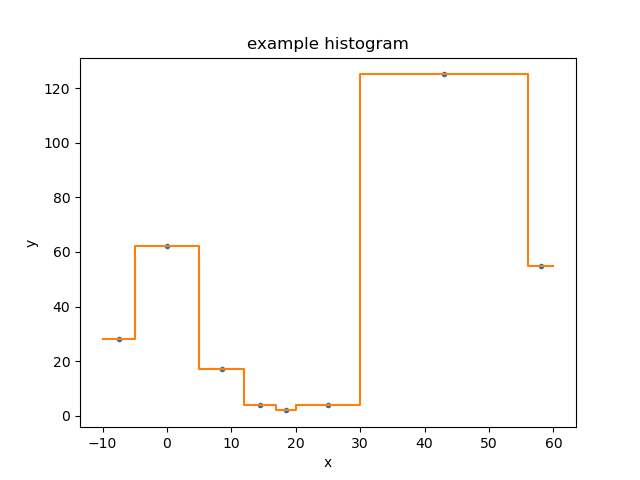
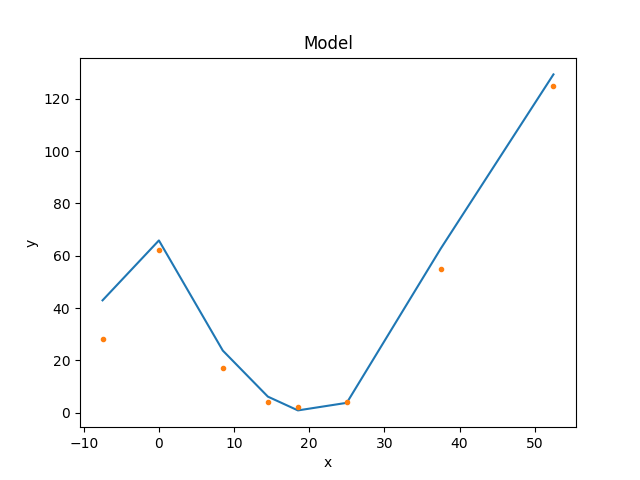
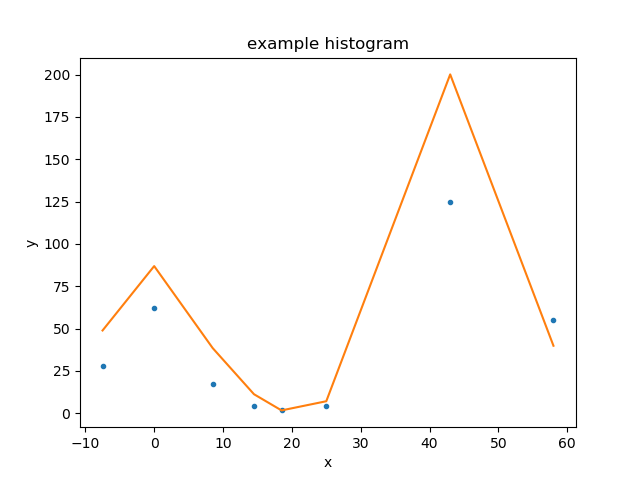
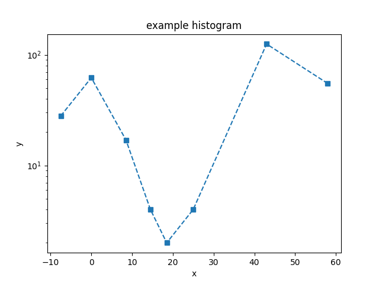
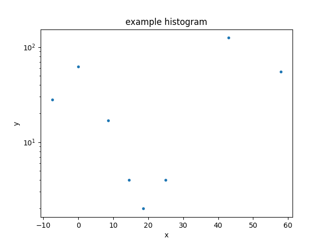
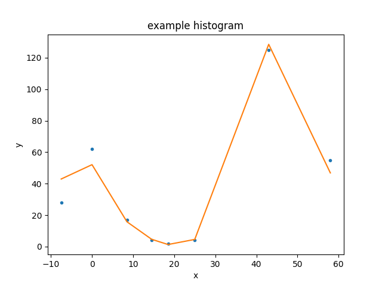
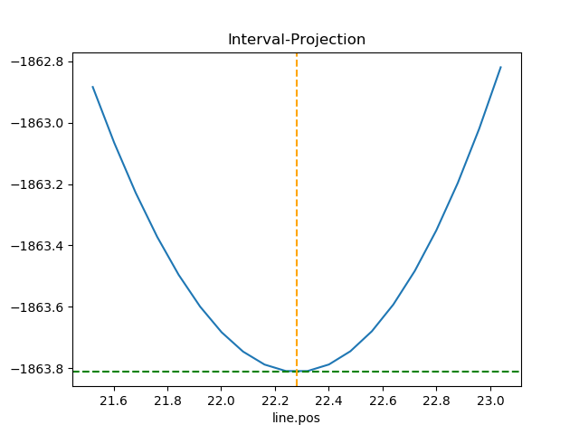

*************
Visualisation
*************

.. todo::

   Describe how to use DS9. See the "Image Display" section below.
   The example needs documentation and the data probably needs
   cleaning up to make it "nicer".

Overview
========

Sherpa has support for different plot backends.
A "backend" here means a module that performs the acutal plotting process,
such as the :term:`matplotlib` package; packages supported directly by Sherpa
are `~sherpa.plot.dummy_backend`, `~sherpa.plot.pylab_backend`, and
`~sherpa.plot.bokeh_backend`.
       
Interactive visualizations of images is provided by :term:`DS9` - an
Astronomical image viewer - if installed, whilst there is limited
support for visualizing two-dimensional data sets with the plotting
backends. The classes described in this document provide some
conveniences for plotting Sherpa data e.g. automatic axes labels.
They also abstract away the details of the plotting process so that
very similar plots can be made with different plotting backends
without changes to the plotting code.  On the other hand, it is always
possible to access the data in the Sherpa data objects and to call any
plotting package directly, which gives a more detailed control over
the exact look and layout of the plots.

The basic approach to creating a visualization using these classes is:

 - create an instance of the relevant class (e.g.
   :py:class:`~sherpa.plot.DataPlot`);
 - send it the necessary data with the ``prepare()`` method (optional);
 - perform any necessary calculation with the ``calc()`` method (optional);
 - and plot the data with the
   :py:meth:`~sherpa.plot.Plot.plot` or
   :py:meth:`~sherpa.plot.Contour.contour`
   methods (or the
   :py:meth:`~sherpa.plot.Plot.overplot`,
   and
   :py:meth:`~sherpa.plot.Contour.overcontour` variants).

.. note::

   The `sherpa.plot` module also includes error-estimation
   routines, such as the `IntervalProjection` class. This is mixing
   analysis with visualization, which may not be ideal.

Image Display
-------------

There are also routines for image display, using the
:term:`DS9` image viewer for interactive display. How are
these used from the object API?

Example
=======

Here is the data we wish to display: a set of consecutive
bins, defining the edges of the bins, and the counts in each bin:

    >>> import numpy as np
    >>> edges = np.asarray([-10, -5, 5, 12, 17, 20, 30, 56, 60])
    >>> y = np.asarray([28, 62, 17, 4, 2, 4, 125, 55])

As this is a one-dimensional integrated data set (i.e. a histogram),
we shall use the :py:class:`~sherpa.data.Data1DInt` class to
represent it:

    >>> from sherpa.data import Data1DInt
    >>> d = Data1DInt('example histogram', edges[:-1], edges[1:], y)

Displaying the data
-------------------

The :py:class:`~sherpa.plot.DataPlot` class can then be used to
display the data, using the :py:meth:`~sherpa.plot.DataPlot.prepare`
method to set up the data to plot - in this case the
:py:class:`~sherpa.data.Data1DInt` object - and then the
:py:meth:`~sherpa.plot.DataPlot.plot` method to actually plot the
data:

    >>> from sherpa.plot import DataPlot
    >>> dplot = DataPlot()
    >>> dplot.prepare(d)
    >>> dplot.plot()

.. image:: ../_static/plots/dataplot_histogram.png

The appearance of the plot will depend on the chosen backend (although
as of the Sherpa 4.12.0 release there is only one, using the
:term:`matplotlib` package).

Plotting data directly
----------------------

Most of the Sherpa plot objects expect Sherpa objects to be sent
to their ``prepare`` methods - normally data and model objects,
but plot objects themselves can be passed around for "composite"
plots - but there are several classes that accept the values to
display directly:
:py:class:`~sherpa.plot.Plot`,
:py:class:`~sherpa.plot.Histogram`,
:py:class:`~sherpa.plot.Point`,
and
:py:class:`~sherpa.plot.Contour`. Here we use the Histogram
class directly to diplay the data directly, on top of the
existing plot:

    >>> from sherpa.plot import Histogram
    >>> hplot = Histogram()
    >>> hplot.overplot(d.xlo, d.xhi, d.y)

Creating a model
----------------

For the following we need a
:doc:`model to display <../models/index>`, so how about
a constant minus a gaussian, using the
:py:class:`~sherpa.models.basic.Const1D`
and
:py:class:`~sherpa.models.basic.Gauss1D`
classes:

    >>> from sherpa.models.basic import Const1D, Gauss1D
    >>> mdl = Const1D('base') - Gauss1D('line')
    >>> mdl.pars[0].val = 10
    >>> mdl.pars[1].val = 25
    >>> mdl.pars[2].val = 22
    >>> mdl.pars[3].val = 10
    >>> print(mdl)
    (base - line)
       Param        Type          Value          Min          Max      Units
       -----        ----          -----          ---          ---      -----
       base.c0      thawed           10 -3.40282e+38  3.40282e+38
       line.fwhm    thawed           25  1.17549e-38  3.40282e+38
       line.pos     thawed           22 -3.40282e+38  3.40282e+38
       line.ampl    thawed           10 -3.40282e+38  3.40282e+38

Displaying the model
--------------------

With a Sherpa model, we can now use the
:py:class:`~sherpa.plot.ModelPlot` to display it. Note that unlike
the data plot, the
:py:meth:`~sherpa.plot.ModelPlot.prepare` method requires
the data *and* the model:

    >>> from sherpa.plot import ModelPlot
    >>> mplot = ModelPlot()
    >>> mplot.prepare(d, mdl)
    >>> mplot.plot()
    >>> dplot.overplot()

The data was drawn on top of the model using the
:py:meth:`~sherpa.plot.DataPlot.overplot` method
(:py:meth:`~sherpa.plot.DataPlot.plot`
could also have been used as long as the
``overplot`` argument was set to ``True``).

Combining the data and model plots
----------------------------------

The above plot is very similar to that created by the
:py:class:`~sherpa.plot.FitPlot` class:

    >>> from sherpa.plot import FitPlot
    >>> fplot = FitPlot()
    >>> fplot.prepare(dplot, mplot)
    >>> fplot.plot()

The major difference is that here the data is drawn first, and then
the model - unlike the previous example - so the colors used for the
line and points has swapped. The plot title is also different.

Changing the plot appearance
----------------------------

There is limited support for changing the appearance of plots,
and this can be done either by

  - changing the preference settings of the plot object
    (which will change any plot created by the object)

  - over-riding the setting when plotting the data (this
    capability is new to Sherpa 4.12.0).

There are several settings which are provided for all backends,
such as whether to draw an axis with a logarithmic scale - the
``xlog`` and ``ylog`` settings - as well as others that are specific
to a backend - such as the ``marker`` preference provided by the
Matplotlib backend. The name of the preference setting depends on
the plot object, for the DataPlot it is
:py:attr:`~sherpa.plot.DataPlot.plot_prefs`:

    >>> print(dplot.plot_prefs)
    {'xerrorbars': False, 'yerrorbars': True, 'ecolor': None, 'capsize': None, 'barsabove': False, 'xlog': False, 'ylog': False, 'linestyle': 'None', 'linecolor': None, 'color': None, 'marker': '.', 'markerfacecolor': None, 'markersize': None, 'xaxis': False, 'ratioline': False}

Here we set the y scale of the data plot to be drawn with a log
scale - by changing the preference setting - and then override
the ``marker`` and ``linestyle`` elements when creating the plot:

    >>> dplot.plot_prefs['ylog'] = True
    >>> dplot.plot(marker='s', linestyle='dashed')

If called without any arguments, the marker and line-style changes
are no-longer applied, but the y-axis is still drawn with a log scale:

    >>> dplot.plot()

Let's remove the y scaling so that the remaining plots use a linear
scale:

    >>> dplot.plot_prefs['ylog'] = False

Updating a plot
---------------

Note that for the FitPlot class the
:py:meth:`~sherpa.plot.FitPlot.prepare` method
accepts plot objects rather than data and model objects.

    >>> from sherpa.optmethods import NelderMead
    >>> from sherpa.stats import Cash
    >>> from sherpa.fit import Fit
    >>> f = Fit(d, mdl, stat=Cash(), method=NelderMead())
    >>> f.fit()

The model plot needs to be updated to reflect the new parameter values
before we can replot the fit:

    >>> mplot.prepare(d, mdl)
    >>> fplot.plot()

Looking at confidence ranges
----------------------------

The variation in best-fit statistic to a parameter can be
investigated with the :py:class:`~sherpa.plot.IntervalProjection`
class (there is also a :py:class:`~sherpa.plot.IntervalUncertainty`
but it is not as robust). Here we use the default options for
determing the parameter range over which to vary the gaussian
line position (which corresponds to `mdl.pars[2]`):

    >>> from sherpa.plot import IntervalProjection
    >>> iproj = IntervalProjection()
    >>> iproj.calc(f, mdl.pars[2])
    WARNING: hard minimum hit for parameter base.c0
    WARNING: hard maximum hit for parameter base.c0
    WARNING: hard minimum hit for parameter line.fwhm
    WARNING: hard maximum hit for parameter line.fwhm
    WARNING: hard minimum hit for parameter line.ampl
    WARNING: hard maximum hit for parameter line.ampl
    >>> iproj.plot()

Selecting and changing the plotting backend
===========================================

When the `sherpa.plot` module is first imported, Sherpa tries to
import the backends installed with Sherpa in the order listed in the
`sherpa.rc` files. The first module that imports successfully is set
as the active backend. The following command prints the name and the
location on disk of that module::

   >>> from sherpa import plot
   >>> print(plot.backend)

Change the backend
------------------

After the initial import, the backend can be changed by loading one of
the plotting backends shipped with sherpa (or any other module that
provides the same interface):

  >>> import sherpa.plot.bokeh_backend
  >>> plot.backend = sherpa.plot.bokeh_backend

Dependencies and the `dummy_backend` module
-------------------------------------------

The Sherpa plotting backends depend on a specific plitting module,
e.g.  `sherpa.plot.pylab_backend` load the pylab interface from
:term:`matplotlib`. If matplotlib is not installed, importing the
`~sherpa.plot.pylab_backend` will fail. The dependencies for each
backend are listed in the backend description. To ensure that the
`sherpa.plot` module will always be importable, Sherpa includes a
`sherpa.plot.dummy_backend` that has no dependencies outside of Sherpa
itself. This backend will accept all plotting commands, and perform
some limited actions (e.g. display some basic information in a
notebook), but not produce any graphical plot.

Reference/API
=============

.. toctree::
   :maxdepth: 2

   plot
   astroplot
   image
   utils
   dummy_backend
   pylab_backend
   bokeh_backend
