***********************************************
A quick guide to modeling and fitting in Sherpa
***********************************************

Here are some examples of using Sherpa to model and fit data.
It is based on some of the examples used in the `astropy.modelling
documentation <https://docs.astropy.org/en/stable/modeling/>`_.

.. _getting-started:

Getting started
===============

The following modules are assumed to have been imported::

    >>> import numpy as np
    >>> import matplotlib.pyplot as plt

The basic process, which will be followed below, is:

* :ref:`create a data object <quick-gauss1d-data>`

* :ref:`define the model <quick-gauss1d-model>`

* :ref:`select the statistic <quick-gauss1d-statistic>`

* :ref:`select the optimisation routine <quick-gauss1d-optimiser>`

* :ref:`fit the data <quick-gauss1d-fit>`

* :ref:`extract the parameter values <quick-gauss1d-extract>`

* :ref:`Calculating error values <quick-gauss1d-errors>`

Although presented as a list, it is not necessarily a linear process,
in that the order can be different to that above, and various steps
can be repeated. The above list also does not include any visualization
steps needed to inform and validate any choices.

.. _quick-gauss1d:

Fitting a one-dimensional data set
==================================

The following data - where ``x`` is the independent axis and
``y`` the dependent one - is used in this example::

    >>> np.random.seed(0)
    >>> x = np.linspace(-5., 5., 200)
    >>> ampl_true = 3
    >>> pos_true = 1.3
    >>> sigma_true = 0.8
    >>> err_true = 0.2
    >>> y = ampl_true * np.exp(-0.5 * (x - pos_true)**2 / sigma_true**2)
    >>> y += np.random.normal(0., err_true, x.shape)
    >>> out = plt.plot(x, y, 'ko')

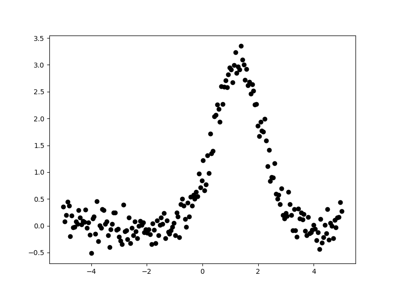

The aim is to fit a one-dimensional gaussian to this data and to recover
estimates of the true parameters of the model, namely the position
(``pos_true``), amplitude (``ampl_true``), and width (``sigma_true``).
The ``err_true`` term adds in random noise (using a
`Normal distribution <https://en.wikipedia.org/wiki/Normal_distribution>`_)
to ensure the data is not perfectly-described by the model.

.. _quick-gauss1d-data:

Creating a data object
----------------------

Rather than pass around the arrays to be fit, Sherpa has the
concept of a "data object", which stores the independent and dependent
axes, as well as any related metadata. For this example, the
class to use is :py:class:`~sherpa.data.Data1D`, which requires
a string label (used to identify the data), the independent
axis, and then dependent axis::

    >>> from sherpa.data import Data1D
    >>> d = Data1D('example', x, y)
    >>> print(d)
    name      = example
    x         = Float64[200]
    y         = Float64[200]
    staterror = None
    syserror  = None

At this point no errors are being used in the fit, so the ``staterror``
and ``syserror`` fields are empty. They can be set either when the
object is created or at a later time.

Plotting the data
-----------------

The :py:mod:`sherpa.plot` module provides a number of classes that
create pre-canned plots. For example, the
:py:class:`sherpa.plot.DataPlot` class can be used to display the data.
The steps taken are normally:

1. create the object;

2. call the :py:meth:`~sherpa.plot.DataPlot.prepare`
   method with the appropriate arguments,
   in this case the data object;

3. and then call the :py:meth:`~sherpa.plot.DataPlot.plot` method.

Sherpa has one plotting backend, :term:`matplotlib`, which is used
to display plots. There is limited support for customizing these
plots - such as always drawing the Y axis with a logarithmic
scale - but extensive changes will require calling the plotting back-end
directly.

As an example of the :py:class:`~sherpa.plot.DataPlot` output::
   
   >>> from sherpa.plot import DataPlot
   >>> dplot = DataPlot()
   >>> dplot.prepare(d)
   >>> dplot.plot()

.. image:: _static/quick/data1d_dataplot.png   

It is not required to use these classes and in the following, plots
will be created either via these classes or directly via matplotlib.

.. _quick-gauss1d-model:

Define the model
----------------

In this example a single model is used - a one-dimensional
gaussian provided by the :py:class:`~sherpa.models.basic.Gauss1D`
class - but more complex examples are possible: these
include :ref:`multiple components <model-combine>`,
sharing models between data sets, and
:ref:`adding user-defined models <usermodel>`.
A full description of the model language and capabilities is provided in
:doc:`models/index`::

    >>> from sherpa.models.basic import Gauss1D
    >>> g = Gauss1D()
    >>> print(g)
    gauss1d
       Param        Type          Value          Min          Max      Units
       -----        ----          -----          ---          ---      -----
       gauss1d.fwhm thawed           10  1.17549e-38  3.40282e+38           
       gauss1d.pos  thawed            0 -3.40282e+38  3.40282e+38           
       gauss1d.ampl thawed            1 -3.40282e+38  3.40282e+38
   
It is also possible to
:ref:`restrict the range of a parameter <params-limits>`,
:ref:`toggle parameters so that they are fixed or fitted <params-freeze>`,
and :ref:`link parameters together <params-link>`.

The :py:class:`sherpa.plot.ModelPlot` class can be used to visualize
the model. The :py:meth:`~sherpa.plot.ModelPlot.prepare` method
takes both a data object and the model to plot::

   >>> from sherpa.plot import ModelPlot
   >>> mplot = ModelPlot()
   >>> mplot.prepare(d, g)
   >>> mplot.plot()

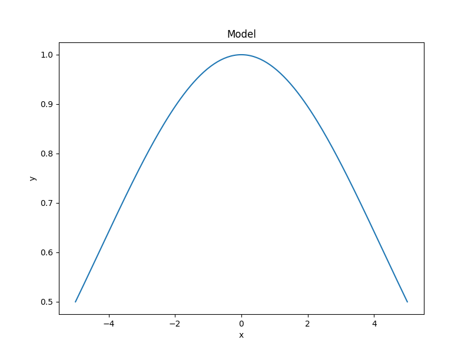

There is also a :py:class:`sherpa.plot.FitPlot` class which will
:ref:`combine the two plot results <quick-fitplot>`,
but it is often just-as-easy to combine them directly::

  >>> dplot.plot()
  >>> mplot.overplot()
  
.. image:: _static/quick/data1d_overplot.png

The model parameters can be changed - either manually or
automatically - to try and start the fit off closer to the best-fit
location, but for this example we shall leave the initial parameters
as they are.

.. todo::
   Need links for parameter setting and guess command

.. _quick-gauss1d-statistic:

Select the statistics
---------------------

In order to optimise a model - that is, to change the model parameters
until the best-fit location is found - a statistic is needed. The
statistic calculates a numerical value for a given set of model
parameters; this is a measure of how well the model matches the
data, and can include knowledge of errors on the dependent axis
values. The
:ref:`optimiser (chosen below) <quick-gauss1d-optimiser>`
attempts to find the set of parameters which minimises this
statistic value.

For this example, since the dependent axis (``y``)
has no error estimate, we shall pick the least-square statistic
(:py:class:`~sherpa.stats.LeastSq`), which calculates the
numerical difference of the model to the data for each point::

    >>> from sherpa.stats import LeastSq
    >>> stat = LeastSq()

.. _quick-gauss1d-optimiser:

Select the optimisation routine
-------------------------------

The optimiser is the part that determines how to minimise the statistic
value (i.e. how to vary the parameter values of the model to find
a local minimum). The main optimisers provided by Sherpa are
:py:class:`~sherpa.optmethods.NelderMead`
(also known as Simplex) and
:py:class:`~sherpa.optmethods.LevMar`
(Levenberg-Marquardt). The latter is often quicker, but less robust,
so we start with it (the optimiser can be changed and the data re-fit):

    >>> from sherpa.optmethods import LevMar
    >>> opt = LevMar()
    >>> print(opt)
    name     = levmar
    ftol     = 1.1920928955078125e-07
    xtol     = 1.1920928955078125e-07
    gtol     = 1.1920928955078125e-07
    maxfev   = None
    epsfcn   = 1.1920928955078125e-07
    factor   = 100.0
    numcores = 1
    verbose  = 0

.. _quick-gauss1d-fit:
    
Fit the data
------------

The :py:class:`~sherpa.fit.Fit` class is used to bundle up the
data, model, statistic, and optimiser choices. The 
:py:meth:`~sherpa.fit.Fit.fit` method runs the optimiser, and
returns a
:py:class:`~sherpa.fit.FitResults` instance, which
contains information on how the fit performed. This
infomation includes the
:py:attr:`~sherpa.fit.FitResults.succeeded`
attribute, to determine whether the fit converged, as well
as information on the fit (such as the start and end
statistic values) and best-fit parameter values. Note that
the model expression can also be queried for the new
parameter values.

    >>> from sherpa.fit import Fit
    >>> gfit = Fit(d, g, stat=stat, method=opt)
    >>> print(gfit)
    data      = example
    model     = gauss1d
    stat      = LeastSq
    method    = LevMar
    estmethod = Covariance

To actually fit the data, use the
:py:meth:`~sherpa.fit.Fit.fit` method, which - depending
on the data, model, or statistic being used - can take some
time::
    
    >>> gres = gfit.fit()
    >>> print(gres.succeeded)
    True

.. todo::

   Add a note about using the logger to get more on-screen information
   about the fit.
   
One useful method for interactive analysis is
:py:meth:`~sherpa.fit.FitResults.format`, which returns
a string representation of the fit results, as shown below::

    >>> print(gres.format())
    Method                = levmar
    Statistic             = leastsq
    Initial fit statistic = 180.71
    Final fit statistic   = 8.06975 at function evaluation 30
    Data points           = 200
    Degrees of freedom    = 197
    Change in statistic   = 172.641
       gauss1d.fwhm   1.91572      +/- 0.165982    
       gauss1d.pos    1.2743       +/- 0.0704859   
       gauss1d.ampl   3.04706      +/- 0.228618    

.. note::

   The :py:class:`~sherpa.optmethods.LevMar` optimiser calculates the
   covariance matrix at the best-fit location, and the errors from
   this are reported in the output from the call to the
   :py:meth:`~sherpa.fit.Fit.fit` method. In this particular case -
   which uses the :py:class:`~sherpa.stats.LeastSq` statistic -
   the error estimates do not have much meaning. As discussed
   below, Sherpa can :ref:`make use of error estimates 
   on the data <quick-gauss1d-errors>`
   to calculate meaningful parameter errors.

.. _quick-fitplot:

The :py:class:`sherpa.plot.FitPlot` class will display the data
and model. The :py:meth:`~sherpa.plot.FitPlot.prepare` method
requires data and model plot objects; in this case the previous
versions can be re-used, although the model plot needs to be
updated to reflect the changes to the model parameters::

   >>> from sherpa.plot import FitPlot
   >>> fplot = FitPlot()
   >>> mplot.prepare(d, g)
   >>> fplot.prepare(dplot, mplot)
   >>> fplot.plot()

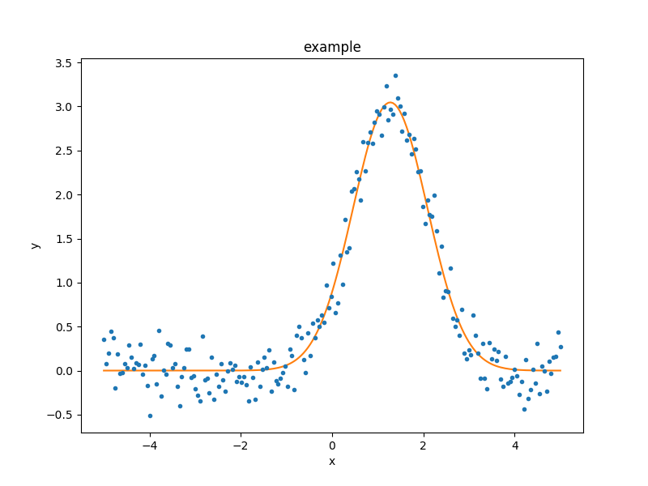

As the model can be
:doc:`evaluated directly <evaluation/index>`,
this plot can also be created manually::

   >>> out = plt.plot(d.x, d.y, 'ko', label='Data')
   >>> out = plt.plot(d.x, g(d.x), linewidth=2, label='Gaussian')
   >>> out = plt.legend(loc=2);

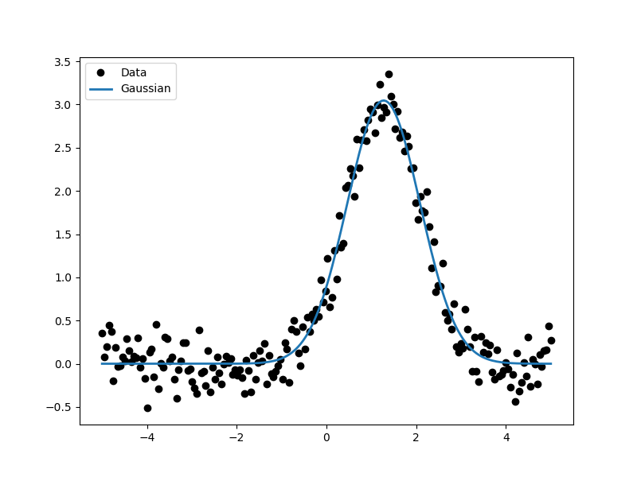

.. _quick-gauss1d-extract:
           
Extract the parameter values
----------------------------

The fit results include a large number of attributes, many of which
are not relevant here (as the fit was done with no error values).
The following relation is used to convert from the full-width
half-maximum value, used by the :py:class:`~sherpa.models.basic.Gauss1D`
model, to the Gaussian sigma value used to create the data:
:math:`\rm{FWHM} = 2 \sqrt{2ln(2)} \sigma`::

    >>> print(gres)
    datasets       = None
    itermethodname = none
    methodname     = levmar
    statname       = leastsq
    succeeded      = True
    parnames       = ('gauss1d.fwhm', 'gauss1d.pos', 'gauss1d.ampl')
    parvals        = (1.915724111406394, 1.2743015983545247, 3.0470560360944017)
    statval        = 8.069746329529591
    istatval       = 180.71034547759984
    dstatval       = 172.64059914807027
    numpoints      = 200
    dof            = 197
    qval           = None
    rstat          = None
    message        = successful termination
    nfev           = 30
    >>> conv = 2 * np.sqrt(2 * np.log(2))
    >>> ans = dict(zip(gres.parnames, gres.parvals))
    >>> print("Position = {:.2f}  truth= {:.2f}".format(ans['gauss1d.pos'], pos_true))
    Position = 1.27  truth= 1.30
    >>> print("Amplitude= {:.2f}  truth= {:.2f}".format(ans['gauss1d.ampl'], ampl_true))
    Amplitude= 3.05  truth= 3.00
    >>> print("Sigma    = {:.2f}  truth= {:.2f}".format(ans['gauss1d.fwhm']/conv, sigma_true))
    Sigma    = 0.81  truth= 0.80
    
The model, and its parameter values, can also be queried directly, as they
have been changed by the fit::

    >>> print(g)
    gauss1d
       Param        Type          Value          Min          Max      Units
       -----        ----          -----          ---          ---      -----
       gauss1d.fwhm thawed      1.91572  1.17549e-38  3.40282e+38           
       gauss1d.pos  thawed       1.2743 -3.40282e+38  3.40282e+38           
       gauss1d.ampl thawed      3.04706 -3.40282e+38  3.40282e+38       
    >>> print(g.pos)
    val         = 1.2743015983545247
    min         = -3.4028234663852886e+38
    max         = 3.4028234663852886e+38
    units       = 
    frozen      = False
    link        = None
    default_val = 0.0
    default_min = -3.4028234663852886e+38
    default_max = 3.4028234663852886e+38

.. _quick-gauss1d-errors:
    
Including errors
================

For this example, the error on each bin is assumed to be
the same, and equal to the true error::

    >>> dy = np.ones(x.size) * err_true
    >>> de = Data1D('with-errors', x, y, staterror=dy)
    >>> print(de)
    name      = with-errors
    x         = Float64[200]
    y         = Float64[200]
    staterror = Float64[200]
    syserror  = None

The statistic is changed from least squares to
chi-square (:py:class:`~sherpa.stats.Chi2`), to take advantage
of this extra knowledge (i.e. the Chi-square statistic includes
the error value per bin when calculating the statistic value)::

    >>> from sherpa.stats import Chi2
    >>> ustat = Chi2()
    >>> ge = Gauss1D('gerr')
    >>> gefit = Fit(de, ge, stat=ustat, method=opt)
    >>> geres = gefit.fit()
    >>> print(geres.format())
    Method                = levmar
    Statistic             = chi2
    Initial fit statistic = 4517.76
    Final fit statistic   = 201.744 at function evaluation 30
    Data points           = 200
    Degrees of freedom    = 197
    Probability [Q-value] = 0.393342
    Reduced statistic     = 1.02408
    Change in statistic   = 4316.01
       gerr.fwhm      1.91572      +/- 0.0331963   
       gerr.pos       1.2743       +/- 0.0140972   
       gerr.ampl      3.04706      +/- 0.0457235   
    >>> if not geres.succeeded: print(geres.message)

Since the error value is independent of bin, then the fit results
should be the same here (that is, the parameters in ``g`` are the
same as ``ge``)::

    >>> print(g)
    gauss1d
       Param        Type          Value          Min          Max      Units
       -----        ----          -----          ---          ---      -----
       gauss1d.fwhm thawed      1.91572  1.17549e-38  3.40282e+38           
       gauss1d.pos  thawed       1.2743 -3.40282e+38  3.40282e+38           
       gauss1d.ampl thawed      3.04706 -3.40282e+38  3.40282e+38           
    >>> print(ge)
    gerr
       Param        Type          Value          Min          Max      Units
       -----        ----          -----          ---          ---      -----
       gerr.fwhm    thawed      1.91572  1.17549e-38  3.40282e+38           
       gerr.pos     thawed       1.2743 -3.40282e+38  3.40282e+38           
       gerr.ampl    thawed      3.04706 -3.40282e+38  3.40282e+38
   
The difference is that more of the fields
in the result structure are populated: in particular the
:py:attr:`~sherpa.fit.FitResults.rstat` and
:py:attr:`~sherpa.fit.FitResults.qval` fields, which give the
reduced statistic and the probability of obtaining this statistic value
respectively.::

    >>> print(geres)
    datasets       = None
    itermethodname = none
    methodname     = levmar
    statname       = chi2
    succeeded      = True
    parnames       = ('gerr.fwhm', 'gerr.pos', 'gerr.ampl')
    parvals        = (1.9157241114064163, 1.2743015983545292, 3.047056036094392)
    statval        = 201.74365823823976
    istatval       = 4517.758636940002
    dstatval       = 4316.014978701763
    numpoints      = 200
    dof            = 197
    qval           = 0.3933424667915623
    rstat          = 1.0240794834428415
    message        = successful termination
    nfev           = 30

Error analysis
--------------

The default error estimation routine is
:py:attr:`~sherpa.estmethods.Covariance`, which will be replaced by
:py:attr:`~sherpa.estmethods.Confidence` for this example::

    >>> from sherpa.estmethods import Confidence
    >>> gefit.estmethod = Confidence()
    >>> print(gefit.estmethod)  # doctest: +SKIP
    name         = confidence
    sigma        = 1
    eps          = 0.01
    maxiters     = 200
    soft_limits  = False
    remin        = 0.01
    fast         = False
    parallel     = True
    numcores     = 4
    maxfits      = 5
    max_rstat    = 3
    tol          = 0.2
    verbose      = False
    openinterval = False

Running the error analysis can take time, for particularly complex
models. The default behavior is to use all the available CPU cores
on the machine, but this can be changed with the ``numcores``
attribute. Note that a message is displayed to the screen when each
bound is calculated, to indicate progress::
  
    >>> errors = gefit.est_errors()

The results can be displayed::
  
    >>> print(errors.format())
    Confidence Method     = confidence
    Iterative Fit Method  = None
    Fitting Method        = levmar
    Statistic             = chi2
    confidence 1-sigma (68.2689%) bounds:
       Param            Best-Fit  Lower Bound  Upper Bound
       -----            --------  -----------  -----------
       gerr.fwhm         1.91572   -0.0326327    0.0332578
       gerr.pos           1.2743   -0.0140981    0.0140981
       gerr.ampl         3.04706   -0.0456119    0.0456119
   
The :py:class:`~sherpa.fit.ErrorEstResults` instance returned by
:py:meth:`~sherpa.fit.Fit.est_errors` contains the parameter
values and limits::

    >>> print(errors)
    datasets    = None
    methodname  = confidence
    iterfitname = none
    fitname     = levmar
    statname    = chi2
    sigma       = 1
    percent     = 68.26894921370858
    parnames    = ('gerr.fwhm', 'gerr.pos', 'gerr.ampl')
    parvals     = (1.9157241114064163, 1.2743015983545292, 3.047056036094392)
    parmins     = (-0.0326327431233302, -0.014098074065578947, -0.045611913713536456)
    parmaxes    = (0.033257800216357714, 0.014098074065578947, 0.045611913713536456)
    nfits       = 29

The data can be accessed, e.g. to create a dictionary where the
keys are the parameter names and the values represent the parameter
ranges::

    >>> dvals = zip(errors.parnames, errors.parvals, errors.parmins,
    ... errors.parmaxes)
    >>> pvals = {d[0]: {'val': d[1], 'min': d[2], 'max': d[3]}
    ...          for d in dvals}
    >>> pvals['gerr.pos']
    {'val': 1.2743015983545256, 'min': -0.014098074065595156, 'max': 0.014098074065595156}
             
.. todo::

   Discuss the relationship between the parameter errors reported in a
   fit and the ones from Confidence, or related.

Screen output
-------------

The default behavior - when *not* using the default 
:py:class:`~sherpa.estmethods.Covariance` method - is for 
:py:meth:`~sherpa.fit.Fit.est_errors` to print out the parameter
bounds as it finds them, which can be useful in an interactive session
since the error analysis can be slow. This can be controlled using
the Sherpa logging interface.

.. todo::

   I need a link to a section describing this. However, first I need
   to work out just what it is when run on multiple cores causes the
   output to be lost.

   Oh, hold on. Does it somehow create a new shell to talk to? Or
   somehow create a different instance. Note that the default handler
   works okay even in this case (i.e. all the bounds are printed to
   stdout), but maybe something in the ipython directive is "causing fun".

.. _quick_errors_intproj:

A single parameter
------------------

.. todo::
   shouldn't this use the default for min/max/nloop in the prepare call?
   
It is possible to investigate the error surface of a single
parameter using the
:py:class:`~sherpa.plot.IntervalProjection` class. The following shows
how the error surface changes with the position of the gaussian. The
:py:meth:`~sherpa.plot.IntervalProjection.prepare` method are given
the range over which to vary the parameter (the range is chosen to
be close to the three-sigma limit from the confidence analysis above,
ahd the dotted line is added to indicate the three-sigma
limit above the best-fit for a single parameter)::

   >>> from sherpa.plot import IntervalProjection
   >>> iproj = IntervalProjection()
   >>> iproj.prepare(min=1.23, max=1.32, nloop=41)
   >>> iproj.calc(gefit, ge.pos)

This can take some time, depending on the complexity of the model and
number of steps requested. The resulting data looks like::
   
   >>> iproj.plot()
   >>> out = plt.axhline(geres.statval + 9, linestyle='dotted');

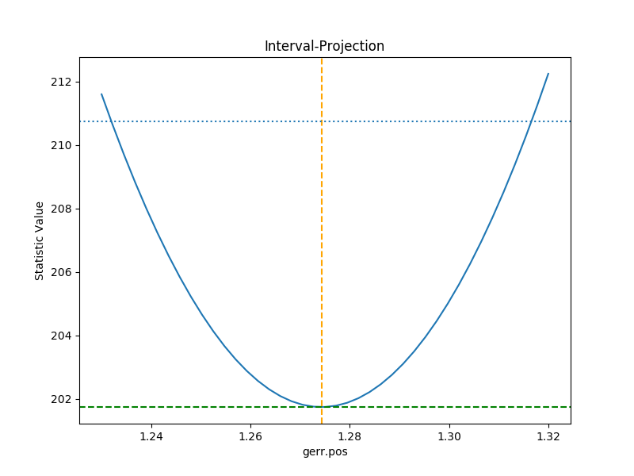

The curve is stored in the
:py:class:`~sherpa.plot.IntervalProjection` object (in fact, these
values are created by the call to
:py:meth:`~sherpa.plot.IntervalProjection.calc` and so can be accesed without
needing to create the plot)::

    >>> print(iproj)
    x     = [ 1.23  , 1.2323, 1.2345, 1.2368, 1.239 , 1.2412, 1.2435, 1.2457, 1.248 ,
      1.2503, 1.2525, 1.2548, 1.257 , 1.2592, 1.2615, 1.2637, 1.266 , 1.2683,
      1.2705, 1.2728, 1.275 , 1.2772, 1.2795, 1.2817, 1.284 , 1.2863, 1.2885,
      1.2908, 1.293 , 1.2953, 1.2975, 1.2997, 1.302 , 1.3043, 1.3065, 1.3088,
      1.311 , 1.3133, 1.3155, 1.3177, 1.32  ]
    y     = [ 211.597 , 210.6231, 209.6997, 208.8267, 208.0044, 207.2325, 206.5113,
      205.8408, 205.2209, 204.6518, 204.1334, 203.6658, 203.249 , 202.883 ,
      202.5679, 202.3037, 202.0903, 201.9279, 201.8164, 201.7558, 201.7461,
      201.7874, 201.8796, 202.0228, 202.2169, 202.462 , 202.758 , 203.105 ,
      203.5028, 203.9516, 204.4513, 205.0018, 205.6032, 206.2555, 206.9585,
      207.7124, 208.5169, 209.3723, 210.2783, 211.235 , 212.2423]
    min   = 1.23
    max   = 1.32
    nloop = 41
    delv  = None
    fac   = 1
    log   = False

A contour plot of two parameters
--------------------------------

The :py:class:`~sherpa.plot.RegionProjection` class supports
the comparison of two parameters. The contours indicate the one,
two, and three sigma contours.

::

   >>> from sherpa.plot import RegionProjection
   >>> rproj = RegionProjection()
   >>> rproj.prepare(min=[2.8, 1.75], max=[3.3, 2.1], nloop=[21, 21])
   >>> rproj.calc(gefit, ge.ampl, ge.fwhm)

As with the :ref:`interval projection <quick_errors_intproj>`,
this step can take time.

::
   
   >>> rproj.contour()

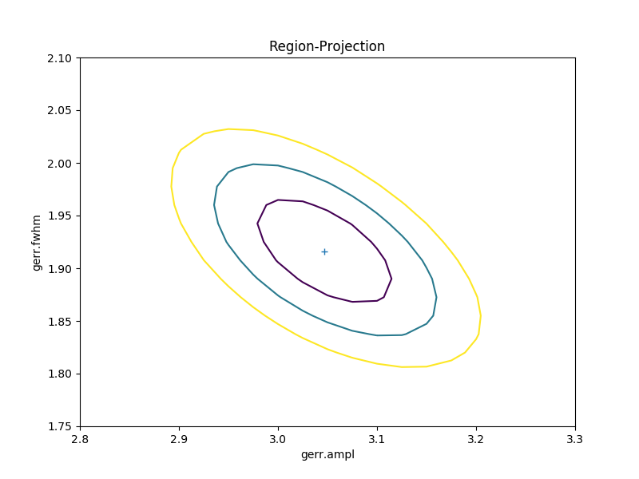

As with the single-parameter case, the statistic values for the grid are
stored in the :py:class:`~sherpa.plot.RegionProjection` object by the 
:py:meth:`~sherpa.plot.RegionProjection.calc` call, 
and so can be accesed without needing to create the contour plot. Useful
fields include ``x0`` and ``x1`` (the two parameter values), 
``y`` (the statistic value), and ``levels`` (the values used for the
contours)::

    >>> lvls = rproj.levels
    >>> print(lvls)
    [ 204.03940717  207.92373254  213.57281632]   
    >>> nx, ny = rproj.nloop
    >>> x0, x1, y = rproj.x0, rproj.x1, rproj.y
    >>> x0.resize(ny, nx)
    >>> x1.resize(ny, nx)
    >>> y.resize(ny, nx)
    >>> out = plt.imshow(y, origin='lower', cmap='viridis_r', aspect='auto',
    ...                  extent=(x0.min(), x0.max(), x1.min(), x1.max()))
    >>> out = plt.colorbar()
    >>> out = plt.xlabel(rproj.xlabel)
    >>> out = plt.ylabel(rproj.ylabel)
    >>> cs = plt.contour(x0, x1, y, levels=lvls)
    >>> lbls = [(v, r"${}\sigma$".format(i+1)) for i, v in enumerate(lvls)]
    >>> out = plt.clabel(cs, lvls, fmt=dict(lbls));

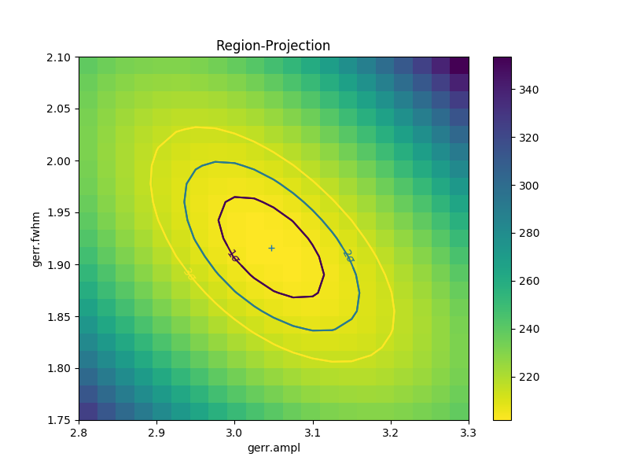

Fitting two-dimensional data
============================

Sherpa has support for two-dimensional data - that is data defined
on the independent axes ``x0`` and ``x1``. In the example below a
contiguous grid is used, that is the pixel size is constant, but
there is no requirement that this is the case.

::

    >>> np.random.seed(0)
    >>> x1, x0 = np.mgrid[:128, :128]
    >>> y = 2 * x0**2 - 0.5 * x1**2 + 1.5 * x0 * x1 - 1
    >>> y += np.random.normal(0, 0.1, y.shape) * 50000

.. todo::

   Actually, the current :py:class:`~sherpa.data.Data2D` class
   probably does force the data to be on a contiguous grid,
   or at least have a constant pixel size, since it has a
   ``shape`` argument.
    
Creating a data object
----------------------

To support irregularly-gridded data, the multi-dimensional
data classes require
that the coordinate arrays and data values are one-dimensional.
For example, the following code creates a
:py:class:`~sherpa.data.Data2D` object::

    >>> from sherpa.data import Data2D
    >>> x0axis = x0.ravel()
    >>> x1axis = x1.ravel()
    >>> yaxis = y.ravel()
    >>> d2 = Data2D('img', x0axis, x1axis, yaxis, shape=(128, 128))
    >>> print(d2)
    name      = img
    x0        = Int64[16384]
    x1        = Int64[16384]
    y         = Float64[16384]
    shape     = (128, 128)
    staterror = None
    syserror  = None

Define the model
----------------

Creating the model is the same as the one-dimensional case; in this
case the :py:class:`~sherpa.models.basic.Polynom2D` class is used
to create a low-order polynomial::

    >>> from sherpa.models.basic import Polynom2D
    >>> p2 = Polynom2D('p2')
    >>> print(p2)
    p2
       Param        Type          Value          Min          Max      Units
       -----        ----          -----          ---          ---      -----
       p2.c         thawed            1 -3.40282e+38  3.40282e+38           
       p2.cy1       thawed            0 -3.40282e+38  3.40282e+38           
       p2.cy2       thawed            0 -3.40282e+38  3.40282e+38           
       p2.cx1       thawed            0 -3.40282e+38  3.40282e+38           
       p2.cx1y1     thawed            0 -3.40282e+38  3.40282e+38           
       p2.cx1y2     thawed            0 -3.40282e+38  3.40282e+38           
       p2.cx2       thawed            0 -3.40282e+38  3.40282e+38           
       p2.cx2y1     thawed            0 -3.40282e+38  3.40282e+38           
       p2.cx2y2     thawed            0 -3.40282e+38  3.40282e+38           

Control the parameters being fit
--------------------------------

To reduce the number of parameters being fit, the ``frozen`` attribute
can be set::

    >>> for n in ['cx1', 'cy1', 'cx2y1', 'cx1y2', 'cx2y2']:
    ...     getattr(p2, n).frozen = True
    >>> print(p2)
    p2
       Param        Type          Value          Min          Max      Units
       -----        ----          -----          ---          ---      -----
       p2.c         thawed            1 -3.40282e+38  3.40282e+38           
       p2.cy1       frozen            0 -3.40282e+38  3.40282e+38           
       p2.cy2       thawed            0 -3.40282e+38  3.40282e+38           
       p2.cx1       frozen            0 -3.40282e+38  3.40282e+38           
       p2.cx1y1     thawed            0 -3.40282e+38  3.40282e+38           
       p2.cx1y2     frozen            0 -3.40282e+38  3.40282e+38           
       p2.cx2       thawed            0 -3.40282e+38  3.40282e+38           
       p2.cx2y1     frozen            0 -3.40282e+38  3.40282e+38           
       p2.cx2y2     frozen            0 -3.40282e+38  3.40282e+38
   
Fit the data
------------

Fitting is no different (the same statistic and optimisation
objects used earlier could have been re-used here)::

    >>> f2 = Fit(d2, p2, stat=LeastSq(), method=LevMar())
    >>> res2 = f2.fit()
    >>> if not res2.succeeded: print(res2.message)
    >>> print(res2)
    datasets       = None
    itermethodname = none
    methodname     = levmar
    statname       = leastsq
    succeeded      = True
    parnames       = ('p2.c', 'p2.cy2', 'p2.cx1y1', 'p2.cx2')
    parvals        = (-80.28947555488139, -0.48174521913599017, 1.5022711710872119, 1.9894112623568638)
    statval        = 400658883390.66907
    istatval       = 6571471882611.967
    dstatval       = 6170812999221.298
    numpoints      = 16384
    dof            = 16380
    qval           = None
    rstat          = None
    message        = successful termination
    nfev           = 45
    >>> print(p2)
    p2
       Param        Type          Value          Min          Max      Units
       -----        ----          -----          ---          ---      -----
       p2.c         thawed     -80.2895 -3.40282e+38  3.40282e+38           
       p2.cy1       frozen            0 -3.40282e+38  3.40282e+38           
       p2.cy2       thawed    -0.481745 -3.40282e+38  3.40282e+38           
       p2.cx1       frozen            0 -3.40282e+38  3.40282e+38           
       p2.cx1y1     thawed      1.50227 -3.40282e+38  3.40282e+38           
       p2.cx1y2     frozen            0 -3.40282e+38  3.40282e+38           
       p2.cx2       thawed      1.98941 -3.40282e+38  3.40282e+38           
       p2.cx2y1     frozen            0 -3.40282e+38  3.40282e+38           
       p2.cx2y2     frozen            0 -3.40282e+38  3.40282e+38           

.. todo::

    TODO: why are all the parameters a good fit *except* for the
    ``c`` value, which is -80 rather than -1? It's probably just that
    the constant value has a large error, since the noise term is
    :math:`\pm 50000`.

Display the model
-----------------

The model can be visualized by evaluating it over a grid of points
and then displaying it::

    >>> m2 = p2(x0axis, x1axis).reshape(128, 128)
    >>> def pimg(d, title):
    ...     plt.imshow(d, origin='lower', interpolation='nearest',
    ...                vmin=-1e4, vmax=5e4, cmap='viridis')
    ...     plt.axis('off')
    ...     plt.colorbar(orientation='horizontal',
    ...                  ticks=[0, 20000, 40000])
    ...     plt.title(title)
    ...
    >>> out = plt.figure(figsize=(8, 3))
    >>> out = plt.subplot(1, 3, 1);
    >>> pimg(y, "Data")
    >>> out = plt.subplot(1, 3, 2)
    >>> pimg(m2, "Model")
    >>> out = plt.subplot(1, 3, 3)
    >>> pimg(y - m2, "Residual")

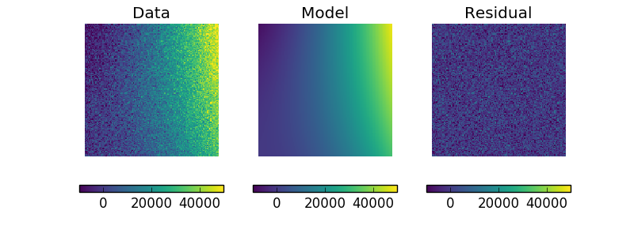

.. note::

   The :py:mod:`sherpa.image` model provides support for *interactive*
   image visualization, but this only works if the
   `DS9 <https://ds9.si.edu/site/Home.html>`_ image viewer is installed.
   For the examples in this document, matplotlib plots will be
   created to view the data directly.
   
Simultaneous fits
=================

Sherpa allows multiple data sets to be fit at the same time, although
there is only really a benefit if there is some model component or
value that is shared between the data sets). In this example we have
a dataset containing a lorentzian signal with a background component,
and another with just the background component. Fitting both together
can improve the constraints on the parameter values.

First we start by simulating the data, where the 
:py:class:`~sherpa.models.basic.Polynom1D`
class is used to model the background as a straight line, and
:py:class:`~sherpa.astro.models.Lorentz1D`
for the signal::

    >>> from sherpa.models import Polynom1D
    >>> from sherpa.astro.models import Lorentz1D
    >>> tpoly = Polynom1D()
    >>> tlor = Lorentz1D()
    >>> tpoly.c0 = 50
    >>> tpoly.c1 = 1e-2
    >>> tlor.pos = 4400
    >>> tlor.fwhm = 200
    >>> tlor.ampl = 1e4
    >>> x1 = np.linspace(4200, 4600, 21)
    >>> y1 = tlor(x1) + tpoly(x1) + np.random.normal(scale=5, size=x1.size)
    >>> x2 = np.linspace(4100, 4900, 11)
    >>> y2 = tpoly(x2) + np.random.normal(scale=5, size=x2.size)
    >>> print("x1 size {}  x2 size {}".format(x1.size, x2.size))
    x1 size 21  x2 size 11

There is **no** requirement that the data sets have a common grid,
as can be seen in a raw view of the data::

    >>> out = plt.plot(x1, y1)
    >>> out = plt.plot(x2, y2)
   
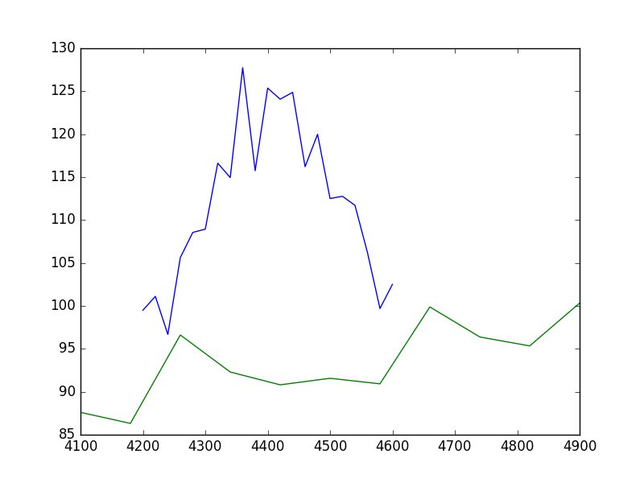

The fits are set up as before; a data object is needed for each
data set, and model instances are created::

    >>> d1 = Data1D('a', x1, y1)
    >>> d2 = Data1D('b', x2, y2)
    >>> fpoly, flor = Polynom1D(), Lorentz1D()
    >>> fpoly.c1.thaw()
    >>> flor.pos = 4500

To help the fit, we use a simple algorithm to estimate the
starting point for the source amplitude, by evaluating
the model on the data grid and calculating the change in
the amplitude needed to make it match the data::
  
    >>> flor.ampl = y1.sum() / flor(x1).sum()

For simultaneous fits the same optimisation and statistic
needs to be used for each fit (this is an area we are looking
to improve)::
  
    >>> from sherpa.optmethods import NelderMead
    >>> stat, opt = LeastSq(), NelderMead()

Set up the fits to the individual data sets::
  
    >>> f1 = Fit(d1, fpoly + flor, stat, opt)
    >>> f2 = Fit(d2, fpoly, stat, opt)

and a simultaneous (i.e. to both data sets) fit::
   
    >>> from sherpa.data import DataSimulFit
    >>> from sherpa.models import SimulFitModel
    >>> sdata = DataSimulFit('all', (d1, d2))
    >>> smodel = SimulFitModel('all', (fpoly + flor, fpoly))
    >>> sfit = Fit(sdata, smodel, stat, opt)

.. todo::

   It seems a bit annoying that we have to send in ``stat`` and
   ``opt`` to the individual fit objects and the ``SimulFitModel``.

   **NOTE** should use simulfit as much simpler and then introduce the
   objects. Although need to check as might be getting different fit
   results.

Note that there is a :py:meth:`~sherpa.fit.Fit.simulfit` method that
can be used to fit using multiple :py:class:`sherpa.fit.Fit` objects,
which wraps the above (using individual fit objects allows some
of the data to be fit first, which may help reduce the parameter
space needed to be searched)::

    >>> res = sfit.fit()
    >>> print(res)
    datasets       = None
    itermethodname = none
    methodname     = neldermead
    statname       = leastsq
    succeeded      = True
    parnames       = ('polynom1d.c0', 'polynom1d.c1', 'lorentz1d.fwhm', 'lorentz1d.pos', 'lorentz1d.ampl')
    parvals        = (36.829217311393585, 0.012540257025027028, 249.55651534213359, 4402.7031194359088, 12793.559398547319)
    statval        = 329.6525419378109
    istatval       = 3813284.1822045334
    dstatval       = 3812954.52966
    numpoints      = 32
    dof            = 27
    qval           = None
    rstat          = None
    message        = Optimization terminated successfully
    nfev           = 1152

The values of the ``numpoints`` and ``dof`` fields show that both datasets
have been used in the fit.

The data can then be viewed (in this case a separate grid
is used, but the
:ref:`data objects could be used to define the grid <evaluation_data>`)::

    >>> out = plt.plot(x1, y1, label='Data 1')
    >>> out = plt.plot(x2, y2, label='Data 2')
    >>> x = np.arange(4000, 5000, 10)
    >>> out = plt.plot(x, (fpoly + flor)(x), linestyle='dotted', label='Fit 1')
    >>> out = plt.plot(x, fpoly(x), linestyle='dotted', label='Fit 2')
    >>> out = plt.legend()

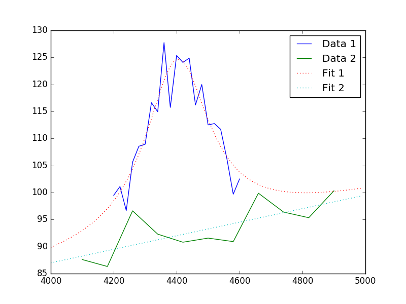

.. todo::

   May want to show the residual plot.

   Improve the English in the following section:
   
How do you do error analysis? Well, can call ``sfit.est_errors()``, but
that will fail with the current statistic (``LeastSq``), so need to
change it. The error is 5, per bin, which has to be set up::

    >>> print(sfit.calc_stat_info())
    name      = 
    ids       = None
    bkg_ids   = None
    statname  = leastsq
    statval   = 329.6525419378109
    numpoints = 32
    dof       = 27
    qval      = None
    rstat     = None
    >>> d1.staterror = np.ones(x1.size) * 5
    >>> d2.staterror = np.ones(x2.size) * 5
    >>> sfit.stat = Chi2()
    >>> check = sfit.fit()

How much did the fit change?::
  
    >>> check.dstatval
    0.0
   
Note that since the error on each bin is the same value, the best-fit
value is not going to be different to the LeastSq result (so ``dstatval``
should be 0)::

    >>> print(sfit.calc_stat_info())
    name      = 
    ids       = None
    bkg_ids   = None
    statname  = chi2
    statval   = 13.186101677512438
    numpoints = 32
    dof       = 27
    qval      = 0.988009259609
    rstat     = 0.48837413620416437
    >>> sres = sfit.est_errors()
    >>> print(sres)
    datasets    = None
    methodname  = covariance
    iterfitname = none
    fitname     = neldermead
    statname    = chi2
    sigma       = 1
    percent     = 68.2689492137
    parnames    = ('polynom1d.c0', 'polynom1d.c1', 'lorentz1d.fwhm', 'lorentz1d.pos', 'lorentz1d.ampl')
    parvals     = (36.829217311393585, 0.012540257025027028, 249.55651534213359, 4402.7031194359088, 12793.559398547319)
    parmins     = (-4.9568824809960628, -0.0011007470586726147, -6.6079122387075824, -2.0094070026087474, -337.50275154547768)
    parmaxes    = (4.9568824809960628, 0.0011007470586726147, 6.6079122387075824, 2.0094070026087474, 337.50275154547768)
    nfits       = 0

Error estimates on a single parameter are
:ref:`as above <quick_errors_intproj>`::

    >>> iproj = IntervalProjection()
    >>> iproj.prepare(min=6000, max=18000, nloop=101)
    >>> iproj.calc(sfit, flor.ampl)
    >>> iproj.plot()

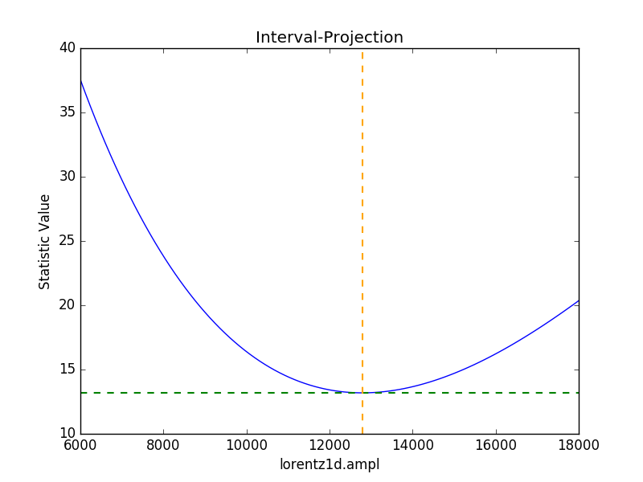

.. todo::
   
   Hmm, not particularly symmetric, but that's life.
