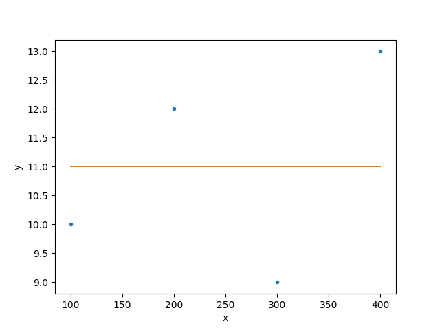

****************************************
Using Sessions to manage models and data
****************************************

So far we have discussed the object-based API of Sherpa -
where it is up to the user to manage the creation
and handling of
:doc:`data <../data/index>`,
:doc:`model <../models/index>`,
:doc:`fit <../fit/index>` and related objects. Sherpa
also provides a "Session" class that handles much of this,
and it can be used
directly - via the :py:class:`sherpa.ui.utils.Session` or
:py:class:`sherpa.astro.ui.utils.Session` classes - or
indirectly using the routines in the
:py:mod:`sherpa.ui` and :py:mod:`sherpa.astro.ui` modules.

The session API is intended to be used in an interactive
setting, and so deals with object management. Rather than
deal with objects, the API uses labels (numeric or string)
to identify data sets and model components. The Astronomy-specific
version adds domain-specific functionality; in this case support
for Astronomical data analysis, with a strong focus on high-energy (X-ray)
data. It is is currently documented on the
http://cxc.harvard.edu/sherpa/ web site.

The :py:class:`~sherpa.ui.utils.Session` object provides methods
that allow you to:

- load data
- set the model
- change the statistic and optimiser
- fit
- calculate errors
- visualize the results

These are the same stages as described in the 
:ref:`getting started <getting-started>` section, but the
syntax is different, since the Session object handles the
creation of, and passing around, the underlying
Sherpa objects.

The :py:mod:`sherpa.ui` module provides an interface where
the Session object is hidden from the user, which makes it
more appropriate for an interactive analysis session.

Examples
========

The following examples are *very* basic, since they are
intended to highlight how the Sesssion API is used.
The CIAO documentation for Sherpa at http://cxc.harvard.edu/sherpa/
provides more documentation and examples.

There are two examples which show the same process -
finding out what value best represents a small dataset -
using the
:py:class:`~sherpa.ui.utils.Session` object directly and then via the
:py:mod:`sherpa.ui` module.

The data to be fit is the four element array:

   >>> x = [100, 200, 300, 400]
   >>> y = [10, 12, 9, 13]

For this example the :py:class:`~sherpa.stats.Cash` statistic will
be used, along with the
:py:class:`~sherpa.optmethods.NelderMead` optimiser.

.. note::

   Importing the Session object - whether directly or via the
   ui module - causes several checks to be run, to see what
   parts of the system may not be available. This can lead to
   warning messages such as the following to be displayed::

      WARNING: imaging routines will not be available, 
      failed to import sherpa.image.ds9_backend due to 
      'RuntimeErr: DS9Win unusable: Could not find ds9 on your PATH'

   Other checks are to see if the chosen I/O and plotting
   backends are present, and if support for the XSPEC
   model library is available.
   
Using the Session object
------------------------

By default the Session object has no available models associated
with it. The
:py:meth:`~sherpa.ui.utils.Session._add_model_types`
method is used to register the models from
:py:mod:`sherpa.models.basic` with the session (by default it will
add any class in the module that is derived from the
:py:class:`~sherpa.models.model.ArithmeticModel`
class)::    

   >>> from sherpa.ui.utils import Session
   >>> import sherpa.models.basic
   >>> s = Session()
   >>> s._add_model_types(sherpa.models.basic)

The :py:meth:`~sherpa.ui.utils.Session.load_arrays` is used to
create a :py:class:`~sherpa.data.Data1D` object, which is managed
by the Session class and referenced by the identifier ``1``
(this is in fact the default identifier, which can be
manipulated by the
:py:meth:`~sherpa.ui.utils.Session.get_default_id`
and
:py:meth:`~sherpa.ui.utils.Session.set_default_id`
methods, and can be a string or an integer).
Many methods will default to using the default identifier,
but ``load_arrays`` requires it::

   >>> s.load_arrays(1, x, y)

.. note::

   The session object is not just limited to handling
   :py:class:`~sherpa.data.Data1D` data sets. The
   ``load_arrays`` takes an optional argument which defines
   the class of the data (e.g. :py:class:`~sherpa.data.Data2D`),
   and there are several other methods which can be used to
   create a data object, such as
   :py:class:`~sherpa.ui.utils.Session.load_data`
   and
   :py:class:`~sherpa.ui.utils.Session.set_data`.
   
The :py:meth:`~sherpa.ui.utils.Session.list_data_ids` method
returns the list of available data sets (i.e. those that have
been loaded into the session)::

   >>> s.list_data_ids()
   [1]

The :py:meth:`~sherpa.ui.utils.Session.get_data` method lets a user
access the underlying data object. This method uses the default
identifier if not specified::

   >>> s.get_data()
   <Data1D data set instance ''>
   >>> print(s.get_data())
   name      = 
   x         = Int64[4]
   y         = Int64[4]
   staterror = None
   syserror  = None

The default statistic and optimiser are set to values useful for
data with Gaussian errors::

   >>> s.get_stat_name()
   'chi2gehrels'
   >>> s.get_method_name()
   'levmar'

As the data here is counts based, and is to be fit with Poisson
statitics, the
:py:meth:`~sherpa.ui.utils.Session.set_stat`
and    
:py:meth:`~sherpa.ui.utils.Session.set_method`
methods are used to change the statistic and optimiser.
Note that they take a string as an argument
(rather than an instance of a
:py:class:`~sherpa.stats.Stat`
or :py:class:`~sherpa.optmethods.OptMethod`
class)::
   
   >>> s.set_stat('cash')
   >>> s.set_method('simplex')

The :py:meth:`~sherpa.ui.utils.Session.set_source` method is
used to define the model expression that is to be fit to the
data. It can be sent a model expression created using the
model classes directly, as described in the
:doc:`Creating Model Instances <../models/index>` section above.
However, in this case a string is used to define the model, and
references each model component using the form
``modelname.instancename``. The ``modelname`` defines the
type of model - in this case the
:py:class:`~sherpa.models.basic.Const1D` model - and it must
have been registered with the session object using
``_add_model_types``. The
:py:meth:`~sherpa.ui.utils.Session.list_models` method
can be used to find out what models are available.
The ``instancename`` is used as an identifier for the
component, and can be used with other methods,
such as :py:meth:`~sherpa.ui.utils.Session.set_par`.

::

   >>> s.set_source('const1d.mdl')

The ``instancename`` value is also used to create a Python variable
which provides direct access to the model component (it can
also be retrieved with
:py:meth:`~sherpa.ui.utils.Session.get_model_component`)::

   >>> print(mdl)
   const1d.mdl
   Param        Type          Value          Min          Max      Units
   -----        ----          -----          ---          ---      -----
   mdl.c0       thawed            1 -3.40282e+38  3.40282e+38           

The source model can be retrievd with
:py:meth:`~sherpa.ui.utils.Session.get_source`, which in this
example is just the single model component ``mdl``::

   >>> s.get_source()
   <Const1D model instance 'const1d.mdl'>
   
With the data, model, statistic, and optimiser set, it
is now possible to perform a fit. The
:py:meth:`~sherpa.ui.utils.Session.fit` method defaults to
a simultaneous fit of all the loaded data sets; in this case
there is only one::
  
   >>> s.fit()
   Dataset               = 1
   Method                = neldermead
   Statistic             = cash
   Initial fit statistic = 8
   Final fit statistic   = -123.015 at function evaluation 90
   Data points           = 4
   Degrees of freedom    = 3
   Change in statistic   = 131.015
      mdl.c0         11
   
The fit results are displayed to the screen, but can also be accessed
with methods such as
:py:meth:`~sherpa.ui.utils.Session.calc_stat`,
:py:meth:`~sherpa.ui.utils.Session.calc_stat_info`,
and    
:py:meth:`~sherpa.ui.utils.Session.get_fit_results`.

   >>> r = s.get_fit_results()
   >>> print(r)
   datasets       = (1,)
   itermethodname = none
   methodname     = neldermead
   statname       = cash
   succeeded      = True
   parnames       = ('mdl.c0',)
   parvals        = (11.0,)
   statval        = -123.01478400625663
   istatval       = 8.0
   dstatval       = 131.014784006
   numpoints      = 4
   dof            = 3
   qval           = None
   rstat          = None
   message        = Optimization terminated successfully
   nfev           = 90

There are also methods which allow you to plot the data, model,
fit, and residuals (amongst others):
:py:meth:`~sherpa.ui.utils.Session.plot_data`,
:py:meth:`~sherpa.ui.utils.Session.plot_model`,
:py:meth:`~sherpa.ui.utils.Session.plot_fit`,
:py:meth:`~sherpa.ui.utils.Session.plot_resid`.
The following
hides the automatically-created error bars on the data points
(but unfortunately not the warning message)
by changing a setting in dictionary returned by
:py:meth:`~sherpa.ui.utils.Session.get_data_plot_prefs`,
and then displays the data along with the model::
   
   >>> s.get_data_plot_prefs()['yerrorbars'] = False      
   >>> s.plot_fit()
   WARNING: The displayed errorbars have been supplied with the data or calculated using chi2xspecvar; the errors are not used in fits with leastsq

   
Using the UI module
-------------------

Using the UI module is very similar to the Session object, since it
automatically creates a global Session object, and registers the available
models, when imported. This means that the preceeding example can be replicated
but without the need for the Session object.

Since the module is intended for an interactive environment, in this example
the symbols are loaded into the default namespace to avoid having to qualify
each function with the module name. For commentary, please refer to the
preceeding example::

   >>> from sherpa.ui import *

   >>> load_arrays(1, x, y)
   >>> list_data_ids()
   [1]

   >>> get_data()
   <Data1D data set instance ''>
   >>> print(get_data())
   name      = 
   x         = Int64[4]
   y         = Int64[4]
   staterror = None
   syserror  = None

   >>> get_stat_name()
   'chi2gehrels'
   >>> get_method_name()
   'levmar'

   >>> set_stat('cash')
   >>> set_method('simplex')

   >>> set_source('const1d.mdl')

   >>> print(mdl)
   const1d.mdl
   Param        Type          Value          Min          Max      Units
   -----        ----          -----          ---          ---      -----
   mdl.c0       thawed            1 -3.40282e+38  3.40282e+38           

   >>> get_source()
   <Const1D model instance 'const1d.mdl'>
   
   >>> fit()
   Dataset               = 1
   Method                = neldermead
   Statistic             = cash
   Initial fit statistic = 8
   Final fit statistic   = -123.015 at function evaluation 90
   Data points           = 4
   Degrees of freedom    = 3
   Change in statistic   = 131.015
      mdl.c0         11
   
   >>> r = get_fit_results()
   >>> print(r)
   datasets       = (1,)
   itermethodname = none
   methodname     = neldermead
   statname       = cash
   succeeded      = True
   parnames       = ('mdl.c0',)
   parvals        = (11.0,)
   statval        = -123.01478400625663
   istatval       = 8.0
   dstatval       = 131.014784006
   numpoints      = 4
   dof            = 3
   qval           = None
   rstat          = None
   message        = Optimization terminated successfully
   nfev           = 90

   >>> get_data_plot_prefs()['yerrorbars'] = False      
   >>> plot_fit()
   WARNING: The displayed errorbars have been supplied with the data or calculated using chi2xspecvar; the errors are not used in fits with leastsq

The plot created by this function is the same as shown in
the previous example. 
   

Reference/API
=============

.. toctree::
   :maxdepth: 2

   sherpa_ui
   sherpa_astro_ui
   sherpa_ui_utils
   sherpa_astro_ui_utils
